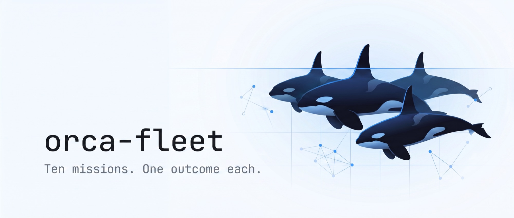
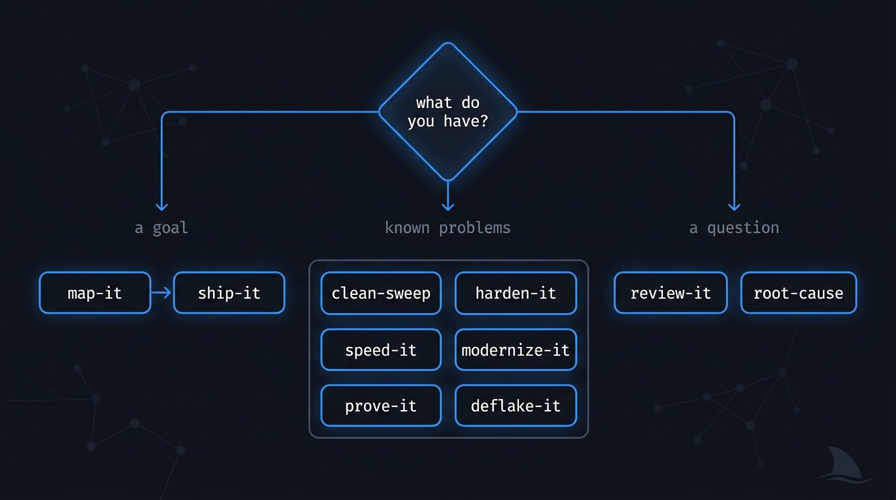
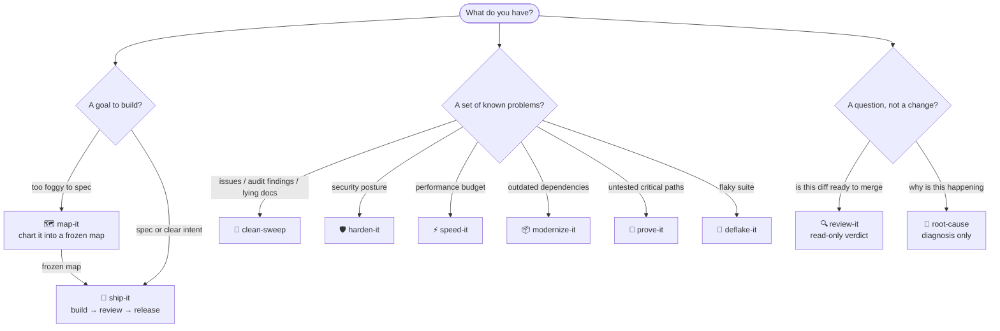
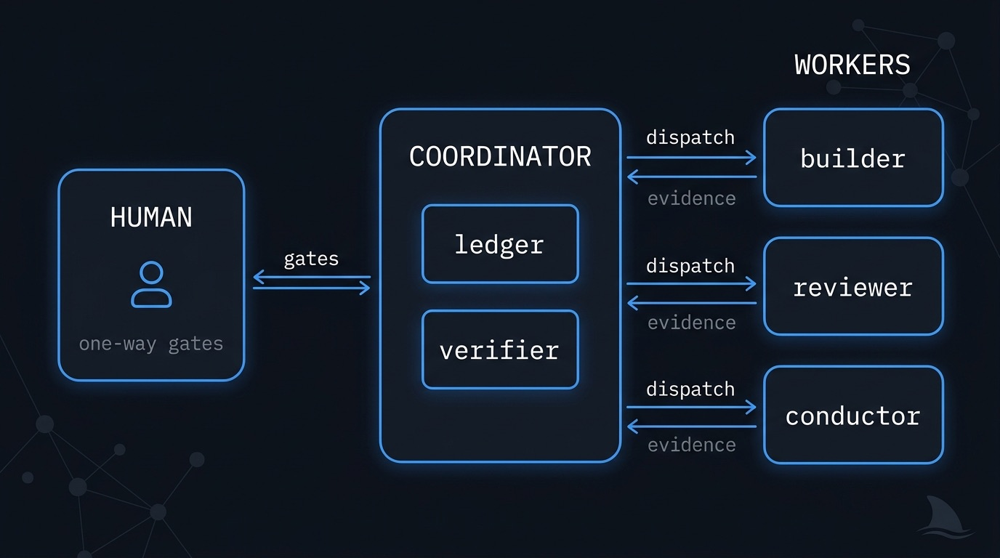
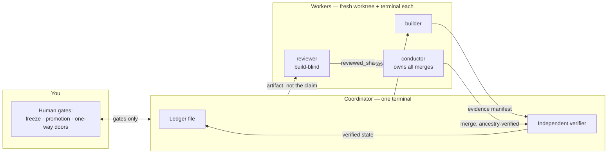
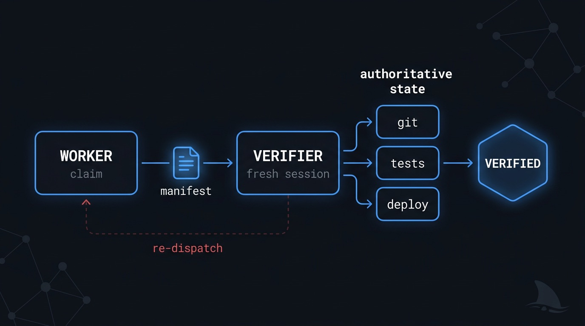
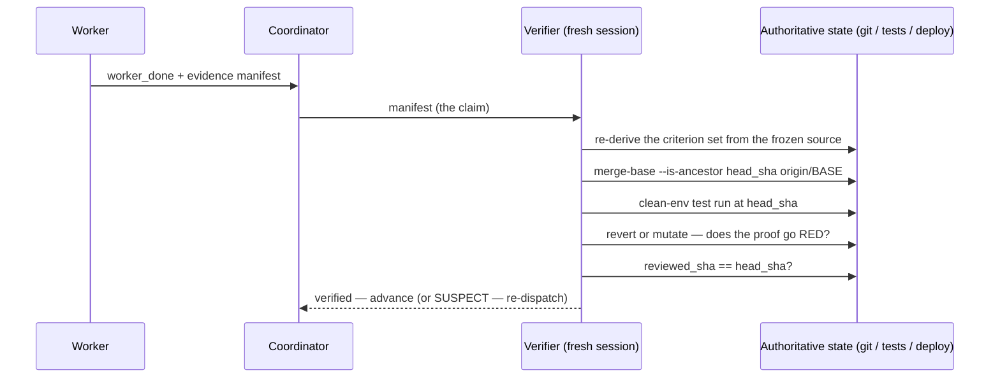
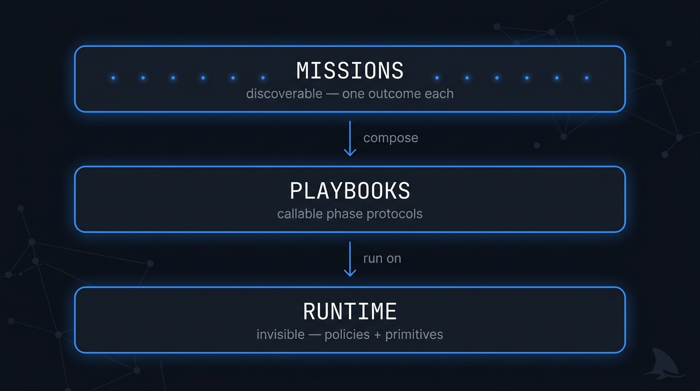

<p align="center">
  <picture>
    <source media="(prefers-color-scheme: dark)" srcset="assets/hero-dark.jpg">
    <source media="(prefers-color-scheme: light)" srcset="assets/hero-light.jpg">
    
  </picture>
</p>

<p align="center">
  <a href="LICENSE"></a>
  <a href="https://agentskills.io/specification"></a>
  <a href="skills/"></a>
  <a href="tests/"></a>
  <a href="CHANGELOG.md"></a>
</p>

<p align="center">
  <b>Give a mission a goal. Come back to an evidence-verified end state.</b><br/>
  <a href="docs/getting-started.md">Getting started</a> ·
  <a href="docs/concepts.md">Concepts</a> ·
  <a href="docs/missions/">Mission guides</a> ·
  <a href="CONTRIBUTING.md">Contributing</a>
</p>

---

Most agent-skill packs give you better *ingredients*: a sharper TDD loop, a stricter review, a
smarter debugger. orca-fleet gives you **outcomes**. Each of its eleven missions is a complete
autonomous fleet for the [Orca](https://github.com/stablyai/orca) runtime — a coordinator that
decomposes a goal, dispatches isolated workers, verifies every claim against git and a clean test
run, and stops at a named, evidence-backed terminal state.

```
 YOU SAY                          THE FLEET RUNS                        YOU GET
┌──────────────────────┐      ┌─────────────────────────────┐      ┌──────────────────────────────┐
│ "ship this"          │ ───▶ │ freeze → build → review     │ ───▶ │ PROMOTION_READY + evidence   │
│ "close every issue"  │ ───▶ │ triage → fix → re-enumerate │ ───▶ │ backlog at zero, SHA-linked  │
│ "harden this"        │ ───▶ │ audit → exploit → re-attack │ ───▶ │ CLEAN re-audit, or named gaps│
│ "why is this flaky"  │ ───▶ │ reproduce → falsify → prove │ ───▶ │ demonstrated root cause      │
└──────────────────────┘      └─────────────────────────────┘      └──────────────────────────────┘
```

No mission is named for a vendor or a technique. There are no `matt-*` or `gstack-*` skills here —
the upstream packs ([mattpocock/skills](https://github.com/mattpocock/skills),
[garrytan/gstack](https://github.com/garrytan/gstack),
[addyosmani/agent-skills](https://github.com/addyosmani/agent-skills)) are sources of *recipes*
that missions compose, one pack per worker, never two in the same context.

## Contents

- [Quick start](#quick-start)
- [The eleven missions](#the-eleven-missions)
- [Which mission do I want?](#which-mission-do-i-want)
- [How a fleet works](#how-a-fleet-works)
- [The evidence protocol](#the-evidence-protocol)
- [Three layers, strictly separated](#three-layers-strictly-separated)
- [Install](#install)
- [Requirements](#requirements)
- [Repository layout](#repository-layout)
- [Validate and test](#validate-and-test)
- [FAQ](#faq)
- [Credits](#credits)

## Quick start

```bash
# 1. Clone
git clone https://github.com/ravidsrk/orca-fleet.git

# 2. Link one mission into Claude Code (link, don't copy — missions reference
#    playbooks/ and runtime/ by relative path)
ln -s "$(pwd)/orca-fleet/skills/ship-it" ~/.claude/skills/ship-it

# 3. In a repo with the Orca runtime + orchestration skill available:
#    "ship this: <your goal>"   — and approve the freeze when asked.
```

Then read [Getting started](docs/getting-started.md) for the full walkthrough: what the
coordinator does, what the workers do, where the evidence lands, and what the two human gates
look like from your side of the terminal.

## The eleven missions

Every mission is one outcome with its own state machine, its own convergence proof, and an
evidence-based definition of done. Click through for the full guide to each.

| Mission | Outcome (definition of done) | Use when |
|---|---|---|
| 🚢 **[ship-it](docs/missions/ship-it.md)** | Intent or a frozen spec → a released, verified change, stopped at the highest release state you authorized (`BUILT` → `PROMOTION_READY` → `RELEASED` → `DEPLOYED_AND_VERIFIED`) | "build and ship this", spec-to-shipped-product |
| 🧹 **[clean-sweep](docs/missions/clean-sweep.md)** | A finite backlog exhausted to zero, PR-per-finding, every close backed by a merged SHA + a test that failed pre-fix; re-enumerated until dry | "close every issue", "fix everything in this audit", "the README lies" |
| 🛡️ **[harden-it](docs/missions/harden-it.md)** | A threat model closed: audit → exploit → fix → **re-attack the fix** → clean re-audit finds zero unrefuted P0/P1 (or `HARDENED-WITH-OPEN-ITEMS`) | "harden this", "security sweep", "red team" |
| ⚡ **[speed-it](docs/missions/speed-it.md)** | A perf budget met against a pre-declared measurement contract: `WITHIN-BUDGET` or `OPTIMIZED-WITH-PARKED` | "the app is slow", "perf budget", "Core Web Vitals" |
| 📦 **[modernize-it](docs/missions/modernize-it.md)** | Dependency currency via expand/migrate/contract at the code level: `CURRENT` or `CURRENT-WITH-PINNED`, every pin justified | "update the dependencies", "framework migration" |
| 🧪 **[prove-it](docs/missions/prove-it.md)** | A mutation-audited critical surface: `COVERED` or `COVERED-WITH-PARKED`, tests that die when the code is mutated | "close the test gap", "cover the critical paths" |
| 🎯 **[deflake-it](docs/missions/deflake-it.md)** | Flake eradication to a statistical streak, local **and** CI: `STABLE` or `STABLE-WITH-QUARANTINE` | "kill the flaky tests", "deflake the suite" |
| 🔍 **[review-it](docs/missions/review-it.md)** | A trusted, read-only, SHA-bound GO/NO-GO verdict — acceptance always, risk lenses when the diff triggers them. **No fix authority.** | "review this PR", "is this ready to merge" |
| 🗺️ **[map-it](docs/missions/map-it.md)** | A foggy multi-session goal resolved into a frozen execution map `ship-it` can consume — decisions, not deliverables | "chart this", "plan this epic", "I don't know the shape yet" |
| 🔬 **[root-cause](docs/missions/root-cause.md)** | A reproduced symptom and a demonstrated cause: repro-first → falsify rival hypotheses → one survivor, with evidence; optional fix handoff | "diagnose this", "why is this happening" |
| 🤝 **[oss-contribute](docs/missions/oss-contribute.md)** | Upstream issues on a repo you do NOT control, each landed as an open, reviewed, etiquette-correct PR (or a quoted review-assist on an existing PR): `CONTRIBUTED` or `CONTRIBUTED-WITH-PARKED`, merge left to maintainers | "contribute to this project", "open PRs upstream", "we only have a fork" |

## Proof status — honesty first

Every mission's frontmatter carries a validator-enforced `proof:` field: `doctrine-only`,
`self-run`, or `external-run`. A mission cannot claim a higher tier without `proof_evidence:`
linking a run report that exists in the repo. Three missions have advanced:
[`clean-sweep`](docs/runs/2026-07-13-clean-sweep-self-run.md) → **self-run** (drained six false
doc-claims in this repo to DRY), [`review-it`](docs/runs/2026-07-13-review-it-external-run.md)
→ **external-run** (a NO-GO verdict on a real gstack PR), and
[`oss-contribute`](docs/runs/2026-07-16-oss-contribute-external-run.md) → **external-run** (5 PRs
and 4 review-assist comments on a real upstream repo). The other eight remain honestly
`doctrine-only` — field-tested protocols with no recorded run yet, and this repo will not pretend
otherwise. (Its predecessor shipped twelve missions with two proven and paid for it; the honesty
is machine-checked here so that cannot recur.) The [run archive](docs/runs/) holds the evidence.

Missions can also run as a **gated sequential chain** ("harden-it, then prove-it, then ship-it")
where each link proceeds only on the previous mission's verified terminal state — see
[`runtime/mission-chaining.md`](runtime/mission-chaining.md).

## Which mission do I want?

<p align="center">
  
</p>

<details>
<summary>Diagram source (mermaid)</summary>



</details>

Two workflows are the **same mission** only if they share all five of: unit of work, per-unit
state machine, convergence proof, ordering/isolation constraints, and parking/failure semantics.
By that test, closing audit findings, tracker issues, and false doc-claims are one mission
(`clean-sweep`) — but security hardening, perf budgeting, dependency modernization, test-debt
proving, and flake eradication are not; their denominators and proofs differ, so each is its own.

## How a fleet works

Every mission runs the same shape: a **coordinator** that never writes code, and disposable
**workers** that never coordinate.

<p align="center">
  
</p>

<details>
<summary>Diagram source (mermaid)</summary>



</details>

The specifics that make this reliable are not abstractions — they are documented runtime
policies preserved exactly because each one paid for itself the hard way:

- **Wrong-base detection.** Every per-unit PR merges into an integration BASE that must not be
  the default branch, compared on canonical refs so `origin/main` can't alias past the guard —
  [`runtime/dispatch-lifecycle.md`](runtime/dispatch-lifecycle.md).
- **Reviewed-SHA freshness.** A review is valid for the exact SHA it reviewed. A rebase, a bot
  autofix, or a late push voids it — [`runtime/reviewed-sha-freshness.md`](runtime/reviewed-sha-freshness.md).
- **One merge train.** A single conductor drains `merge_ready` signals in arrival order; hot
  files form chains, never fan-outs — [`runtime/merge-serialization.md`](runtime/merge-serialization.md).
- **Liveness and resume.** Stalled workers are respawned in fresh terminals with bounded
  attempts; a dead coordinator resumes from the ledger and re-verifies every "completed" unit
  against git before trusting it — [`runtime/liveness-resume.md`](runtime/liveness-resume.md).
- **Gates below the model.** Every decision is classified mechanical / taste / one-way; one-way
  doors are always human, never defaulted on timeout — [`runtime/gate-classification.md`](runtime/gate-classification.md).
- **Least-privilege workers.** `ro` for report-only, `rw` for fix work, `danger` only inside a
  disposable sandbox with an explicit grant — [`runtime/sandbox-policy.md`](runtime/sandbox-policy.md).

The human-readable tour of all of this lives in [docs/concepts.md](docs/concepts.md).

## The evidence protocol

A trace proves an action was *attempted*, not that the resulting state is *correct* — an agent
can run the right-looking commands against the wrong SHA. So completion is never graded on
narration. It is a two-part protocol:

<p align="center">
  
</p>

<details>
<summary>Diagram source (mermaid)</summary>



</details>

The manifest binds every claim to a SHA and an artifact; the verifier re-derives the facts. The
denominator is frozen at run start (`contract.digest`), so a worker cannot quietly shrink its own
scope and report a subset as "all". A negative control is mandatory for every fix and every test:
show the proof fails when the change is reverted or mutated. Full schema:
[`runtime/evidence-manifest.md`](runtime/evidence-manifest.md).

This is what made `clean-sweep` and `spec-to-ship` reliable in production use: **verify, never
trust.**

## Three layers, strictly separated

<p align="center">
  
</p>

> Missions are discoverable. Playbooks are callable. Runtime mechanisms are invisible unless
> directly administered.

Publishing a playbook or a runtime policy as an auto-triggering skill would recreate the exact
routing collisions and ingredient-shaped entry points this repo exists to remove — so only
`skills/` holds a `SKILL.md`, and [`scripts/validate.py`](scripts/validate.py) fails the build if
that breaks. The full design rationale, including the mission-identity test and what counts as a
new mission versus a new playbook, is in **[ARCHITECTURE.md](ARCHITECTURE.md)**.

## Install

<details>
<summary><b>Symlink individual missions (recommended for trying it out)</b></summary>

```bash
git clone https://github.com/ravidsrk/orca-fleet.git
cd orca-fleet

# Link the missions you want — link, don't copy. Missions reference ../../playbooks/
# and ../../runtime/ relative to their own directory; a symlink preserves that, a
# copy breaks it.
ln -s "$(pwd)/skills/ship-it"     ~/.claude/skills/ship-it
ln -s "$(pwd)/skills/clean-sweep" ~/.claude/skills/clean-sweep
```

</details>

<details>
<summary><b>Claude Code plugin (whole catalog)</b></summary>

The repo ships a plugin manifest at [`.claude-plugin/plugin.json`](.claude-plugin/plugin.json):

```
/plugin marketplace add ravidsrk/orca-fleet
/plugin install orca-fleet
```

A plugin install copies the whole repo, so the `../../playbooks/` references resolve inside the
plugin directory — nothing else to configure.

</details>

<details>
<summary><b>skills CLI (any agent) — with a caveat</b></summary>

The open [skills CLI](https://github.com/vercel-labs/skills) installs into Claude Code, Cursor,
Codex, and 70+ other agents:

```bash
npx skills add ravidsrk/orca-fleet --list    # browse the eleven missions
npx skills add ravidsrk/orca-fleet           # install
```

**Caveat — verify the install preserved the tree.** Every mission references
`../../playbooks/` and `../../runtime/` relative to its own directory. Any installer that
copies skill directories *out* of the repo tree severs those references — whether it copies
one mission or all ten. After installing, check that `playbooks/` and `runtime/` exist two
levels above each installed mission:

```bash
ls "$(dirname "$(dirname "$(readlink -f ~/.claude/skills/ship-it 2>/dev/null || echo ~/.claude/skills/ship-it)")")"/playbooks
```

If that fails, the references are broken — use the symlink or plugin path above instead;
both are verified to preserve them.

</details>

## Requirements

Every mission has a **hard dependency on companions not published in this repo**:

1. **Orca app** running, orchestration experimental feature enabled  
2. **`orca` CLI** (use `orca-ide` on Linux outside Orca terminals)  
3. **orchestration skill** + **orca-cli skill** installed for the agent host (the public Orca
   skills — worktrees, terminals, task DAG, ask/reply, `worker_done`). orca-fleet is the
   *outcome* layer; those two skills are the *substrate*. Without them, missions cannot dispatch.

Beyond that, each mission declares its own tooling in its `SKILL.md` frontmatter:

| Mission      | Additional tooling                                                        |
|--------------|---------------------------------------------------------------------------|
| all          | `git` + `gh` (or a tracker reachable via `orca linear`)                   |
| harden-it    | `gitleaks`; an ephemeral per-workspace sandbox for exploit PoCs           |
| speed-it     | a real measurement path — Lighthouse/DevTools or a load/profiler harness  |
| modernize-it | the project's package manager + a green CI baseline                       |
| prove-it     | a runnable suite + a coverage tool                                        |
| deflake-it   | a runnable suite; CI history via `gh run list`                            |
| ship-it      | deploy tooling + a canary surface for the release states                  |

## Repository layout

```
skills/       11 missions — the discoverable catalog (SKILL.md each)
playbooks/    11 callable phase protocols missions compose by name
runtime/      policies + runtime/scripts/ (spawn_worker, preflight, pm)
docs/         human documentation: getting started, concepts, mission guides
assets/       banners and images
scripts/      validate.py — spec + three-layer + cross-reference validation
tests/        architecture contracts + validator negative-path fixtures (stdlib unittest)
```

## Validate and test

```bash
python3 scripts/validate.py                # agentskills.io spec + three-layer separation
                                           #   + composition/cross-doc reference checks
                                           #   + eval JSON schema checks
python3 scripts/eval.py run --suite all    # mission-routing baseline + per-skill eval count
python3 -m unittest discover -s tests -v   # architecture contract tests + validator
                                           #   negative-path fixtures + eval contracts
```

The validator is deliberately paranoid: every composition reference must resolve, every mission
must expose at least one machine-checkable composition, dangling or typo'd `<name>.md` references
fail the build anywhere in the catalog, every mission must declare an honest `proof:` status
(with evidence on disk before it can claim one), and instruction-budget line caps stop doctrine
creep at CI. The contract tests keep the ten-mission set, the outcome-naming rule, the
orphan-protocol guarantee, and script interpolation hygiene locked.

## FAQ

<details>
<summary><b>Why outcome names instead of vendor names?</b></summary>

Because "run the Matt pack" is an instruction about ingredients, and you don't want ingredients —
you want the backlog at zero. Vendor-named skills also collide: each upstream pack ships its own
router, and two routers in one context fight over the same trigger phrases. Missions compose the
packs *underneath* (one pack per worker) and keep the user-facing namespace about outcomes.

</details>

<details>
<summary><b>Why not one mega-skill with modes?</b></summary>

Because the eleven missions genuinely differ in unit of work, state machine, convergence proof,
ordering, and failure semantics — the five-point mission-identity test in
[ARCHITECTURE.md](ARCHITECTURE.md). A mode flag can't change a convergence proof. When two
workflows *do* share all five, they are one mission: that is why audit findings, tracker issues,
and lying docs are all `clean-sweep`.

</details>

<details>
<summary><b>What stops a worker from just claiming it finished?</b></summary>

Nothing stops the claim — the protocol just refuses to grade it. Completion requires a SHA-bound
evidence manifest, and an independent verifier re-derives every fact from authoritative state:
ancestry on the intended base, a clean-env test run at the exact SHA, a negative control that
goes red when the fix is reverted, a reviewed SHA that still equals the head. See
[the evidence protocol](#the-evidence-protocol).

</details>

<details>
<summary><b>Do I need all three upstream packs installed?</b></summary>

Workers draw methodology from the packs, and each mission's `compatibility` field names which
pack(s) its workers load. You need the packs the missions you run actually reference — and never
more than one pack mounted in a single worker.

</details>

<details>
<summary><b>Can a mission touch my default branch?</b></summary>

No. Every fleet works on an integration BASE that is verified to *not* be the default branch
(`runtime/scripts/preflight.py`), and the BASE→default promotion is a one-way human gate. The
fleet opens the promotion PR and stops. If it reports otherwise, that is a bug — file it.

</details>

## Credits

Missions compose recipes from three excellent upstream packs — one router per worker, credit
where it is due:

| Pack | What missions borrow |
|------|----------------------|
| [mattpocock/skills](https://github.com/mattpocock/skills) | grilling, domain modeling, spec/ticket decomposition, TDD seams + tautology guard, feedback-loop-first debugging, two-axis review |
| [addyosmani/agent-skills](https://github.com/addyosmani/agent-skills) | incremental implementation, doubt-driven verification, security/perf/a11y/data-migration specialist lenses, deprecation-and-migration |
| [garrytan/gstack](https://github.com/garrytan/gstack) | review-army dispatch mechanics, ship's release state machine, canary observation, user-challenge governance |

And the substrate everything rides: the [Orca](https://github.com/stablyai/orca) runtime.

## License

MIT — see [LICENSE](LICENSE).
