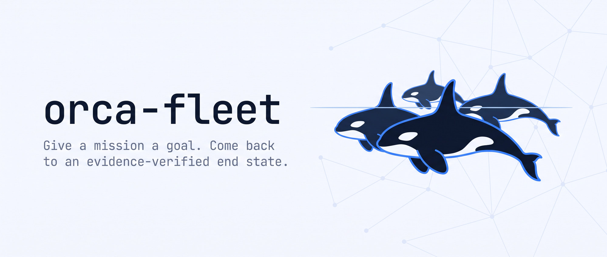
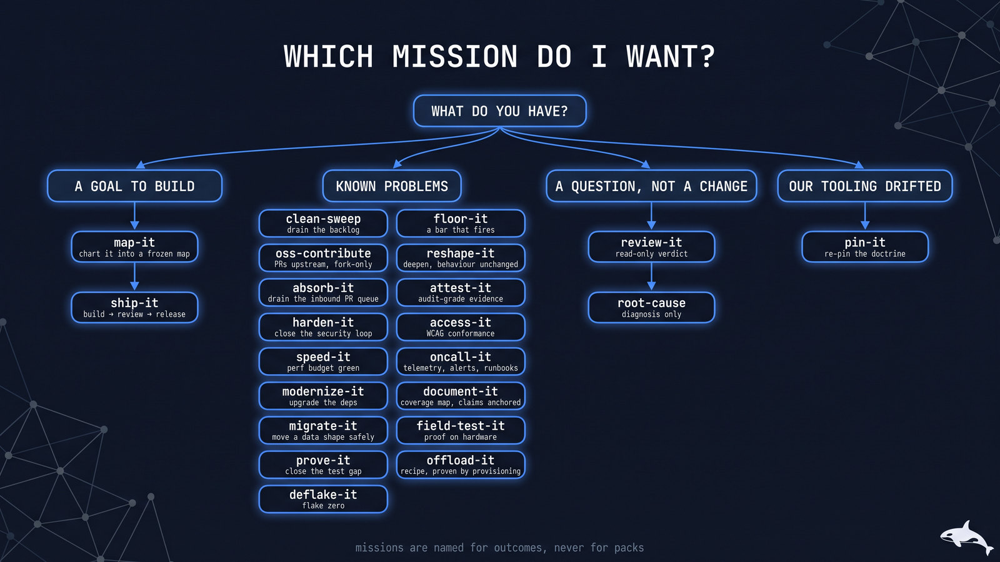
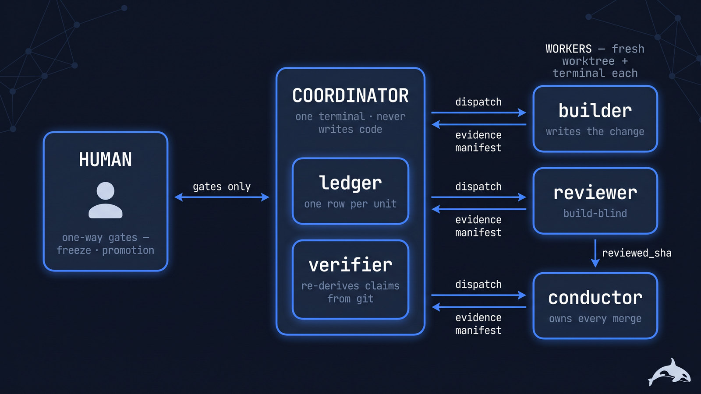
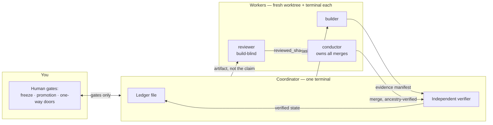
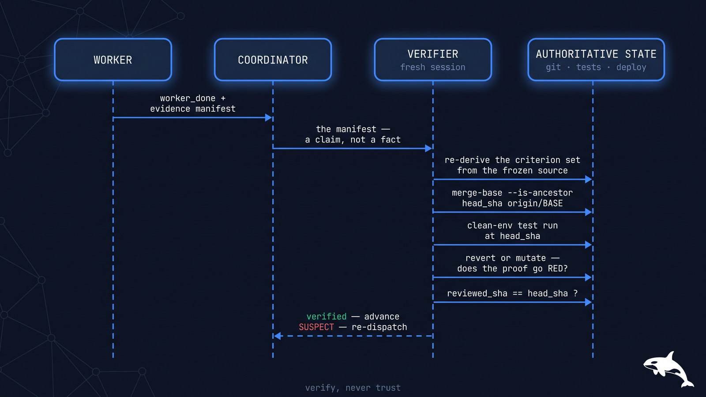
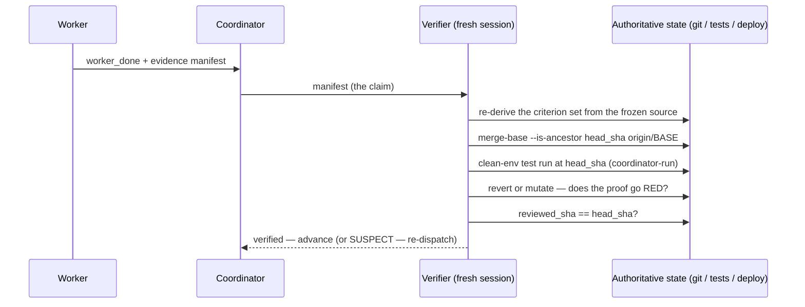
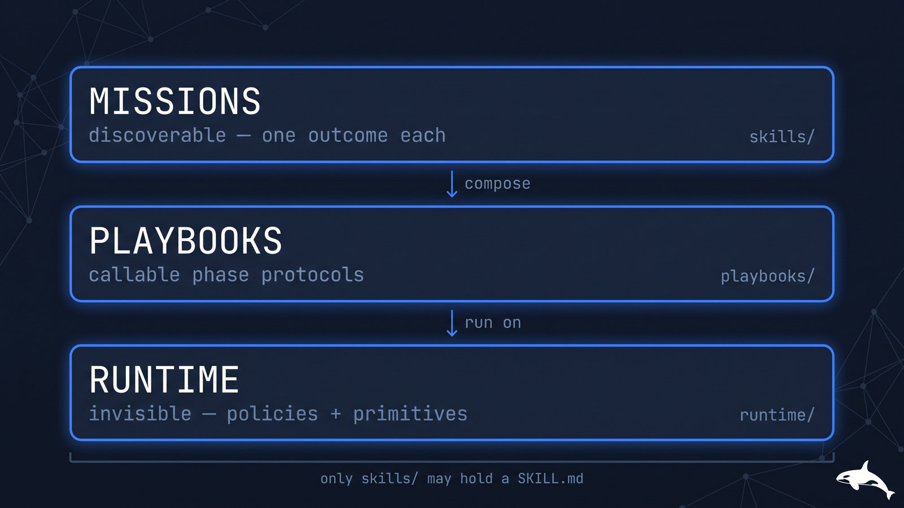

<p align="center">
  <picture>
    <source media="(prefers-color-scheme: dark)" srcset="assets/hero-dark.jpg">
    <source media="(prefers-color-scheme: light)" srcset="assets/hero-light.jpg">
    
  </picture>
</p>

<p align="center">
  <a href="LICENSE"></a>
  <a href="https://agentskills.io/specification"></a>
  <a href="skills/"></a>
  <a href="tests/"></a>
  <a href="CHANGELOG.md"></a>
</p>

<p align="center">
  <b>Give a mission a goal. Come back to an evidence-verified end state.</b><br/>
  <a href="docs/getting-started.md">Getting started</a> ·
  <a href="docs/concepts.md">Concepts</a> ·
  <a href="docs/missions/">Mission guides</a> ·
  <a href="CONTRIBUTING.md">Contributing</a> ·
  <a href="SECURITY.md">Security</a> ·
  <a href="docs/ops.md">Ops</a>
</p>

---

Most agent-skill packs give you better *ingredients* — a sharper TDD loop, a stricter review, a
smarter debugger. A few now ship *outcomes* too: gstack carries a content-hash evidence ledger,
cross-model review, and a Stop gate (one that fails open), and addyosmani/agent-skills a
floor-guard reference implementation — all of it graded inside the run that produced the work,
and no shipped pack executes a negative control. orca-fleet's edge is narrower and harder to
copy: **the claim is checked by mechanism, outside the run that made it.** Each mission is a
complete autonomous fleet for the [Orca](https://github.com/stablyai/orca) runtime — a
coordinator that decomposes a goal, dispatches isolated workers, and stops at a named terminal
state whose claims `verify.py` re-derives from git: the **scope is frozen** against a
coordinator-held digest the worker cannot quietly shrink, the **commits are real** on the
intended base, the **review is looked up on GitHub** and bound to the head tree, and — landing
on this branch — the **negative control is executed** (`--execute-nc` reverts or re-applies the
change in a fresh worktree and requires the proof to go red) for revert and hand controls. The
coordinator's clean-env re-run at the head SHA and its ≥10% re-execution sample of controls
remain doctrine it performs, not mechanism the verifier performs for it. (Report-only missions
like `review-it` bind their claims to the reviewed SHA instead of landing a change to control
against.)

```
 YOU SAY                          THE FLEET RUNS                        YOU GET
┌──────────────────────┐      ┌─────────────────────────────┐      ┌──────────────────────────────┐
│ "ship this"          │ ───▶ │ freeze → build → review     │ ───▶ │ PROMOTION_READY + evidence   │
│ "close every issue"  │ ───▶ │ triage → fix → re-enumerate │ ───▶ │ backlog at zero, SHA-linked  │
│ "harden this"        │ ───▶ │ audit → exploit → re-attack │ ───▶ │ CLEAN re-audit, or named gaps│
│ "why is this flaky"  │ ───▶ │ reproduce → falsify → prove │ ───▶ │ demonstrated root cause      │
└──────────────────────┘      └─────────────────────────────┘      └──────────────────────────────┘
```

No mission is named for a vendor or a technique. There are no `matt-*` or `gstack-*` skills here —
the upstream packs ([mattpocock/skills](https://github.com/mattpocock/skills),
[garrytan/gstack](https://github.com/garrytan/gstack),
[addyosmani/agent-skills](https://github.com/addyosmani/agent-skills)) are sources of *recipes*
that missions compose, one pack per worker, never two in the same context.

## Contents

- [Quick start](#quick-start)
- [The mission catalog](#the-mission-catalog)
- [Which mission do I want?](#which-mission-do-i-want)
- [How a fleet works](#how-a-fleet-works)
- [The evidence protocol](#the-evidence-protocol)
- [Three layers, strictly separated](#three-layers-strictly-separated)
- [Install](#install)
- [Requirements](#requirements)
- [Repository layout](#repository-layout)
- [Validate and test](#validate-and-test)
- [FAQ](#faq)
- [Credits](#credits)

## Quick start

```bash
# 1. Clone
git clone https://github.com/ravidsrk/orca-fleet.git

# 2. Link one mission into Claude Code (link, don't copy — missions reference
#    playbooks/ and runtime/ by relative path)
ln -s "$(pwd)/orca-fleet/skills/ship-it" ~/.claude/skills/ship-it

# 3. A symlink install loads NO plugin, so it gets no completion gate. Wire it:
sh orca-fleet/hooks/print-settings-snippet.sh   # merge the output into ~/.claude/settings.json

# 4. In a repo with the Orca runtime + orchestration skill available:
#    "ship this: <your goal>"   — and approve the freeze when asked.
```

> **Step 3 is not optional if you want the gate.** `hooks/hooks.json` wires the verifier through
> `${CLAUDE_PLUGIN_ROOT}`, which Claude Code sets only for **plugin** installs. A `ln -s` into
> `~/.claude/skills/` loads no plugin, so without the snippet above the missions run with no
> completion gate at all (issue #262). The plugin install below needs nothing extra.

Then read [Getting started](docs/getting-started.md) for the full walkthrough: what the
coordinator does, what the workers do, where the evidence lands, and what the two human gates
look like from your side of the terminal.

## The mission catalog

Every mission is one outcome with its own state machine, its own convergence proof, and an
evidence-based definition of done. Click through for the full guide to each.

| Mission | Outcome (definition of done) | Use when |
|---|---|---|
| 🚢 **[ship-it](docs/missions/ship-it.md)** | Intent or a frozen spec → a released, verified change, stopped at the highest release state you authorized (`BUILT` → `PROMOTION_READY` → `RELEASED` → `DEPLOYED_AND_VERIFIED`) | "build and ship this", spec-to-shipped-product |
| 🧹 **[clean-sweep](docs/missions/clean-sweep.md)** | A finite backlog exhausted to zero, PR-per-finding, every close backed by a merged SHA + a test that failed pre-fix; re-enumerated until dry | "close every issue", "fix everything in this audit", "the README lies" |
| 🛡️ **[harden-it](docs/missions/harden-it.md)** | A threat model closed: audit → exploit → fix → **re-attack the fix** → clean re-audit finds zero unrefuted P0/P1 (or `HARDENED-WITH-OPEN-ITEMS`) | "harden this", "security sweep", "red team" |
| ⚡ **[speed-it](docs/missions/speed-it.md)** | A perf budget met against a pre-declared measurement contract: `WITHIN-BUDGET` or `OPTIMIZED-WITH-PARKED` | "the app is slow", "perf budget", "Core Web Vitals" |
| 📦 **[modernize-it](docs/missions/modernize-it.md)** | Dependency currency via expand/migrate/contract at the code level: `CURRENT` or `CURRENT-WITH-PINNED`, every pin justified | "update the dependencies", "framework migration" |
| 🧪 **[prove-it](docs/missions/prove-it.md)** | A mutation-audited critical surface: `COVERED` or `COVERED-WITH-PARKED`, tests that die when the code is mutated | "close the test gap", "cover the critical paths" |
| 🎯 **[deflake-it](docs/missions/deflake-it.md)** | Flake eradication to a statistical streak, local **and** CI: `STABLE` or `STABLE-WITH-QUARANTINE` | "kill the flaky tests", "deflake the suite" |
| 🔍 **[review-it](docs/missions/review-it.md)** | A trusted, read-only, SHA-bound GO/NO-GO verdict — acceptance always, risk lenses when the diff triggers them. **No fix authority.** | "review this PR", "is this ready to merge" |
| 🗺️ **[map-it](docs/missions/map-it.md)** | A foggy multi-session goal resolved into a frozen execution map `ship-it` can consume — decisions, not deliverables | "chart this", "plan this epic", "I don't know the shape yet" |
| 🔬 **[root-cause](docs/missions/root-cause.md)** | A reproduced symptom and a demonstrated cause: repro-first → falsify rival hypotheses → one survivor, with evidence; optional fix handoff | "diagnose this", "why is this happening" |
| 🤝 **[oss-contribute](docs/missions/oss-contribute.md)** | Upstream issues on a repo you do NOT control, each landed as an open, reviewed, etiquette-correct PR (or a quoted review-assist on an existing PR): `CONTRIBUTED` or `CONTRIBUTED-WITH-PARKED`, merge left to maintainers | "contribute to this project", "open PRs upstream", "we only have a fork" |
| 📋 **[attest-it](docs/missions/attest-it.md)** | Conformance to a frozen standard (EU AI Act Art-12/50, SOC 2, NIST SSDF) proven with independently re-derived, auditor-grade evidence: `CONFORMANT` or `CONFORMANT-WITH-GAPS` (gaps parked to a human/legal owner) | "prove compliance", "conformance", "audit-ready evidence", "SOC 2 / EU AI Act / SSDF" |
| ♿ **[access-it](docs/missions/access-it.md)** | A frozen page/flow set driven to WCAG 2.2 AA (EAA/ADA/508): a deterministic axe-core oracle clean + a revert-to-violation negative control, the ~30–40% automation ceiling parked to a human-AT reviewer: `CONFORMANT` or `CONFORMANT-WITH-MANUAL-PARKED` | "accessibility", "a11y", "WCAG", "screen reader / keyboard" |
| 📌 **[pin-it](docs/missions/pin-it.md)** | Runtime doctrine re-witnessed against the installed binary: every mechanics claim receipted CURRENT, patched with receipts, or removed with an archived refutation — `PINNED` or `PINNED-WITH-PARKED` | "Orca updated", "re-pin the runtime contract", "policy lags practice" |
| 🧱 **[floor-it](docs/missions/floor-it.md)** | A written, numbered quality bar: one tool per frozen dimension, every gate proven RED on an injected violation before it blocks CI, and a guard against bar-lowering diffs — `FLOORED` or `FLOORED-WITH-PARKED` | "set the quality bar", "make CI enforce", "define our standards" |
| 🧬 **[reshape-it](docs/missions/reshape-it.md)** | Confirmed hot modules deepened behind smaller, testable interfaces with behaviour demonstrably unchanged — characterization net pinned before any restructure: `RESHAPED` or `RESHAPED-WITH-PARKED` | "god file", "architecture erosion", "refactor the hot path safely" |
| 📱 **[field-test-it](docs/missions/field-test-it.md)** | On-device reproduce → fix → re-verify at the head SHA with a revert negative control — the ledgered device session is the oracle, never a desktop pass: `FIELD-PROVEN` or `FIELD-PROVEN-WITH-PARKED` | "test on a real device", "works on desktop, breaks on mobile", "emulator QA" |
| 🗄️ **[migrate-it](docs/missions/migrate-it.md)** | A stateful shape change landed across deploys — expand → dual-write → backfill → switch reads → zero readers → contract, each phase deployed and baked, each `down` run, parity probed: `MIGRATED`, `MIGRATED-WITH-PARKED`, or `ABANDONED` | "migrate the database", "rename this column safely", "backfill without downtime" |
| 📟 **[oncall-it](docs/missions/oncall-it.md)** | A frozen path set made operable: every on-call question answered by a quoted signal, symptom alerts test-fired with runbooks, and an induced staging failure named by a source-blind worker: `OPERABLE` or `OPERABLE-WITH-PARKED` | "make this operable", "we were blind during the incident", "add observability" |
| 📥 **[absorb-it](docs/missions/absorb-it.md)** | An inbound PR queue drained: each contribution absorbed with authorship preserved and a RED-on-base / GREEN-on-head receipt, refuted with a reproduction, or parked with a named ask: `ABSORBED` or `ABSORBED-WITH-PARKED` | "drain the PR queue", "absorb these community contributions", "close out the contributor backlog" |
| 📚 **[document-it](docs/missions/document-it.md)** | A public surface covered by quadrant with zero critical gaps, every claim bound to a `file:symbol` or a run and proven by a rename-to-RED control: `DOCUMENTED` or `DOCUMENTED-WITH-PARKED` | "document this project", "the API is undocumented", "docs coverage" |

### Autonomy levels

Each mission's `metadata:` block also carries a validator-enforced `autonomy:` level on Addy Osmani's
L0–L5 ladder ("Agentic Autonomy Levels", addyo.substack.com, 2026-07-03). The ladder is
structural. In the source's own terms, L3 is one agent looping toward a measurable stop
condition; L4 is many agents working in parallel, each on an isolated slice of the task; L5 is a
manager that wakes on triggers, dispatches workers, verifies their output, retries, and
escalates. Every mission here is a coordinator plus parallel isolated workers, so every mission
is **L4** — the read-only and planning ones included: `review-it` fans its axis reviewers out in
parallel and `map-it` its research workers, and the human-owned verdict or plan at the end is a
one-way gate class, not a lower rung. A scheduled unattended run is the L5 shape
([`runtime/mission-scheduling.md`](runtime/mission-scheduling.md)); the derivation is in
[docs/concepts.md](docs/concepts.md#autonomy).

## Proof status — honesty first

Every mission's `metadata:` block carries a validator-enforced `proof:` field: `doctrine-only`,
`self-run`, or `external-run`. A tier cannot be claimed without **artifacts that hash true at a
named commit**: `runtime/scripts/run_report.py` requires a `RUN:` header, an evidence manifest
inside the run's own `docs/runs/<date>-<mission>…/` directory, and an integrity inventory whose
hashes are re-computed from the git objects at the commit the header names. A report that merely
names the mission in its filename no longer advances anything (issue #259).

Be precise about what that buys, because the gate is weaker than "re-derives" would imply and
[`run_report.py`](runtime/scripts/run_report.py) says so in its own docstring: **it hashes, it does
not re-run the verifier.** The 2026-09-11 review fabricated a `map-it` self-run — seven files,
32 lines, one commit, under fifteen minutes — that reported "bound" and passed `validate.py`,
`proof_status.py --check` and the whole suite, because files a worker writes and commits hash true
at the commit that contains them. What the gate really refuses is a tier claimed on a report whose
artifacts were never retained, re-pointed at another mission, or pinned to a commit where the bytes
differ. It does not refuse a tier whose artifacts were manufactured, and re-running the verifier
afterwards would not fix that: the authorities that made the original verdict — the coordinator's
out-of-band contract, a live GitHub review lookup, the worktree as it stood — are gone, so a
"re-derivation" here would be a weaker check wearing the name of a stronger one. Closing this needs
a leg the worker cannot type at all: a coordinator-signed verifier transcript checked against a
committed key ([#281](https://github.com/ravidsrk/orca-fleet/issues/281)), on top of making the
tier cost an actual run ([#286](https://github.com/ravidsrk/orca-fleet/issues/286)).

**No mission clears that bar today.** Four runs really happened; none of them is currently a tier
claim:

- [`clean-sweep`](docs/runs/2026-07-13-clean-sweep-self-run.md) (drained six false doc-claims to
  DRY; a later [tracker run](docs/runs/2026-07-17-clean-sweep-tracker-self-run.md) closed 22 of 26
  issues), [`review-it`](docs/runs/2026-07-13-review-it-external-run.md) (a NO-GO verdict on a real
  gstack PR) and [`oss-contribute`](docs/runs/2026-07-16-oss-contribute-external-run.md) (5 PRs and
  4 review-assist comments on a real upstream repo) retained their artifacts outside this
  repository, so nothing here can re-hash them.
- [`ship-it`](docs/runs/2026-08-28-ship-it-self-run.md) (a slice driven to `PROMOTION_READY`, its
  promotion PR since human-merged) kept its artifacts — all five hashes still re-derive at
  `748b328` — but never wrote down the verifier's command line, which its own template asked for
  verbatim. So its recorded outcome is the coordinator's word.

Each report says so in its own "Evidence binding" section. The catalog reads 21 `doctrine-only`.
That number went *down* as the mechanism got stronger, which is the mechanism working: the
predecessor shipped twelve missions with two proven and paid for it, and a tier whose artifacts
are gone is the same claim in better packaging. The [run archive](docs/runs/) holds the runs; the
[binding gate](runtime/scripts/run_report.py) holds the bar, exercised by `tests/test_run_report.py`
against real git repositories.

Missions can also run as a **gated sequential chain** ("harden-it, then prove-it, then ship-it")
where each link proceeds only on the previous mission's verified terminal state — see
[`runtime/mission-chaining.md`](runtime/mission-chaining.md).

## Which mission do I want?

<p align="center">
  
</p>

<details>
<summary>Diagram source (mermaid)</summary>


```mermaid
flowchart TD
    S([What do you have?]) --> A{A goal to build?}
    A -->|too foggy to spec| MAP[🗺️ map-it<br/>chart it into a frozen map]
    A -->|spec or clear intent| SHIP[🚢 ship-it<br/>build → review → release]
    MAP -->|frozen map| SHIP
    S --> B{A set of known problems?}
    B -->|issues / audit findings / lying docs| SWEEP[🧹 clean-sweep]
    B -->|upstream issues, fork-only access| OSS[🤝 oss-contribute]
    B -->|security posture| HARD[🛡️ harden-it]
    B -->|performance budget| SPEED[⚡ speed-it]
    B -->|outdated dependencies| MOD[📦 modernize-it]
    B -->|untested critical paths| PROVE[🧪 prove-it]
    B -->|flaky suite| FLAKE[🎯 deflake-it]
    B -->|no enforced quality bar| FLOOR[🧱 floor-it<br/>written bar, tools that fire]
    B -->|architecture erosion / god files| RESHAPE[🧬 reshape-it<br/>deepen, behaviour unchanged]
    B -->|compliance evidence| ATTEST[📋 attest-it]
    B -->|accessibility| ACCESS[♿ access-it]
    B -->|breaks on a real device| FIELD[📱 field-test-it<br/>on-device proof]
    B -->|a schema or data shape to move| MIG[🗄️ migrate-it<br/>expand → contract, phase by phase]
    B -->|blind in production| ONCALL[📟 oncall-it<br/>telemetry, alerts, runbooks]
    B -->|an inbound PR queue| ABSORB[📥 absorb-it<br/>land with credit or refute]
    B -->|an undocumented public surface| DOC[📚 document-it<br/>coverage map, claims anchored]
    S --> C{A question, not a change?}
    C -->|is this diff ready to merge| REV[🔍 review-it<br/>read-only verdict]
    C -->|why is this happening| RC[🔬 root-cause<br/>diagnosis only]
    S --> D{our own tooling drifted?}
    D -->|policy lags the Orca binary| PIN[📌 pin-it<br/>re-witness + re-pin doctrine]
```

</details>

Two workflows are the **same mission** only if they share all six of: unit of work, per-unit
state machine, convergence proof, ordering/isolation constraints, parking/failure semantics, and
the oracle the proof binds to — where a different oracle makes a different mission only when it
changes the proof's shape or the parking classes. By that test, closing audit findings, tracker
issues, and false doc-claims are one mission (`clean-sweep`: three sources, one repo-suite
oracle) — but security hardening, perf budgeting, dependency modernization, test-debt proving,
and flake eradication are not; their denominators and proofs differ, so each is its own.

## How a fleet works

Every mission runs the same shape: a **coordinator** that never writes code, and disposable
**workers** that never coordinate.

<p align="center">
  
</p>

<details>
<summary>Diagram source (mermaid)</summary>


```mermaid
flowchart LR
    subgraph you [You]
        H[Human gates:<br/>freeze · promotion · one-way doors]
    end
    subgraph coord [Coordinator — one terminal]
        L[Ledger file]
        V[Independent verifier]
    end
    subgraph workers [Workers — fresh worktree + terminal each]
        W1[builder]
        W2[reviewer<br/>build-blind]
        W3[conductor<br/>owns all merges]
    end
    coord -->|task spec + playbook| W1
    W1 -->|evidence manifest| V
    coord -->|artifact, not the claim| W2
    W2 -->|reviewed_sha| W3
    W3 -->|merge, ancestry-verified| V
    V -->|verified state| L
    H <-->|gates only| coord
```

</details>

The specifics that make this reliable are not abstractions — they are documented runtime
policies preserved exactly because each one paid for itself the hard way:

- **Wrong-base detection.** Every per-unit PR merges into an integration BASE that must not be
  the default branch, compared on canonical refs so `origin/main` can't alias past the guard —
  [`runtime/dispatch-lifecycle.md`](runtime/dispatch-lifecycle.md).
- **Reviewed-SHA freshness.** A review is valid for the exact SHA it reviewed. A rebase, a bot
  autofix, or a late push voids it — [`runtime/reviewed-sha-freshness.md`](runtime/reviewed-sha-freshness.md).
- **One merge train.** A single conductor drains `merge_ready` signals in arrival order; hot
  files form chains, never fan-outs — [`runtime/merge-serialization.md`](runtime/merge-serialization.md).
- **Attention budget.** Scale concurrent builders to verification capacity (default ≤3), not the
  spawn UI — [`runtime/attention-budget.md`](runtime/attention-budget.md).
- **Liveness and resume.** Stalled workers are respawned in fresh terminals with bounded
  attempts and reflection-before-retry; a dead coordinator resumes from the ledger and
  re-verifies every "completed" unit against git before trusting it —
  [`runtime/liveness-resume.md`](runtime/liveness-resume.md).
- **Gates below the model.** Every decision is classified mechanical / taste / one-way; one-way
  doors are always human, never defaulted on timeout. Units default **lit** (a reviewer reads
  the change); `dark-eligible` is opt-in and narrow —
  [`runtime/gate-classification.md`](runtime/gate-classification.md).
- **Least-privilege workers.** `ro` for report-only, `rw` for fix work, `danger` only inside a
  disposable sandbox with an explicit grant — [`runtime/sandbox-policy.md`](runtime/sandbox-policy.md).

The human-readable tour of all of this lives in [docs/concepts.md](docs/concepts.md).

## The evidence protocol

A trace proves an action was *attempted*, not that the resulting state is *correct* — an agent
can run the right-looking commands against the wrong SHA. So completion is never graded on
narration. It is a two-part protocol:

<p align="center">
  
</p>

<details>
<summary>Diagram source (mermaid)</summary>


```mermaid
sequenceDiagram
    participant W as Worker
    participant C as Coordinator
    participant V as Verifier (fresh session)
    participant G as Authoritative state (git / tests / deploy)
    W->>C: worker_done + evidence manifest
    C->>V: manifest (the claim)
    V->>G: re-derive the criterion set from the frozen source
    V->>G: merge-base --is-ancestor head_sha origin/BASE
    V->>G: clean-env test run at head_sha (coordinator-run)
    V->>G: revert or mutate — does the proof go RED?
    V->>G: reviewed_sha == head_sha?
    V-->>C: verified — advance (or SUSPECT — re-dispatch)
```

</details>

The manifest binds every claim to a SHA and an artifact; `verify.py` re-derives what it can
from authoritative state, scope first: the criterion set from `contract.source` at
`contract.digest`, frozen at run start so a worker cannot quietly shrink its own scope and
report a subset as "all"; `head_sha` a real commit that is an ancestor of the integration BASE;
the review looked up on GitHub with `reviewed_sha` — or the reviewed content tree — equal to the
head. A negative control is mandatory for every fix and every test: show the proof fails when
the change is reverted or mutated. The verifier reads the control's artifact and rejects a
"survived" result; landing on this branch, `verify.py --execute-nc` replays revert and hand
controls itself in a fresh worktree at `head_sha` and requires RED, and fail-closes on any other
control tool. Two checks remain doctrine the coordinator performs rather than mechanism the
verifier performs: the clean-env suite run at `head_sha`, and the ≥10% re-execution sample of
controls ([`runtime/evidence-manifest.md`](runtime/evidence-manifest.md) §2). Mutation units
also carry a non-empty **intent packet** (`goal` · `ruled_out` · `why`) and a `lighting` bit
(`lit` by default; `dark-eligible` only for Lane A work with an unfakeable oracle). Full schema:
[`runtime/evidence-manifest.md`](runtime/evidence-manifest.md).

This is the discipline the predecessor's `clean-sweep` and `spec-to-ship` runs taught — encoded
as mechanism where it is mechanism, and named as doctrine where it is still doctrine: **verify,
never trust.**

## Three layers, strictly separated

<p align="center">
  
</p>

> Missions are discoverable. Playbooks are callable. Runtime mechanisms are invisible unless
> directly administered.

Publishing a playbook or a runtime policy as an auto-triggering skill would recreate the exact
routing collisions and ingredient-shaped entry points this repo exists to remove — so only
`skills/` holds a `SKILL.md`, and [`scripts/validate.py`](scripts/validate.py) fails the build if
that breaks. The full design rationale, including the mission-identity test and what counts as a
new mission versus a new playbook, is in **[ARCHITECTURE.md](ARCHITECTURE.md)**.

## Install

<details>
<summary><b>Symlink individual missions (recommended for trying it out)</b></summary>

```bash
git clone https://github.com/ravidsrk/orca-fleet.git
cd orca-fleet

# Link the missions you want — link, don't copy. Missions reference ../../playbooks/
# and ../../runtime/ relative to their own directory; a symlink preserves that, a
# copy breaks it.
ln -s "$(pwd)/skills/ship-it"     ~/.claude/skills/ship-it
ln -s "$(pwd)/skills/clean-sweep" ~/.claude/skills/clean-sweep

# Then wire the completion gate — a symlink install loads no plugin, so
# hooks/hooks.json (which resolves through ${CLAUDE_PLUGIN_ROOT}) never fires.
sh hooks/print-settings-snippet.sh          # merge into ~/.claude/settings.json
sh hooks/print-settings-snippet.sh --check  # confirm the gate script resolves
```

Without that snippet this install has **no completion gate**: missions still run, but nothing
blocks a unit from being marked done on an unverified manifest. See
[docs/verify-gate.md](docs/verify-gate.md#install-paths-and-which-ones-carry-the-gate).

</details>

<details>
<summary><b>Claude Code plugin (whole catalog)</b></summary>

The repo ships a plugin manifest at [`.claude-plugin/plugin.json`](.claude-plugin/plugin.json):

```
/plugin marketplace add ravidsrk/orca-fleet
/plugin install orca-fleet
```

A plugin install copies the whole repo, so the `../../playbooks/` references resolve inside the
plugin directory — and it is the one path where the completion gate wires itself, because
`${CLAUDE_PLUGIN_ROOT}` is set. Nothing else to configure.

</details>

<details>
<summary><b>skills CLI (any agent) — with a caveat</b></summary>

The open [skills CLI](https://github.com/vercel-labs/skills) installs into Claude Code, Cursor,
Codex, and 70+ other agents:

```bash
npx skills add ravidsrk/orca-fleet --list    # browse the catalog
npx skills add ravidsrk/orca-fleet           # install
```

**Copy installers need a bundled tree.** Every mission references `../../playbooks/` and
`../../runtime/` relative to its own directory. An installer that copies skill directories *out*
of the repo tree severs those references — one mission or the whole catalog. Build self-contained
missions first:

```bash
python3 scripts/bundle.py           # writes dist/skills/<name>/ with references/ vendored
python3 scripts/bundle.py --check   # verify no reference escapes a mission directory
```

Each bundled mission carries its own `references/` copies of every protocol it names plus the root
docs it links, with its SKILL.md links rewritten to point there and an index at
`references/README.md`. Install from `dist/` rather than the repo root. `dist/` is generated and
gitignored: committing 21 copies of the doctrine tree would make every runtime edit a 21-file diff
and the copies would rot between edits.

To check an existing copy install instead, confirm `playbooks/` and `runtime/` sit two levels above
the mission:

```bash
ls "$(dirname "$(dirname "$(readlink -f ~/.claude/skills/ship-it 2>/dev/null || echo ~/.claude/skills/ship-it)")")"/playbooks
```

If that fails, the references are broken — bundle, or use the symlink or plugin path above. The
symlink path is verified to preserve them
([`docs/completion/evidence/CF-02-r2-happy-symlink-install.txt`](docs/completion/evidence/CF-02-r2-happy-symlink-install.txt));
the plugin path preserves them by construction — the whole repo is copied — but has no recorded
install transcript yet.

</details>

## Requirements

Every mission has a **hard dependency on companions not published in this repo**:

1. **Orca app** running, orchestration experimental feature enabled  
2. **`orca` CLI** (use `orca-ide` on Linux outside Orca terminals)  
3. **orchestration skill** + **orca-cli skill** installed for the agent host (the public Orca
   skills — worktrees, terminals, task DAG, ask/reply, `worker_done`). orca-fleet is the
   *outcome* layer; those two skills are the *substrate*. Without them, missions cannot dispatch.

Beyond that, each mission declares its own tooling in its `SKILL.md` frontmatter:

| Mission      | Additional tooling                                                        |
|--------------|---------------------------------------------------------------------------|
| all          | `git` + `gh` (or a tracker reachable via `orca linear`)                   |
| harden-it    | `gitleaks`; an ephemeral per-workspace sandbox for exploit PoCs           |
| speed-it     | a real measurement path — Lighthouse/DevTools or a load/profiler harness  |
| modernize-it | the project's package manager + a green CI baseline                       |
| prove-it     | a runnable suite + a coverage tool                                        |
| deflake-it   | a runnable suite; CI history via `gh run list`                            |
| ship-it      | deploy tooling + a canary surface for the release states                  |
| pin-it       | the installed Orca CLI itself (`orca skills get` is the re-witness oracle) |
| floor-it     | the repo's own counters per dimension (coverage runner, scanner, harness, linter) + CI write on BASE |
| reshape-it   | the repo's mutation tooling (or the hand-mutant fallback) + a runnable suite |
| field-test-it | an Orca emulator skill (`orca-emulator` / `orca-emulator-android`) or a paired device; the app's build toolchain |

## Repository layout

```
skills/       missions — the discoverable catalog (one SKILL.md each)
playbooks/    callable phase protocols missions compose by name
runtime/      policies + runtime/scripts/ (spawn_worker, preflight, pm)
docs/         human documentation: getting started, concepts, mission guides
assets/       banners and images
scripts/      validate.py — spec + three-layer + cross-reference validation
tests/        architecture contracts + validator negative-path fixtures (stdlib unittest)
```

## Validate and test

```bash
python3 scripts/validate.py                # agentskills.io spec + three-layer separation
                                           #   + composition/cross-doc reference checks
                                           #   + eval JSON schema checks
python3 scripts/eval.py run --suite all    # mission-routing baseline + per-skill eval count
python3 -m unittest discover -s tests -v   # architecture contract tests + validator
                                           #   negative-path fixtures + eval contracts
```

The validator is deliberately paranoid: every composition reference must resolve, every mission
must expose at least one machine-checkable composition, dangling or typo'd `<name>.md` references
fail the build anywhere in the catalog, every mission must declare an honest `metadata.proof:`
status (with a run report that re-hashes at the commit it names before it can claim one) and all
six identity points, and instruction-budget line caps stop doctrine creep at CI. The contract tests keep the mission catalog, the outcome-naming rule, the
orphan-protocol guarantee, and script interpolation hygiene locked.

## FAQ

<details>
<summary><b>Why outcome names instead of vendor names?</b></summary>

Because "run the Matt pack" is an instruction about ingredients, and you don't want ingredients —
you want the backlog at zero. Vendor-named skills also collide: each upstream pack ships its own
router, and two routers in one context fight over the same trigger phrases. Missions compose the
packs *underneath* (one pack per worker) and keep the user-facing namespace about outcomes.

</details>

<details>
<summary><b>Why not one mega-skill with modes?</b></summary>

Because the missions genuinely differ in unit of work, state machine, convergence proof,
ordering, failure semantics, or the oracle their proof binds to — the six-point
mission-identity test in [ARCHITECTURE.md](ARCHITECTURE.md). A mode flag can't change a
convergence proof. When two workflows *do* share all six, they are one mission: that is why
audit findings, tracker issues, and lying docs are all `clean-sweep`.

</details>

<details>
<summary><b>What stops a worker from just claiming it finished?</b></summary>

Nothing stops the claim — the protocol just refuses to grade it. Completion requires a SHA-bound
evidence manifest, and `verify.py` re-derives the facts from authoritative state: the frozen
scope, ancestry on the base, a negative control that goes red when the fix is reverted (executed
by the verifier itself for revert and hand controls, landing on this branch), and a reviewed
SHA (an APPROVED GitHub review) still equal to the head; the coordinator re-runs the suite at
that SHA in a clean env. See [the evidence protocol](#the-evidence-protocol).

</details>

<details>
<summary><b>Do I need all three upstream packs installed?</b></summary>

Workers draw methodology from the packs, and each mission's `compatibility` field names which
pack(s) its workers load. You need the packs the missions you run actually reference — and never
more than one pack mounted in a single worker.

</details>

<details>
<summary><b>Can a mission touch my default branch?</b></summary>

No. Every fleet works on an integration BASE that is verified to *not* be the default branch
(`runtime/scripts/preflight.py`), and the BASE→default promotion is a one-way human gate. The
fleet opens the promotion PR and stops. If it reports otherwise, that is a bug — file it.

</details>

## Credits

Missions compose recipes from three excellent upstream packs — one router per worker, credit
where it is due:

| Pack | What missions borrow |
|------|----------------------|
| [mattpocock/skills](https://github.com/mattpocock/skills) | grilling, domain modeling, spec/ticket decomposition, TDD seams + tautology guard, feedback-loop-first debugging, two-axis review |
| [addyosmani/agent-skills](https://github.com/addyosmani/agent-skills) | incremental implementation, doubt-driven verification, security/perf/a11y/data-migration specialist lenses, deprecation-and-migration |
| [garrytan/gstack](https://github.com/garrytan/gstack) | review-army dispatch mechanics, ship's release state machine, canary observation, user-challenge governance |

And the substrate everything rides: the [Orca](https://github.com/stablyai/orca) runtime.

## License

MIT — see [LICENSE](LICENSE).
