<p align="center">
  <picture>
    <source media="(prefers-color-scheme: dark)" srcset="assets/hero-dark.jpg">
    <source media="(prefers-color-scheme: light)" srcset="assets/hero-light.jpg">
    
  </picture>
</p>

<p align="center">
  <a href="LICENSE"></a>
  <a href="https://agentskills.io/specification"></a>
  <a href="skills/"></a>
  <a href="tests/"></a>
  <a href="CHANGELOG.md"></a>
</p>

<p align="center">
  <b>Give a mission a goal. Come back to an evidence-verified end state.</b><br/>
  <a href="docs/getting-started.md">Getting started</a> ·
  <a href="docs/concepts.md">Concepts</a> ·
  <a href="docs/missions/">Mission guides</a> ·
  <a href="CONTRIBUTING.md">Contributing</a> ·
  <a href="SECURITY.md">Security</a> ·
  <a href="docs/install.md">Install</a> ·
  <a href="docs/ops.md">Ops</a>
</p>

---

**orca-fleet** is a catalog of missions for the [Orca](https://github.com/stablyai/orca) runtime.
Each mission is a complete autonomous fleet: a coordinator that decomposes a goal, dispatches
isolated workers, and stops at a named end state whose claims an independent verifier re-derives
from git. You give it a goal in plain words. You get back a verified end state, or the exact place
it stopped and why. The vocabulary this page leans on is one line each in the
[glossary](docs/concepts.md#glossary).

<p align="center">
  <picture>
    <source media="(prefers-color-scheme: dark)" srcset="assets/diagrams/you-say.jpg">
    <source media="(prefers-color-scheme: light)" srcset="assets/diagrams/you-say-light.jpg">
    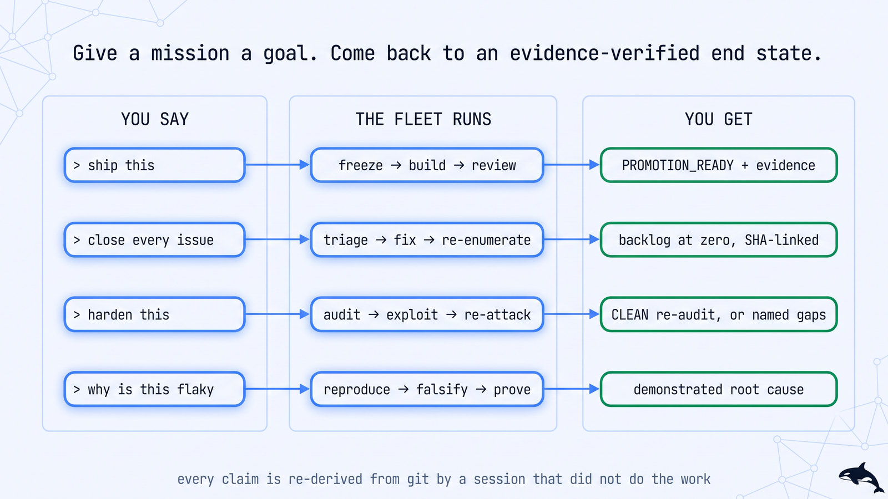
  </picture>
</p>

<details>
<summary>Text version</summary>

```
 YOU SAY                          THE FLEET RUNS                        YOU GET
┌──────────────────────┐      ┌─────────────────────────────┐      ┌──────────────────────────────┐
│ "ship this"          │ ───▶ │ freeze → build → review     │ ───▶ │ PROMOTION_READY + evidence   │
│ "close every issue"  │ ───▶ │ triage → fix → re-enumerate │ ───▶ │ backlog at zero, SHA-linked  │
│ "harden this"        │ ───▶ │ audit → exploit → re-attack │ ───▶ │ CLEAN re-audit, or named gaps│
│ "why is this flaky"  │ ───▶ │ reproduce → falsify → prove │ ───▶ │ demonstrated root cause      │
└──────────────────────┘      └─────────────────────────────┘      └──────────────────────────────┘
```

</details>

What makes it different is not the ingredients. Other packs ship sharper TDD loops, stricter
reviews, evidence ledgers, even completion gates — all graded inside the run that produced the
work. Here **the claim is checked by mechanism, outside the run that made it**: the scope is
frozen against a coordinator-held digest the worker cannot quietly shrink, the commits are real on
the intended base, the review is looked up on GitHub and bound to the head tree, and every fix
carries a negative control the verifier can execute — revert the change in a fresh worktree and
require the proof to go red. What that does and does not prove is spelled out in
[the evidence protocol](#the-evidence-protocol); how it compares with other packs is in the
[positioning snapshot](docs/research/2026-08-28-positioning-and-comparison.md).

No mission is named for a vendor or a technique. The upstream packs
([mattpocock/skills](https://github.com/mattpocock/skills),
[garrytan/gstack](https://github.com/garrytan/gstack),
[addyosmani/agent-skills](https://github.com/addyosmani/agent-skills)) are sources of *recipes*
that missions compose — one pack per worker, never two in the same context
([why](docs/concepts.md#one-router-per-worker)).

## Contents

- [Requirements](#requirements)
- [Quick start](#quick-start)
- [The mission catalog](#the-mission-catalog)
- [Proof status](#proof-status)
- [Which mission do I want?](#which-mission-do-i-want)
- [How a fleet works](#how-a-fleet-works)
- [The evidence protocol](#the-evidence-protocol)
- [Three layers, strictly separated](#three-layers-strictly-separated)
- [Install](#install)
- [Repository layout](#repository-layout)
- [Validate and test](#validate-and-test)
- [FAQ](#faq)
- [Further reading](#further-reading)
- [Credits](#credits)
- [License](#license)

## Requirements

<p align="center">
  <picture>
    <source media="(prefers-color-scheme: dark)" srcset="assets/diagrams/install-stack.jpg">
    <source media="(prefers-color-scheme: light)" srcset="assets/diagrams/install-stack-light.jpg">
    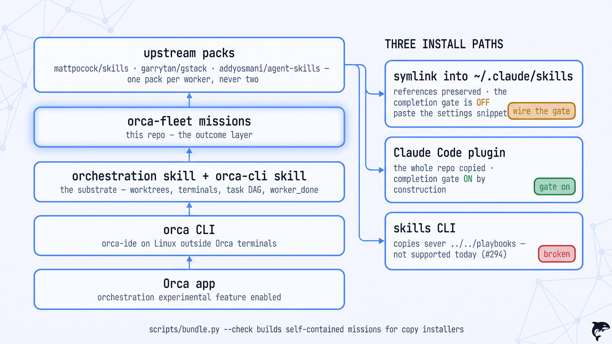
  </picture>
</p>

Every mission has a hard dependency on companions not published in this repo:

1. **The Orca app**, running, with the orchestration experimental feature enabled.
2. **The `orca` CLI** (`orca-ide` on Linux outside Orca terminals).
3. **Orca's two public skills, `orchestration` and `orca-cli`**, installed for the agent host —
   they provide the worktrees, terminals, task DAG, ask/reply and `worker_done` primitives.
   orca-fleet is the *outcome* layer; those two are the *substrate*, and without them no mission
   can dispatch.
4. **`git` and `gh`**, authenticated — or a tracker reachable via `orca linear`.
5. **Python 3.13** for the catalog gates and the runtime scripts; stdlib only.

Each mission declares any extra tooling in its `SKILL.md` frontmatter; the per-mission list lives
in [Getting started](docs/getting-started.md#prerequisites).

## Quick start

```bash
# 1. Clone
git clone https://github.com/ravidsrk/orca-fleet.git
cd orca-fleet

# 2. Link one mission into Claude Code — link, don't copy. A mission names its
#    playbooks and runtime policies by bare name and finds them in playbooks/ and
#    runtime/ two levels above its own directory; a symlink keeps that tree intact.
mkdir -p ~/.claude/skills
ln -s "$(pwd)/skills/ship-it" ~/.claude/skills/ship-it

# 3. A symlink install loads NO plugin, so nothing fires the completion gate. Wire it:
sh hooks/print-settings-snippet.sh   # merge the output into ~/.claude/settings.json

# 4. Open a Claude Code session in the repository you want worked on (Orca app
#    running, both Orca skills installed) and type:
#    "ship this: <your goal>"   — then approve the freeze when asked.
```

> **Step 3 is not optional if you want the gate.** `hooks/hooks.json` wires the verifier through
> `${CLAUDE_PLUGIN_ROOT}`, which Claude Code sets only for **plugin** installs. A `ln -s` into
> `~/.claude/skills/` loads no plugin, so without the snippet above the missions run with no
> completion gate at all ([#262](https://github.com/ravidsrk/orca-fleet/issues/262)). The plugin
> install needs nothing extra.

[Getting started](docs/getting-started.md) walks a first run end to end: what the coordinator
does, what the workers do, where the evidence lands, and what the two human gates look like from
your side of the terminal. [Install](docs/install.md) covers every install path and which ones
carry the gate.

## The mission catalog

Every mission is one outcome with its own state machine, its own convergence proof, and an
evidence-based definition of done. Click through for the full guide to each.

| Mission | Outcome (definition of done) | Use when |
|---|---|---|
| 🚢 **[ship-it](docs/missions/ship-it.md)** | Intent or a frozen spec → a released, verified change, stopped at the highest release state you authorized (`BUILT` → `PROMOTION_READY` → `RELEASED` → `DEPLOYED_AND_VERIFIED`) | "build and ship this", spec-to-shipped-product |
| 🧹 **[clean-sweep](docs/missions/clean-sweep.md)** | A finite backlog exhausted to zero, PR-per-finding, every close backed by a merged SHA + a test that failed pre-fix; re-enumerated until dry | "close every issue", "fix everything in this audit", "the README lies" |
| 🛡️ **[harden-it](docs/missions/harden-it.md)** | A threat model closed: audit → exploit → fix → **re-attack the fix** → clean re-audit finds zero unrefuted P0/P1 (or `HARDENED-WITH-OPEN-ITEMS`) | "harden this", "security sweep", "red team" |
| ⚡ **[speed-it](docs/missions/speed-it.md)** | A perf budget met against a pre-declared measurement contract: `WITHIN-BUDGET` or `OPTIMIZED-WITH-PARKED` | "the app is slow", "perf budget", "Core Web Vitals" |
| 📦 **[modernize-it](docs/missions/modernize-it.md)** | Dependency currency via expand/migrate/contract at the code level: `CURRENT` or `CURRENT-WITH-PINNED`, every pin justified | "update the dependencies", "framework migration" |
| 🧪 **[prove-it](docs/missions/prove-it.md)** | A mutation-audited critical surface: `COVERED` or `COVERED-WITH-PARKED`, tests that die when the code is mutated | "close the test gap", "cover the critical paths" |
| 🎯 **[deflake-it](docs/missions/deflake-it.md)** | Flake eradication to a statistical streak, local **and** CI: `STABLE` or `STABLE-WITH-QUARANTINE` | "kill the flaky tests", "deflake the suite" |
| 🔍 **[review-it](docs/missions/review-it.md)** | A trusted, read-only, SHA-bound GO/NO-GO verdict — acceptance always, risk lenses when the diff triggers them. **No fix authority.** | "review this PR", "is this ready to merge" |
| 🗺️ **[map-it](docs/missions/map-it.md)** | A foggy multi-session goal resolved into a frozen execution map `ship-it` can consume — decisions, not deliverables | "chart this", "plan this epic", "I don't know the shape yet" |
| 🔬 **[root-cause](docs/missions/root-cause.md)** | A reproduced symptom and a demonstrated cause: repro-first → falsify rival hypotheses → one survivor, with evidence; optional fix handoff | "diagnose this", "why is this happening" |
| 🤝 **[oss-contribute](docs/missions/oss-contribute.md)** | Upstream issues on a repo you do NOT control, each landed as an open, reviewed, etiquette-correct PR (or a quoted review-assist on an existing PR): `CONTRIBUTED` or `CONTRIBUTED-WITH-PARKED`, merge left to maintainers | "contribute to this project", "open PRs upstream", "we only have a fork" |
| 📋 **[attest-it](docs/missions/attest-it.md)** | Conformance to a frozen standard (EU AI Act Art-12/50, SOC 2, NIST SSDF) proven with independently re-derived, auditor-grade evidence: `CONFORMANT` or `CONFORMANT-WITH-GAPS` (gaps parked to a human/legal owner) | "prove compliance", "conformance", "audit-ready evidence", "SOC 2 / EU AI Act / SSDF" |
| ♿ **[access-it](docs/missions/access-it.md)** | A frozen page/flow set driven to WCAG 2.2 AA (EAA/ADA/508): a deterministic axe-core oracle clean + a revert-to-violation negative control, the ~30–40% automation ceiling parked to a human-AT reviewer: `CONFORMANT` or `CONFORMANT-WITH-MANUAL-PARKED` | "accessibility", "a11y", "WCAG", "screen reader / keyboard" |
| 📌 **[pin-it](docs/missions/pin-it.md)** | Runtime doctrine re-witnessed against the installed binary: every mechanics claim receipted CURRENT, patched with receipts, or removed with an archived refutation — `PINNED` or `PINNED-WITH-PARKED` | "Orca updated", "re-pin the runtime contract", "policy lags practice" |
| 🧱 **[floor-it](docs/missions/floor-it.md)** | A written, numbered quality bar: one tool per frozen dimension, every gate proven RED on an injected violation before it blocks CI, and a guard against bar-lowering diffs — `FLOORED` or `FLOORED-WITH-PARKED` | "set the quality bar", "make CI enforce", "define our standards" |
| 🧬 **[reshape-it](docs/missions/reshape-it.md)** | Confirmed hot modules deepened behind smaller, testable interfaces with behaviour demonstrably unchanged — characterization net pinned before any restructure: `RESHAPED` or `RESHAPED-WITH-PARKED` | "god file", "architecture erosion", "refactor the hot path safely" |
| 📱 **[field-test-it](docs/missions/field-test-it.md)** | On-device reproduce → fix → re-verify at the head SHA with a revert negative control — the ledgered device session is the oracle, never a desktop pass: `FIELD-PROVEN` or `FIELD-PROVEN-WITH-PARKED` | "test on a real device", "works on desktop, breaks on mobile", "emulator QA" |
| 🗄️ **[migrate-it](docs/missions/migrate-it.md)** | A stateful shape change landed across deploys — expand → dual-write → backfill → switch reads → zero readers → contract, each phase deployed and baked, each `down` run, parity probed: `MIGRATED`, `MIGRATED-WITH-PARKED`, or `ABANDONED` | "migrate the database", "rename this column safely", "backfill without downtime" |
| 📟 **[oncall-it](docs/missions/oncall-it.md)** | A frozen path set made operable: every on-call question answered by a quoted signal, symptom alerts test-fired with runbooks, and an induced staging failure named by a source-blind worker: `OPERABLE` or `OPERABLE-WITH-PARKED` | "make this operable", "we were blind during the incident", "add observability" |
| 📥 **[absorb-it](docs/missions/absorb-it.md)** | An inbound PR queue drained: each contribution absorbed with authorship preserved and a RED-on-base / GREEN-on-head receipt, refuted with a reproduction, or parked with a named ask: `ABSORBED` or `ABSORBED-WITH-PARKED` | "drain the PR queue", "absorb these community contributions", "close out the contributor backlog" |
| 📚 **[document-it](docs/missions/document-it.md)** | A public surface covered by quadrant with zero critical gaps, every claim bound to a `file:symbol` or a run and proven by a rename-to-RED control: `DOCUMENTED` or `DOCUMENTED-WITH-PARKED` | "document this project", "the API is undocumented", "docs coverage" |

Every mission is a coordinator plus parallel isolated workers, which is level L4 on Addy Osmani's
autonomy ladder; a scheduled unattended run is the L5 shape. The derivation is in
[docs/concepts.md](docs/concepts.md#autonomy). Missions can also run as a gated sequential chain
("harden-it, then prove-it, then ship-it") where each link proceeds only on the previous mission's
verified terminal state — see [`runtime/mission-chaining.md`](runtime/mission-chaining.md).

## Proof status

<p align="center">
  <picture>
    <source media="(prefers-color-scheme: dark)" srcset="assets/diagrams/proof-ladder.jpg">
    <source media="(prefers-color-scheme: light)" srcset="assets/diagrams/proof-ladder-light.jpg">
    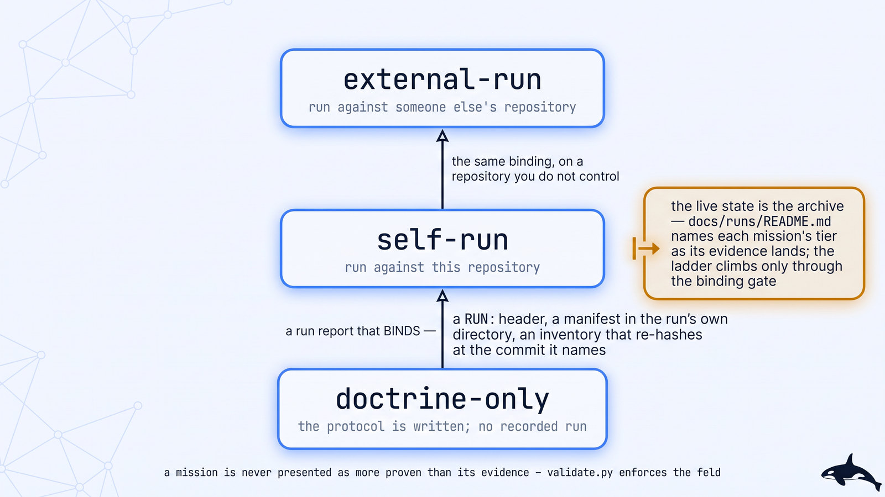
  </picture>
</p>

Every mission's `metadata:` block carries a validator-enforced `proof:` field: `doctrine-only`,
`self-run`, or `external-run`. A tier cannot be claimed without a run report that binds: a `RUN:`
header, an evidence manifest inside the run's own `docs/runs/` directory, and an integrity
inventory that re-hashes at the commit the header names. **Today every mission reads
`doctrine-only`.** The [run archive](docs/runs/) records every run that really happened and says,
per run, why it does not bind. The gate hashes but does not re-run the verifier, and
[the 2026-09-11 review](REVIEW.md) showed that a fabricated run can pass it; closing that is
[#281](https://github.com/ravidsrk/orca-fleet/issues/281) and
[#286](https://github.com/ravidsrk/orca-fleet/issues/286). Why the number went *down* as the
mechanism got stronger is explained in [docs/concepts.md](docs/concepts.md#proof-status).

## Which mission do I want?

<p align="center">
  <picture>
    <source media="(prefers-color-scheme: dark)" srcset="assets/diagrams/mission-map.jpg">
    <source media="(prefers-color-scheme: light)" srcset="assets/diagrams/mission-map-light.jpg">
    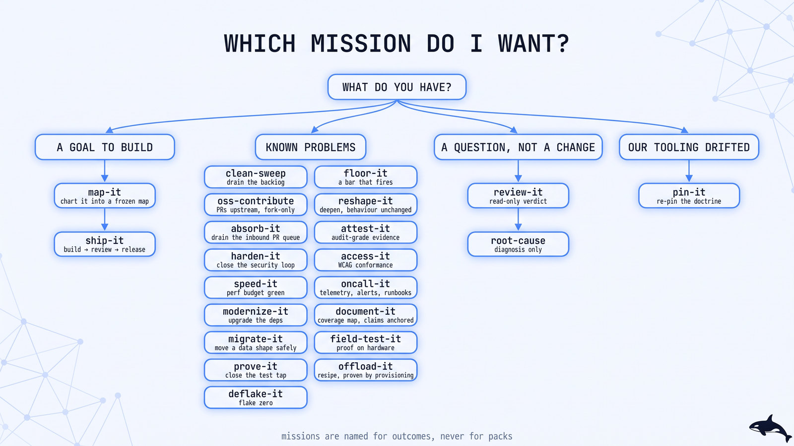
  </picture>
</p>

<details>
<summary>Diagram source (mermaid)</summary>


```mermaid
flowchart TD
    S([What do you have?]) --> A{A goal to build?}
    A -->|too foggy to spec| MAP[🗺️ map-it<br/>chart it into a frozen map]
    A -->|spec or clear intent| SHIP[🚢 ship-it<br/>build → review → release]
    MAP -->|frozen map| SHIP
    S --> B{A set of known problems?}
    B -->|issues / audit findings / lying docs| SWEEP[🧹 clean-sweep]
    B -->|upstream issues, fork-only access| OSS[🤝 oss-contribute]
    B -->|security posture| HARD[🛡️ harden-it]
    B -->|performance budget| SPEED[⚡ speed-it]
    B -->|outdated dependencies| MOD[📦 modernize-it]
    B -->|untested critical paths| PROVE[🧪 prove-it]
    B -->|flaky suite| FLAKE[🎯 deflake-it]
    B -->|no enforced quality bar| FLOOR[🧱 floor-it<br/>written bar, tools that fire]
    B -->|architecture erosion / god files| RESHAPE[🧬 reshape-it<br/>deepen, behaviour unchanged]
    B -->|compliance evidence| ATTEST[📋 attest-it]
    B -->|accessibility| ACCESS[♿ access-it]
    B -->|breaks on a real device| FIELD[📱 field-test-it<br/>on-device proof]
    B -->|a schema or data shape to move| MIG[🗄️ migrate-it<br/>expand → contract, phase by phase]
    B -->|blind in production| ONCALL[📟 oncall-it<br/>telemetry, alerts, runbooks]
    B -->|an inbound PR queue| ABSORB[📥 absorb-it<br/>land with credit or refute]
    B -->|an undocumented public surface| DOC[📚 document-it<br/>coverage map, claims anchored]
    S --> C{A question, not a change?}
    C -->|is this diff ready to merge| REV[🔍 review-it<br/>read-only verdict]
    C -->|why is this happening| RC[🔬 root-cause<br/>diagnosis only]
    S --> D{our own tooling drifted?}
    D -->|policy lags the Orca binary| PIN[📌 pin-it<br/>re-witness + re-pin doctrine]
```

</details>

Missions also hand work to one another, each handoff a separately authorized run:

<p align="center">
  <picture>
    <source media="(prefers-color-scheme: dark)" srcset="assets/diagrams/mission-handoffs.jpg">
    <source media="(prefers-color-scheme: light)" srcset="assets/diagrams/mission-handoffs-light.jpg">
    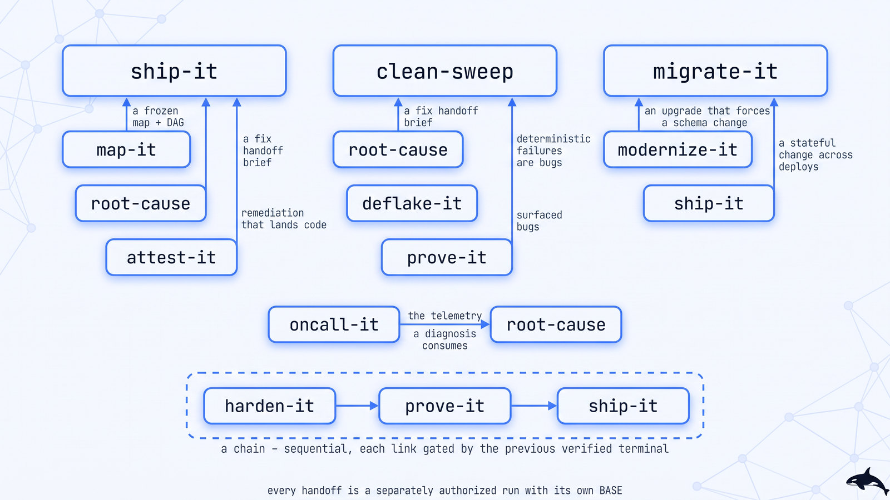
  </picture>
</p>

Two workflows are the same mission only if they share all six identity points: unit of work,
per-unit state machine, convergence proof, ordering and isolation, parking semantics, and the
oracle the proof binds to. That test — and why closing audit findings, tracker issues and lying
docs are one mission while security, performance, dependencies, test debt and flakes are each
their own — is in [ARCHITECTURE.md](ARCHITECTURE.md#what-makes-a-mission-a-mission-not-a-mode-of-another).

## How a fleet works

Every mission runs the same shape: a **coordinator** that never writes code, and disposable
**workers** that never coordinate.

<p align="center">
  <picture>
    <source media="(prefers-color-scheme: dark)" srcset="assets/diagrams/fleet-topology.jpg">
    <source media="(prefers-color-scheme: light)" srcset="assets/diagrams/fleet-topology-light.jpg">
    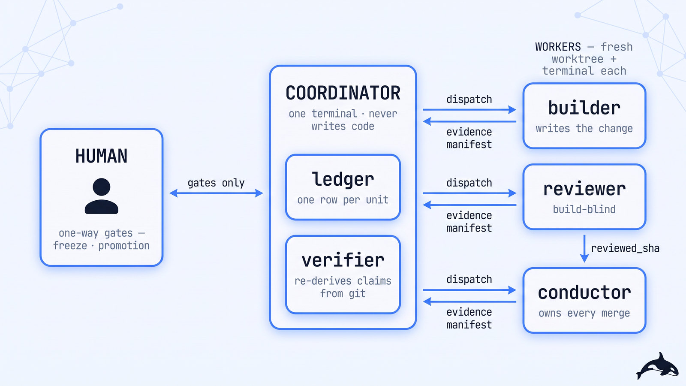
  </picture>
</p>

<details>
<summary>Diagram source (mermaid)</summary>

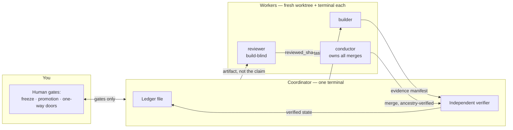
```mermaid
flowchart LR
    subgraph you [You]
        H[Human gates:<br/>freeze · promotion · one-way doors]
    end
    subgraph coord [Coordinator — one terminal]
        L[Ledger file]
        V[Independent verifier]
    end
    subgraph workers [Workers — fresh worktree + terminal each]
        W1[builder]
        W2[reviewer<br/>build-blind]
        W3[conductor<br/>owns all merges]
    end
    coord -->|task spec + playbook| W1
    W1 -->|evidence manifest| V
    coord -->|artifact, not the claim| W2
    W2 -->|reviewed_sha| W3
    W3 -->|merge, ancestry-verified| V
    V -->|verified state| L
    H <-->|gates only| coord
```

</details>

The specifics that make this reliable are documented runtime policies, each preserved because it
paid for itself the hard way:

- **Wrong-base detection.** Every per-unit PR merges into an integration BASE that must not be
  the default branch, compared on canonical refs so `origin/main` can't alias past the guard —
  [`runtime/dispatch-lifecycle.md`](runtime/dispatch-lifecycle.md).
- **Reviewed-SHA freshness.** A review is valid for the exact SHA it reviewed. A rebase, a bot
  autofix, or a late push voids it — [`runtime/reviewed-sha-freshness.md`](runtime/reviewed-sha-freshness.md).
- **One merge train.** A single conductor drains `merge_ready` signals in arrival order; hot
  files form chains, never fan-outs — [`runtime/merge-serialization.md`](runtime/merge-serialization.md).
- **Attention budget.** Scale concurrent builders to verification capacity (default ≤3), not the
  spawn UI — [`runtime/attention-budget.md`](runtime/attention-budget.md).
- **Liveness and resume.** Stalled workers are respawned in fresh terminals with bounded
  attempts and reflection-before-retry; a dead coordinator resumes from the ledger and
  re-verifies every "completed" unit against git before trusting it —
  [`runtime/liveness-resume.md`](runtime/liveness-resume.md).
- **Gates below the model.** Every decision is classified mechanical / taste / one-way; one-way
  doors are always human, never defaulted on timeout. Units default **lit** (a reviewer reads
  the change); `dark-eligible` is opt-in and narrow —
  [`runtime/gate-classification.md`](runtime/gate-classification.md).
- **Least-privilege workers.** `ro` for report-only, `rw` for fix work, `danger` only inside a
  disposable sandbox with an explicit grant — [`runtime/sandbox-policy.md`](runtime/sandbox-policy.md).

The human-readable tour of all of this lives in [docs/concepts.md](docs/concepts.md).

## The evidence protocol

A trace proves an action was *attempted*, not that the resulting state is *correct* — an agent
can run the right-looking commands against the wrong SHA. So completion is never graded on
narration. Every unit emits a SHA-bound evidence manifest, and a fresh session re-derives its
claims from authoritative state:

<p align="center">
  <picture>
    <source media="(prefers-color-scheme: dark)" srcset="assets/diagrams/evidence-protocol.jpg">
    <source media="(prefers-color-scheme: light)" srcset="assets/diagrams/evidence-protocol-light.jpg">
    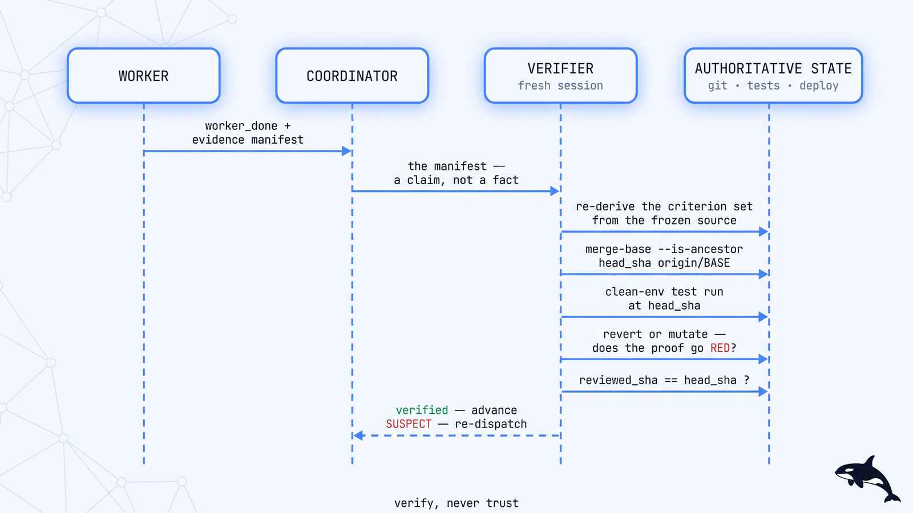
  </picture>
</p>

<details>
<summary>Diagram source (mermaid)</summary>

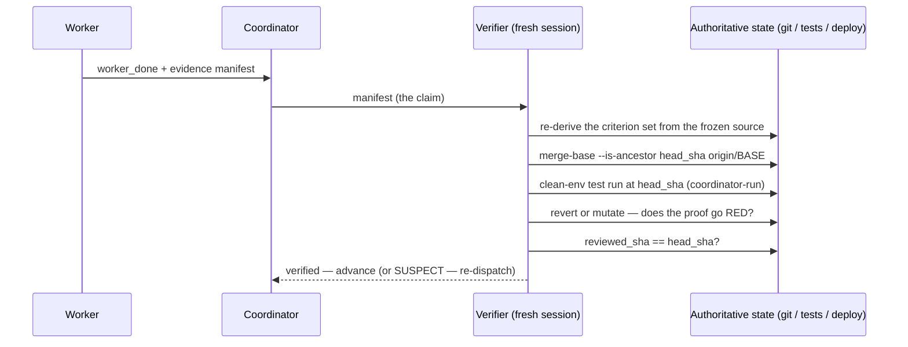
```mermaid
sequenceDiagram
    participant W as Worker
    participant C as Coordinator
    participant V as Verifier (fresh session)
    participant G as Authoritative state (git / tests / deploy)
    W->>C: worker_done + evidence manifest
    C->>V: manifest (the claim)
    V->>G: re-derive the criterion set from the frozen source
    V->>G: merge-base --is-ancestor head_sha origin/BASE
    V->>G: clean-env test run at head_sha (coordinator-run)
    V->>G: revert or mutate — does the proof go RED?
    V->>G: reviewed_sha == head_sha?
    V-->>C: verified — advance (or SUSPECT — re-dispatch)
```

</details>

The difference that matters is checkable. On the same gamed manifest a self-scoring gate goes
GREEN and the verifier goes RED, reproducibly
([demo/negative-control/](demo/negative-control/README.md)):

<p align="center">
  <picture>
    <source media="(prefers-color-scheme: dark)" srcset="assets/diagrams/negative-control.jpg">
    <source media="(prefers-color-scheme: light)" srcset="assets/diagrams/negative-control-light.jpg">
    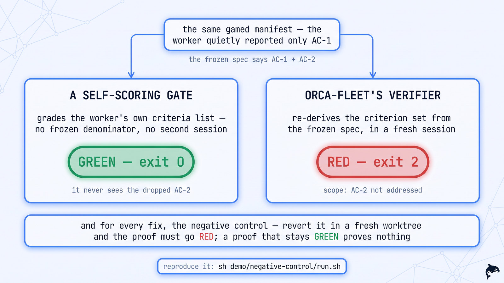
  </picture>
</p>

`verify.py` checks scope first — the criterion set re-derived from the frozen contract, so a
worker cannot shrink its own denominator — then that `head_sha` is a real ancestor of the
integration BASE, then the review on GitHub bound to the head, then the negative control: read by
default, executed in a throwaway worktree when the coordinator passes `--execute-nc` and names the
command with `--nc-command`. Two checks stay doctrine the coordinator performs rather than
mechanism the verifier performs: the clean-environment suite run at `head_sha`, and the ≥10%
re-execution sample of controls. The manifest schema and the full checks table are in
[docs/concepts.md](docs/concepts.md#independent-verification) and
[`runtime/evidence-manifest.md`](runtime/evidence-manifest.md); the hook that turns the verifier
into a completion gate is in [docs/verify-gate.md](docs/verify-gate.md). **Verify, never trust.**

## Three layers, strictly separated

<p align="center">
  <picture>
    <source media="(prefers-color-scheme: dark)" srcset="assets/diagrams/three-layers.jpg">
    <source media="(prefers-color-scheme: light)" srcset="assets/diagrams/three-layers-light.jpg">
    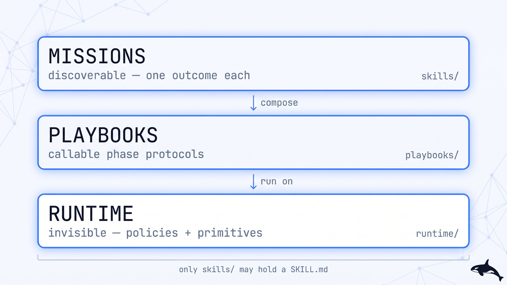
  </picture>
</p>

> Missions are discoverable. Playbooks are callable. Runtime mechanisms are invisible unless
> directly administered.

Only `skills/` holds a `SKILL.md`, and [`scripts/validate.py`](scripts/validate.py) fails the
build if that breaks: publishing a playbook or a runtime policy as an auto-triggering skill would
recreate the routing collisions this repo exists to remove. The design rationale, including what
counts as a new mission versus a new playbook, is in [ARCHITECTURE.md](ARCHITECTURE.md).

## Install

Two paths work today and a third does not yet; each is walked step by step in
[docs/install.md](docs/install.md).

- **Symlink individual missions** (recommended while evaluating): the Quick start above, one
  `ln -s` per mission, then wire the completion gate with `sh hooks/print-settings-snippet.sh`.
- **Claude Code plugin** (whole catalog): `/plugin marketplace add ravidsrk/orca-fleet`, then
  `/plugin install orca-fleet`. The gate wires itself.
- **skills CLI**: not from this repository, today. A copy installer severs the tree a mission
  resolves its playbooks against; what would fix it is a published `dist/` for the CLI to point
  at ([#294](https://github.com/ravidsrk/orca-fleet/issues/294)), and
  `python3 scripts/bundle.py --check` already builds that self-contained tree.

## Repository layout

```
skills/          missions — the discoverable catalog (one SKILL.md each)
playbooks/       callable phase protocols missions compose by name
runtime/         policies + runtime/scripts/ (verify, verify-gate, preflight, spawn_worker, pm, …)
hooks/           hooks.json — the native completion-gate wiring
scripts/         validate.py, gen-badges.py, eval.py, bundle.py
tests/           architecture contracts + validator negative-path fixtures (stdlib unittest)
evals/           routing eval fixtures
bench/           vf-bench — verifier-soundness benchmark
demo/            negative-control head-to-head
docs/            getting started, concepts, install, mission guides, run archive, research
assets/          banners, diagrams (dark + light), generated badges, and the image generator
.claude-plugin/  plugin.json — the Claude Code plugin manifest
```

## Validate and test

```bash
python3 scripts/validate.py                # agentskills.io spec + three-layer separation
                                           #   + composition/cross-doc reference checks
                                           #   + eval JSON schema checks
python3 scripts/eval.py run --suite all    # mission-routing baseline + per-skill eval count
python3 -m unittest discover -s tests -v   # architecture contract tests + validator
                                           #   negative-path fixtures + eval contracts
```

The validator is deliberately paranoid: every composition reference must resolve, every mission
must expose at least one machine-checkable composition, dangling or typo'd `<name>.md` references
fail the build anywhere in the catalog, every mission must declare an honest `metadata.proof:`
status (with a run report that re-hashes at the commit it names before it can claim one) and all
six identity points, and instruction-budget line caps stop doctrine creep at CI. The contract tests keep the mission catalog, the outcome-naming rule, the
orphan-protocol guarantee, and script interpolation hygiene locked.

## FAQ

<details>
<summary><b>Why outcome names instead of vendor names?</b></summary>

Because "run the Matt pack" is an instruction about ingredients, and you don't want ingredients —
you want the backlog at zero. Vendor-named skills also collide: each upstream pack ships its own
router, and two routers in one context fight over the same trigger phrases. Missions compose the
packs *underneath* (one pack per worker) and keep the user-facing namespace about outcomes.

</details>

<details>
<summary><b>Why not one mega-skill with modes?</b></summary>

Because the missions genuinely differ in unit of work, state machine, convergence proof,
ordering, failure semantics, or the oracle their proof binds to — the six-point
mission-identity test in [ARCHITECTURE.md](ARCHITECTURE.md). A mode flag can't change a
convergence proof. When two workflows *do* share all six, they are one mission: that is why
audit findings, tracker issues, and lying docs are all `clean-sweep`.

</details>

<details>
<summary><b>What stops a worker from just claiming it finished?</b></summary>

Nothing stops the claim — the protocol just refuses to grade it. Completion requires a SHA-bound
evidence manifest, and `verify.py` re-derives the facts from authoritative state: the frozen
scope, ancestry on the base, a negative control that goes red when the fix is reverted (executed
by the verifier itself for revert and hand controls when the coordinator passes `--execute-nc`), and a reviewed
SHA (an APPROVED GitHub review) still equal to the head; the coordinator re-runs the suite at
that SHA in a clean env. See [the evidence protocol](#the-evidence-protocol).

</details>

<details>
<summary><b>Do I need all three upstream packs installed?</b></summary>

Workers draw methodology from the packs, and each mission's `compatibility` field names which
pack(s) its workers load. You need the packs the missions you run actually reference — and never
more than one pack mounted in a single worker.

</details>

<details>
<summary><b>Can a mission touch my default branch?</b></summary>

By doctrine, no — and the honest answer is that the doctrine is not yet fully backed by a
mechanism. Every fleet works on an integration BASE that `runtime/scripts/preflight.py` verifies is
*not* the default branch, and the BASE → default promotion is a one-way human gate: the fleet opens
the promotion PR and stops. But `preflight.py` is invoked by a sentence in each mission rather than
by anything that refuses to proceed without it, and `deny-hook.sh`, written to refuse a push to the
default branch, is unregistered by construction ([#284](https://github.com/ravidsrk/orca-fleet/issues/284)).
If a fleet touches your default branch, that is a bug — file it. The full trust boundary is in
[docs/verify-gate.md](docs/verify-gate.md#trust-boundary).

</details>

## Further reading

- [ARCHITECTURE.md](ARCHITECTURE.md) — the three-layer design, the mission-identity test, and the
  proof-over-doctrine guards.
- [docs/install.md](docs/install.md) — every install path and which ones carry the completion gate.
- [docs/verify-gate.md](docs/verify-gate.md) — the verifier as a native completion gate, its env
  surface, and its trust boundary.
- [Anatomy of a run](docs/guides/anatomy-of-a-run.md) — one real run, hour by hour, incidents
  included.
- [docs/platform-ride.md](docs/platform-ride.md) — what to ride from Claude Code, the Agent SDK
  and MCP, and the absorption-risk register.
- [docs/distribution.md](docs/distribution.md) — install paths, indexers, and what the proof
  records establish.
- [docs/compliance-provenance.md](docs/compliance-provenance.md) — the manifest's provenance block
  against the EU AI Act's logging obligations.
- [docs/research/](docs/research/README.md) — dated research snapshots and the ledger of rejected
  mission candidates.
- [REVIEW.md](REVIEW.md) — the 2026-09-11 review; the earlier one is
  [docs/reviews/2026-09-10-review.md](docs/reviews/2026-09-10-review.md).
- [AGENTS.md](AGENTS.md) — the agent-facing summary of this page; [docs/about.md](docs/about.md) —
  the canonical repository description; [docs/ops.md](docs/ops.md) — maintainer ops.

## Credits

Missions compose recipes from three excellent upstream packs — one router per worker, credit
where it is due:

| Pack | What missions borrow |
|------|----------------------|
| [mattpocock/skills](https://github.com/mattpocock/skills) | grilling, domain modeling, spec/ticket decomposition, TDD seams + tautology guard, feedback-loop-first debugging, two-axis review |
| [addyosmani/agent-skills](https://github.com/addyosmani/agent-skills) | incremental implementation, doubt-driven verification, security/perf/a11y/data-migration specialist lenses, deprecation-and-migration |
| [garrytan/gstack](https://github.com/garrytan/gstack) | review-army dispatch mechanics, ship's release state machine, canary observation, user-challenge governance |

And the substrate everything rides: the [Orca](https://github.com/stablyai/orca) runtime.

## License

MIT — see [LICENSE](LICENSE).

