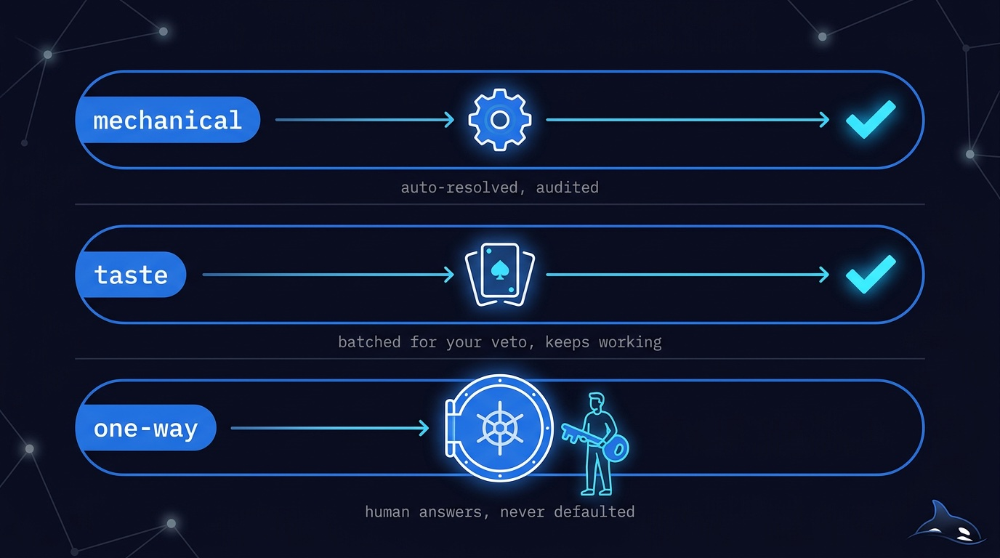
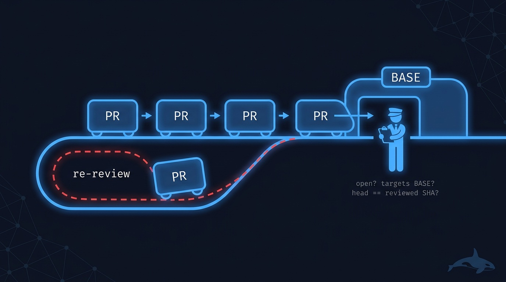
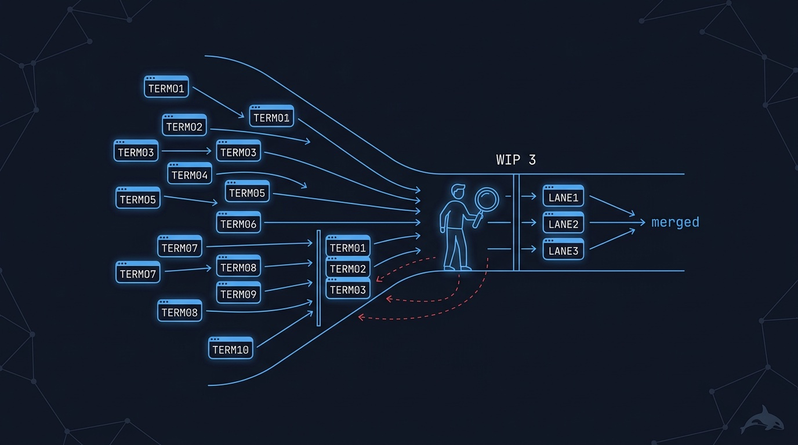
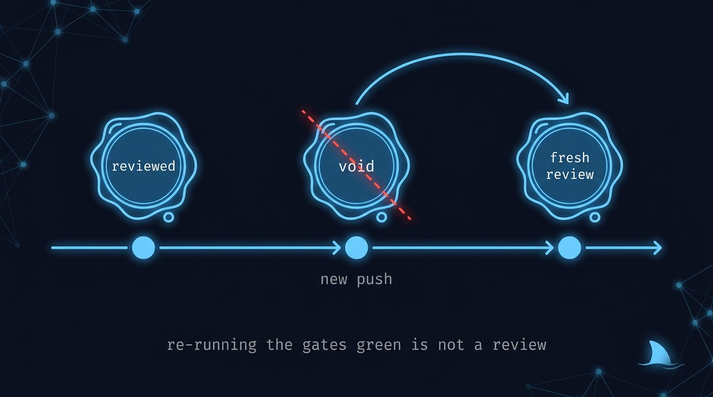
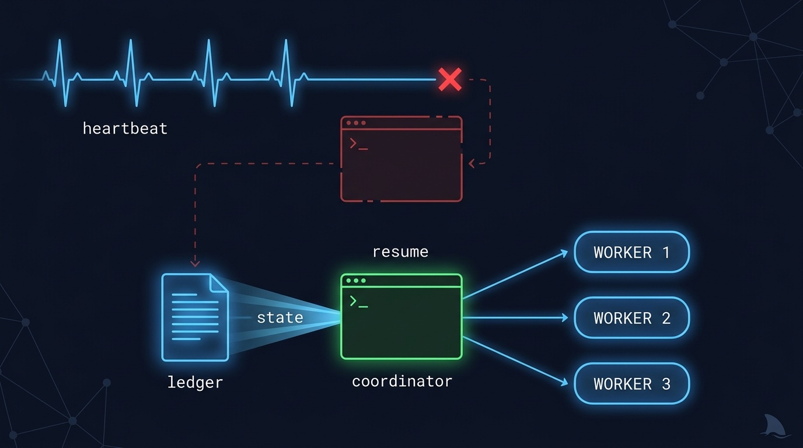
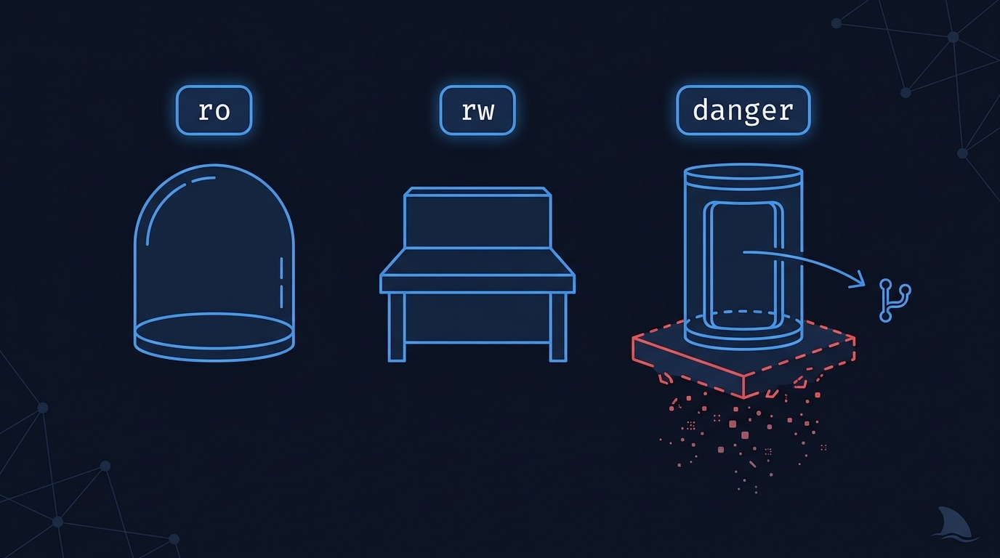
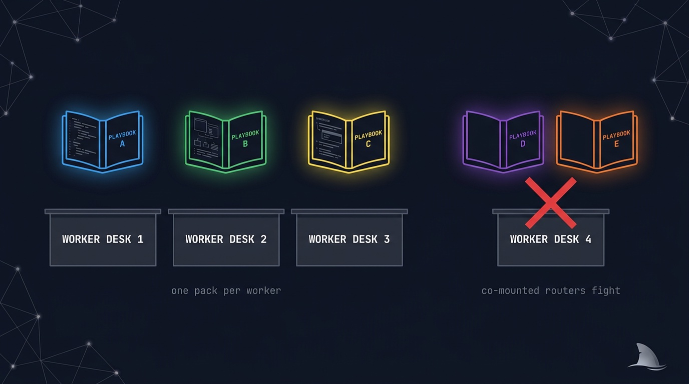
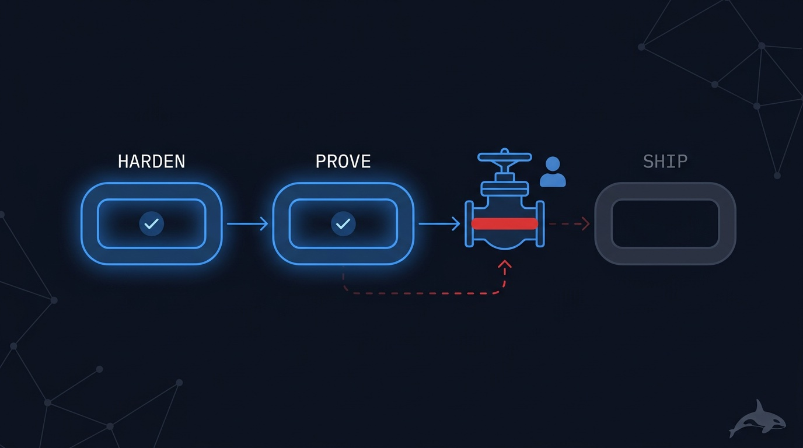

# Concepts — the mental model behind orca-fleet

The files in [`runtime/`](../runtime/) are written for agents: terse, imperative, load-bearing.
This page is the same material written for humans — why each mechanism exists, what failure it
prevents, and how the pieces fit together. Nothing here overrides the runtime policies; when in
doubt, the policy file is the source of truth.

## Contents

- [A fleet is an outcome, not an ingredient](#a-fleet-is-an-outcome-not-an-ingredient)
- [Coordinators and workers](#coordinators-and-workers)
- [The evidence manifest](#the-evidence-manifest)
- [Independent verification](#independent-verification)
- [Decision gates: mechanical, taste, one-way](#decision-gates-mechanical-taste-one-way)
- [The merge train](#the-merge-train)
- [Attention budget (orchestration tax)](#attention-budget-orchestration-tax)
- [Reviewed-SHA freshness](#reviewed-sha-freshness)
- [Liveness, crash, resume](#liveness-crash-resume)
- [Sandbox profiles](#sandbox-profiles)
- [One router per worker](#one-router-per-worker)
- [Chaining missions](#chaining-missions)
- [Proof status](#proof-status)
- [The mission-identity test](#the-mission-identity-test)

## A fleet is an outcome, not an ingredient

A skill like `/tdd` is an ingredient: it makes one agent better at one activity. A **fleet** is a
different species — it is a commitment to an end state. `clean-sweep` does not mean "apply the
triage technique"; it means *the backlog will be at zero, every close will be backed by a merged
SHA and a test that failed pre-fix, and the enumeration will be re-run until it comes back dry.*

That commitment is only credible if the fleet can prove it, which is why every mission in this
catalog is built around three things:

1. a **state machine** for its unit of work (a finding, a slice, a flake, a hypothesis),
2. a **convergence proof** — the specific, checkable condition that means "done",
3. an **evidence protocol** that makes every claim verifiable after the fact.

## Coordinators and workers

<p align="center">
  
</p>

Every mission runs the same topology on the Orca runtime:

- **One coordinator.** The terminal you started. It decomposes the goal, creates worktrees,
  spawns workers, classifies decisions, verifies results, and keeps the ledger. It **never
  writes code** — a coordinator that starts editing files has lost the thread that makes
  verification independent.
- **Many workers.** Each is a fresh agent in its own git worktree and terminal, dispatched with
  a task spec that embeds the playbook it should follow. Workers are disposable by design: a
  fresh context window per unit of work is what keeps quality flat across a 40-unit run, where a
  single long-running agent degrades.
- **Specialized workers.** Builders build. Build-blind reviewers review code they did not write
  and were not told the conclusion about. Integrators open PRs (builders never do — a builder
  that self-opens a PR gets the default branch as its base, which is exactly the wrong place).
  One conductor owns every merge.

The ledger deserves a special note: the coordinator's context gets compacted over a long run, so
its memory is not durable. The **ledger file** is. One row per unit — id, state, PR, reviewed
SHA, merge SHA, evidence pointer. Everything the run needs to resume lives there, not in the
scrollback.

## The evidence manifest

The definition of done, as data. Every worker emits one in its `worker_done` payload; the full
schema lives in [`runtime/evidence-manifest.md`](../runtime/evidence-manifest.md). Annotated:

```jsonc
{
  "unit": "AC-3-healthz-endpoint",       // which unit of work this claims to complete
  "base_sha": "6f7e3f8…",                // where the work started
  "head_sha": "9b06458…",                // what the work produced — both must be real commits
  "base_branch": "ravidsrk/fleet-base",  // the integration BASE the PR targets

  "contract": {
    // Binds the manifest to an AUTHORITATIVE denominator captured at run start.
    // The worker cannot choose its own scope: the verifier re-derives the id set
    // from this source and rejects a manifest that drops any criterion.
    "source": "specs/healthz.md@0b073fb",
    "digest": "sha256:…",
    "criterion_ids": ["AC-1", "AC-2", "AC-3"]
  },

  "criteria": [
    {"id": "AC-1", "text": "GET /healthz returns 200 with version", "addressed": true}
    // one entry per criterion — an unaddressed criterion is unmet work, not a waiver
  ],

  "commands": [
    // real invocations + exit codes + artifact paths. Never a prose summary.
    {"cmd": "pnpm test src/health", "exit": 0, "artifact": "docs/reports/AC-3/test.txt"}
  ],

  "negative_control": {
    // mandatory for any fix or test: prove the proof can fail.
    "did": "reverted the handler registration",
    "result": "healthz.test.ts went RED",
    "artifact": "docs/reports/AC-3/revert.txt"
  },

  "pr": {"number": 12, "url": "…", "reviewed_sha": "9b06458…"},  // gates the merge
  "parked": [],                          // anything not done is named, never dropped
  "claim": "implemented /healthz with DB ping"   // narration — NEVER the completion oracle
}
```

Why this and not "read the transcript"? Three reasons, all learned the hard way:

- a coordinator does not hold its workers' terminal traces;
- traces get truncated and compacted, and they are gameable;
- most fundamentally, **a trace proves an action was attempted, not that the resulting state is
  correct** — an agent can run the right-looking commands against the wrong SHA.

## Independent verification

<p align="center">
  
</p>

The manifest is a claim. A **different session** than the one that produced the work checks it
against authoritative state, in a fixed order — scope first, because passing tests on a shrunken
denominator is the most dangerous false "done":

| Claim                       | Authoritative check                                              |
|-----------------------------|------------------------------------------------------------------|
| scope is complete           | re-derive the criterion set from `contract.source` at its digest |
| the commit is where claimed | `git merge-base --is-ancestor <head_sha> origin/<BASE>`          |
| tests pass at that SHA      | clean worktree checkout + full run — pasted output is a hint     |
| the proof can fail          | revert/mutate on a sample, watch it go red                       |
| the review is fresh         | `pr.reviewed_sha == head_sha`                                    |
| the change is real on base  | a symbol from the unit is greppable on `origin/<BASE>`           |
| deployed == reviewed        | (ship only) deployed revision equals the released SHA            |

A unit that fails any required check is not done — it returns to its state machine. When Orca's
provenance says "completed" but git disagrees, the unit is marked SUSPECT and treated as failed.
Git is truth; the ledger is its cache.

Two further guards keep the reviews honest: the verifier rejects an evidence set whose
"independent" review is byte-identical to the worker's own output (each manifest records its
`reviewer_mode`, so instructed isolation is named as the weaker guarantee it is), and reviewers
practice **blind-fix** — writing their own expected fix to disk before opening the candidate
diff, because anchoring on a handed artifact is cheaper than re-deriving the answer. At run
close, a sha256 inventory of every referenced artifact makes the evidence tamper-evident.

## Decision gates: mechanical, taste, one-way

<p align="center">
  
</p>

Fleets hit hundreds of decisions per run. Sending every one to a human makes autonomy pointless;
sending none makes it dangerous. So every decision is classified **before** anyone answers
([`runtime/gate-classification.md`](../runtime/gate-classification.md)):

- **Mechanical** — one defensible answer exists (tooling with repo precedent, naming,
  retry-on-transient). The coordinator auto-resolves and writes an audit line: gate, class,
  answer, why.
- **Taste** — reasonable people could disagree, and it is reversible (API shape, copy,
  structure within spec). The coordinator picks the recommendation, batches the decision into a
  brief, and keeps working. You can veto later.
- **One-way** — hard or impossible to reverse, or out of authority: merge to default, deploy,
  rollback, deletion, spend, scope change, secret rotation. **Human, always.** Never
  auto-resolved, never defaulted on timeout.

Two refinements worth knowing. First, the *user-challenge* rule: when the fleet's analysis says
**your** stated direction is wrong, that is never auto-decided — your direction is the default,
and the fleet must argue its case, name its blind spots, and state the cost if it is wrong.
Second, escalation is honest about who is on the other end: an agent-to-agent `ask` is not a
human, and labeling one as human approval is forbidden. In unattended runs, unanswerable one-way
questions get parked and the run continues elsewhere or winds down.

## The merge train

<p align="center">
  
</p>

Parallel workers opening PRs onto one integration BASE invites two failure modes: merge races
(PRs rebasing over each other) and stale evidence (merging a SHA the reviewer never saw). The
cure is boring and absolute ([`runtime/merge-serialization.md`](../runtime/merge-serialization.md)):

- **One conductor per BASE.** Two trains on one base is a race, not redundancy.
- **Arrival order.** No priority lanes without a human gate.
- **Freshness at the head of the queue.** The conductor checks the PR is open, targets BASE
  (never the default branch), and its head equals the reviewed SHA. Mismatch → bounce to
  re-review, requeue at the back.
- **Hot-file chains.** PRs touching the same mount-point file (route registry, DI wiring,
  migrations, barrels) build in parallel but merge as a chain, one at a time, as a union.
- **Ancestry verification, not grep.** A merge counts when
  `git merge-base --is-ancestor <mergeCommit> origin/<BASE>` says so.

## Attention budget (orchestration tax)

<p align="center">
  
</p>

Starting agents is cheap; closing the loop is not. Your judgment is the serial bottleneck, so
fleets scale to **verification capacity**, not the UI's spawn limit
([`runtime/attention-budget.md`](../runtime/attention-budget.md)). Default mutation waves keep
≤3 concurrent builders and about one build-blind reviewer per three builders. Isolated,
machine-verifiable work fans out; judgment-heavy work stays serial. Merge serialization is
consumer-side backpressure; the attention budget is producer-side — together they keep the
fleet from burying you under unreviewed diffs.

## Reviewed-SHA freshness

<p align="center">
  
</p>

The single most common way a fleet ships unreviewed code: a branch head that moved *after*
review. A conductor rebase, a review-bot autofix commit, a builder's late push — all of them void
the review, by rule ([`runtime/reviewed-sha-freshness.md`](../runtime/reviewed-sha-freshness.md)).
The merge step refuses on mismatch, and — the part people push back on until it saves them —
**"re-ran the gates green" is not a review.** Only a fresh build-blind review of the new head
restores freshness.

## Liveness, crash, resume

<p align="center">
  
</p>

Long runs die in boring ways: a worker hangs, a terminal is killed, the coordinator's machine
sleeps. The runtime tracks heartbeats and provenance in SQLite; the fleet supplies the reflexes
([`runtime/liveness-resume.md`](../runtime/liveness-resume.md)):

- **WATCH.** A dispatched task with no heartbeat past the window is stale. Respawn goes to a
  **fresh terminal** (re-dispatching to a used handle is a no-op), with an evidence line and a
  **reflection-before-retry** note first, and a bounded attempt count. Three failures — or two
  consecutive identical error signatures — → escalate or reassign, don't thrash.
- **The stuck-pending watchdog.** Task dependencies are not validated at creation, and a dep
  that *fails* (rather than completes) strands its children in `pending` forever — convergence
  detection only flags `blocked`. Every fleet watches for pending-with-unmet-deps explicitly.
- **RESUME.** A dead coordinator rebuilds from the ledger header + Orca provenance, scoped to
  its own run (runtime state is global; without scope, resume aborts). Every "completed" unit is
  cross-verified against git before being trusted; verified-merged work is never redone.

## Sandbox profiles

<p align="center">
  
</p>

Workers get the least privilege that does their job
([`runtime/sandbox-policy.md`](../runtime/sandbox-policy.md)):

| Profile  | Means                                     | Used for                          |
|----------|--------------------------------------------|-----------------------------------|
| `ro`     | read-only / plan mode                      | report-only work: reviews, audits |
| `rw`     | workspace-write                            | ordinary fix/build work           |
| `danger` | bypass approvals — **opt-in flag required**| exploit PoCs, destructive tests   |

`danger` never runs on your machine: its sanctioned home is a disposable per-workspace sandbox.
Work is harvested off the sandbox via `git push` to a work branch **before** teardown, and enters
BASE through the normal PR → review → merge-train pipeline like everything else. A lane whose
sandbox died before the push is a failed lane, not a shrug.

## One router per worker

<p align="center">
  
</p>

Missions draw worker methodology from three upstream packs, and each pack ships its own
router/meta-skill. Co-mount two and they fight: clashing command names, competing routing,
conflicting philosophies (one pack folds refactoring into the TDD loop, another puts it in
review). The rule is absolute: **a worker loads exactly one pack's playbooks.** Cross-pack
composition happens at the mission level — one worker runs Matt-style triage while another runs
Addy-style security — never inside a single worker's context.

## Chaining missions

<p align="center">
  
</p>

"Make this repo production-ready" is not one mission — it is harden-it, then prove-it, then
ship-it. Chains are deliberately minimal ([`runtime/mission-chaining.md`](../runtime/mission-chaining.md)):
sequential only, declared up front with the terminal states allowed to proceed at each link. The
gate between missions is the previous mission's **verified** terminal state — an audit gates, it
never "continues anyway"; a degraded terminal (`HARDENED-WITH-OPEN-ITEMS`, `COVERED-WITH-PARKED`)
stops the chain, and advancing past it is a one-way human gate. Each link is a full run with its
own preflight and BASE, and mission N's parked and noticed-but-not-touched items seed mission
N+1's enumeration as findings to triage. A chain that stops early is a correct outcome.

## Proof status

Every mission declares how proven it is — `doctrine-only`, `self-run`, or `external-run` — in
validator-enforced frontmatter, and cannot advance without a linked run report on disk. This is
the inherited lesson from this catalog's failed predecessor, which shipped twelve missions with
two proven: doctrine is allowed to encode hard-won lessons, but it is never allowed to dress up
as evidence.

## The mission-identity test

The catalog stays deliberately small because of a bright-line test. Two workflows are the **same
mission** only if they share *all five*:

1. the same unit of work,
2. the same per-unit state machine,
3. the same convergence proof,
4. the same ordering and isolation constraints,
5. the same parking / failure semantics.

"Inventory → fix → repeat" is not enough — almost every maintenance process paraphrases that
way. Audit findings, tracker issues, and false doc-claims all close through the same
per-finding pipeline with the same proof, so they are one mission (`clean-sweep`). A perf breach
is *not* a finding: done is a statistical budget over journeys, measurements are noisy, and fixes
interact — different proof, different mission (`speed-it`). Contributing those same fixes to a repo
you do *not* control is also its own mission (`oss-contribute`): the convergence proof is a PR open
and reviewed rather than a merged SHA, the state machine adds upstream-PR overlap discovery and drops
the merge step, and `awaiting-maintainer-merge` is a normal terminal — three of the five differ from
`clean-sweep`. When you are tempted to add a mission, run this test first; when you are tempted to add
a *mode* to a mission, run it twice.

---

Deep dives: every mission has its own guide under [docs/missions/](missions/), a real run is
walked ledger-line by ledger-line in [Anatomy of a run](guides/anatomy-of-a-run.md), and the
agent-facing sources are [`skills/`](../skills/), [`playbooks/`](../playbooks/), and
[`runtime/`](../runtime/).
