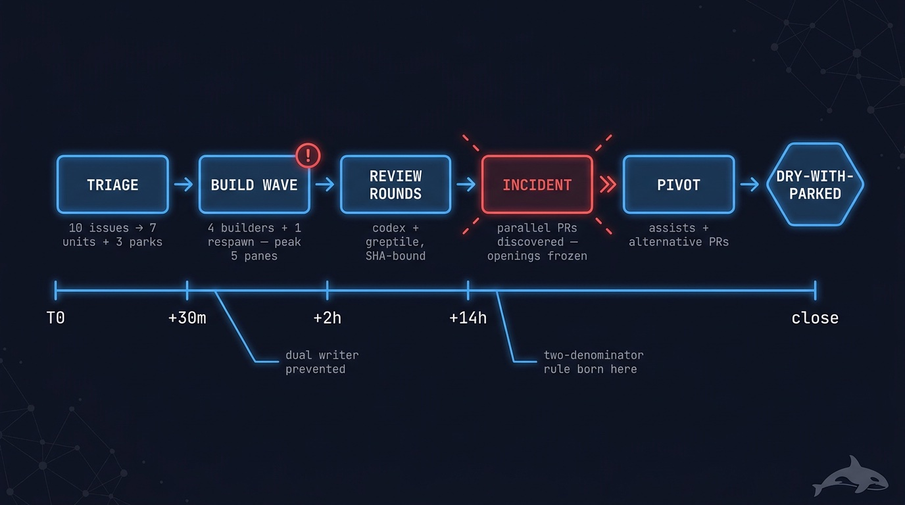

# Anatomy of a run — the chimely sweep, hour by hour

Every mission guide describes its machinery in the abstract. This page does the opposite: it
walks one real run end to end — the 2026-07-15 sweep of `dodopayments/chimely` that became the
[`oss-contribute` proving run](../runs/2026-07-16-oss-contribute-external-run.md) — quoting the
actual ledger and dispatch log, including the parts that went wrong. Nothing here is
illustrative fiction; the incidents below each changed a runtime policy, and this page names
which.

<p align="center">
  
</p>

## T0 — the header is written before anything runs

The first line of the ledger, written before the first dispatch:

```
RUN: clean-sweep-chimely-20260715 · COORDINATOR: term_905ccdf2… + term_c5e4d798… ·
BASE: clean-sweep/integration · FORK_POINT: ce7891bf… · T0: 2026-07-15T17:40:00Z ·
SOURCE: tracker dodopayments/chimely open issues #34,35,36,37,38,39,55,56,58,61
(count=10, enumerated via gh api --paginate state=open)
```

Everything a crash-resume needs is in this one line: which terminals own the run (the
orchestration DB is machine-global — scope or drown), which branch integrates, and the exact
denominator with how it was enumerated. One field is missing that today would be mandatory:
`WIP: builders=<n> reviewers=<n>`. Keep reading to see why it exists now.

## +6 minutes — triage before any build

A skeptic-triage worker reproduces or refutes every issue before anyone writes code. Ten issues
in; the freeze line out:

```
TRIAGE FREEZE: 7 build units (#34 S docs, #35 M, #36 S, #55 M, #56 S, #58 S, #61 M)
· 3 parks (#37, #38, #39 needs-human, decisions named in triage report)
```

Three issues never became work: each needed a product decision (snooze semantics, preferences
schema, filter design) that an agent must not guess. They parked with the decision *named* —
parking is a terminal state with content, not a shrug.

## +30 minutes — wave 1, and the first incident

The dispatch log, verbatim:

```
18:09Z · cs-61 · task_1c5563001ab3 · wt …/cs-61-inbox-polish · builder term_77ba692d HB ok
18:11Z · cs-56 · task_39dcba7b044a · builder term_6bc3cfd4 NO heartbeat · doctor attempt 1 · respawning
18:18Z · cs-56 · attempt-1 term_6bc3cfd4 was ALIVE (spawn HB window false negative)
        · closed to prevent dual-writer · attempt-2 term_257e9a1e owns task, verified alive
18:22Z · cs-55 · task_741dbc6d010a · builder term_a856f374 HB ok · fork 55-A answer injected
18:25Z · cs-58 · task_6491862e2f23 · builder term_d9cc0af3 HB ok · forks 58-A/B answers injected
```

Two things happened here worth study. First, a heartbeat **false negative**: cs-56's builder was
alive but had not heartbeated inside the spawn window, so the doctor respawned it — creating two
panes owning one task. The coordinator caught it and closed the original *before* it could push
(a dual-writer is how two agents silently fight over one branch). Second, the wave itself was
too wide: four builders plus the respawn peaked at **five live builder panes** — the provenance
DB records the peak at 18:24:37Z. The attention-budget policy that would have held this wave to
three landed on main at 22:07Z *that same night*, distilled from exactly this experience. Its
rule now: the WIP cap goes in the ledger header at T0, and it counts **live panes, not tasks**
— a respawn's original pane counts against the cap until its closure is verified.

## +75 minutes — "done" is a claim, not a fact

The cs-61 builder reported done. The ledger shows what the coordinator did with that claim:

```
18:55Z · cs-61 · BUILT=t verified: head 887087c on origin, 5 bisectable red-first commits,
author ok, manifest criteria all status=met (C1-C6; docs-sse-note DELEGATED to cs-34 —
cs-34 spec must inherit it) · dispatching integrator
```

Nothing advanced on the builder's say-so. The head SHA was checked on the remote, the commits
were checked for red-first structure, the manifest's criteria were checked one by one — and the
one criterion the builder delegated is recorded as a *debt on another unit's spec*, not dropped.

## The zombie pane — why panes close at worker_done now

```
04:55Z · cs-61 · INCIDENT: builder pane kept working post-worker_done, pushed f7efaec
(P2 focus-trap fix, good content, wrong protocol) mid-greptile-review · greptile r1 stale
at 887087c · all 4 unit terminals closed
```

A builder that had already reported done pushed *more code* while a reviewer was mid-review of
the earlier head — instantly staling the review. The content was even good; the protocol
violation is the point, because a review of SHA X says nothing about SHA Y. This incident is why
[`dispatch-lifecycle`](../../runtime/dispatch-lifecycle.md) now says: close unit panes at
`worker_done`, do not merely consume the message. The push itself was salvaged the honest way —
a fix-round worker validated it with a negative control and folded it in as a reviewed commit.

## Review rounds are bounded, and freshness is enforced

cs-61's review history, compressed: greptile r1 found one valid P1 (a Tab-key escape from a
focus trap), fix round 1 landed, r2 came back clean but codex r2 failed it again — the trap
matched disabled-tab buttons via `button:not([disabled])` — fix round 2, and round 3 passed
BOTH reviewers at head `53f6688`, explicitly the final round in budget. Every verdict is bound
to the SHA it reviewed; every fix round voided the previous verdict by construction
([`reviewed-sha-freshness`](../../runtime/reviewed-sha-freshness.md)). One unit later spent a
**recorded human grant** for a fourth round — the budget bends only through a gate, never
silently.

## +14 hours — the run-level incident, and the pivot

```
07:45Z · RUN-LEVEL INCIDENT: parent repo PRs #72-#79 by a parallel contributor (opened
PRE-T0) claim closure of #35,#36,#55,#56,#58,#61 + #38-frontend. Triage REDUNDANCY check
swept code only, never parent open PRs — protocol gap, post-mortem item. NEW PR OPENINGS
FROZEN pending user decision (in-flight reviews continue; their findings are valuable
under every option).
```

Two hours of building had duplicated work a maintainer-side contributor already had in flight —
because triage had enumerated the *issues* but not the *open PRs*. Notice what the fleet did
and did not do: it froze the blast radius (no new PR openings), it kept in-flight reviews
running (their findings stay valuable under every option), and it put the direction change in
front of the human instead of improvising. The pivot that followed re-missioned every affected
unit: our confirmed findings became **review-assist comments** on the parallel PRs (ten quoted
findings across four PRs, zero hollow comments), and the fully-reviewed branches later opened
as **cross-linked alternative PRs** under an explicit user directive.

This incident is the founding scar of the `oss-contribute` mission: its two-denominator rule —
enumerate the open PRs, not just the issues, and re-enumerate both every loop — is this
post-mortem, promoted to protocol.

## Closing honestly

The ledger closed `DRY-WITH-PARKED (contribution mode)` — the run had begun as `clean-sweep`
and its ledger kept that mission's vocabulary to the end. The run report, written after the
mission was extracted mid-flight, names the same terminal `CONTRIBUTED-WITH-PARKED` in
`oss-contribute`'s vocabulary, whose convergence proof never claims a merge the fleet cannot
perform. Same facts, two honest names; the rename is itself part of the extraction story. Ten
issues at T0, every one at a named terminal — five upstream PRs (#81-#85), four assist
comments, three `needs-human` parks — with a re-enumeration pasted into the ledger proving the
set was stable (10 open at T0, 10 at close, 0 new since T0). The unmerged unit worktrees were
**retained** at run close, not force-cleaned: their branches backed open PRs, and
[`dispatch-lifecycle`](../../runtime/dispatch-lifecycle.md) forbids destroying unmerged
evidence. Only at session close were the worktrees retired, each branch first verified clean
and pushed to the fork — the local checkout goes, the branch and its evidence survive on the
remote, which is exactly what the never-destroy-unmerged-evidence guard protects. Even the follow-up was ledgered: every post-open bot review thread on all five PRs was
triaged against the current head and answered — the `FOLLOWED_UP` flag this run added to the
mission.

## What this one run changed in the doctrine

| Incident in this run | What it became |
|----------------------------------------------|------------------------------------------------------------------|
| 4-builder wave peaked at 5 panes | [`attention-budget`](../../runtime/attention-budget.md): WIP caps, pane-counting, mandatory ledger-header field |
| Heartbeat false negative → dual-writer risk | [`liveness-resume`](../../runtime/liveness-resume.md) spawn-window guidance; verify by pane read |
| Builder pushed after `worker_done` | [`dispatch-lifecycle`](../../runtime/dispatch-lifecycle.md): close panes at worker_done |
| Triage missed the parallel contributor's PRs | The two-denominator rule; the `oss-contribute` mission itself |
| Post-open bot reviews arrived unanswered | The `FOLLOWED_UP` flag and follow-up loop |

That table is the actual product of a fleet run beyond its deliverables: every operational
scar, promoted to a policy the next run inherits. If you read only one thing next, make it
[`concepts.md`](../concepts.md) for the mental model, then the
[mission guides](../missions/) to pick your first run.
