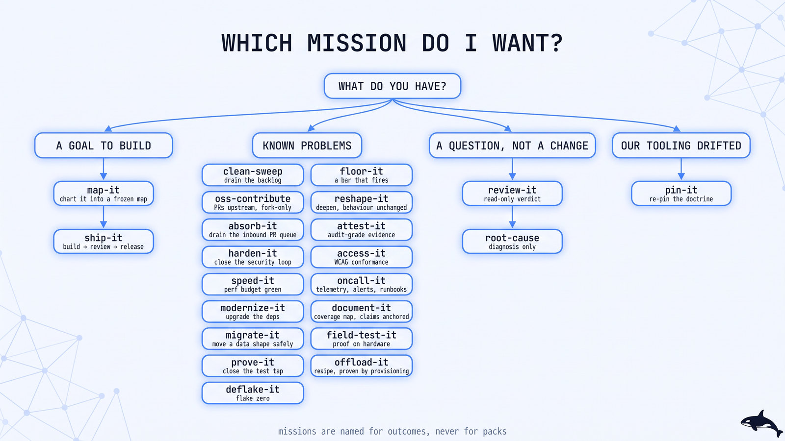
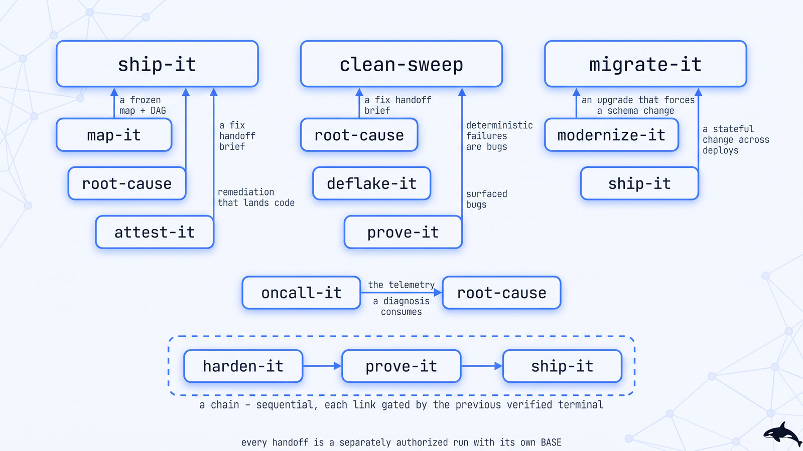

# Mission guides

[Documentation](../README.md) · [First run](../getting-started.md) · [Prompt recipes](../recipes.md)

One deep-dive per mission: what it does, when to reach for it (and when not to), the pipeline
with its phases, terminal states, human gates, convergence proof, and the failure modes it is
built to prevent. The agent-facing contracts live in [`skills/`](../../skills/); these pages are
for the human deciding what to run and what to expect.

## Choose by task

Pick the outcome you need. The guides below explain inputs, tooling, approvals and terminal
states. Their **Proof** callout shows the mission's retained evidence tier.

| Developer task | Start with | Use the neighboring mission when… |
|---|---|---|
| Build a feature with testable acceptance criteria | [ship-it](ship-it.md) | Use [map-it](map-it.md) while the scope or decisions are still unclear |
| Fix a finite audit or issue backlog | [clean-sweep](clean-sweep.md) | Use [oss-contribute](oss-contribute.md) when you cannot merge upstream |
| Assess an existing PR | [review-it](review-it.md) | Use [clean-sweep](clean-sweep.md) to implement known findings |
| Explain one hard failure | [root-cause](root-cause.md) | Use [deflake-it](deflake-it.md) to eradicate flakes across a suite |
| Make tests detect real regressions | [prove-it](prove-it.md) | Use [floor-it](floor-it.md) to establish and enforce the overall quality bar |
| Refactor without changing behavior | [reshape-it](reshape-it.md) | Use [modernize-it](modernize-it.md) for dependency or framework upgrades |
| Change persistent schema or data | [migrate-it](migrate-it.md) | Use [ship-it](ship-it.md) for feature work without a stateful migration |
| Close the security audit loop | [harden-it](harden-it.md) | Use [review-it](review-it.md) for a bounded security lens on one diff |
| Meet a measured performance budget | [speed-it](speed-it.md) | Use [field-test-it](field-test-it.md) to reproduce a defect on its target device |
| Improve accessibility on defined pages or flows | [access-it](access-it.md) | Manual criteria still need the named assistive-technology reviewer |
| Add telemetry, alerts and runbooks | [oncall-it](oncall-it.md) | Use [root-cause](root-cause.md) to diagnose an incident already happening |
| Fill missing public documentation | [document-it](document-it.md) | Use [clean-sweep](clean-sweep.md) for existing false claims |
| Drain incoming contributor PRs | [absorb-it](absorb-it.md) | Use [review-it](review-it.md) for a verdict on one PR |
| Collect conformance evidence | [attest-it](attest-it.md) | Use [harden-it](harden-it.md) for exploit, fix and re-attack work |
| Provision a cloud workspace recipe | [offload-it](offload-it.md) | An existing recipe's worker placement is runtime administration |
| Recheck runtime doctrine after Orca changes | [pin-it](pin-it.md) | Use [modernize-it](modernize-it.md) for dependencies in your application |

Start with one bounded outcome. When several missions are needed, declare a
[sequential chain](../concepts.md#chaining-missions) and its allowed terminal states before
starting. A parked result names work still owed; it does not count as the clean terminal.

## All mission guides

  <picture>
    <source media="(prefers-color-scheme: dark)" srcset="../../assets/diagrams/mission-map.jpg">
    <source media="(prefers-color-scheme: light)" srcset="../../assets/diagrams/mission-map-light.jpg">
    
  </picture>

How the missions hand work to one another:

  <picture>
    <source media="(prefers-color-scheme: dark)" srcset="../../assets/diagrams/mission-handoffs.jpg">
    <source media="(prefers-color-scheme: light)" srcset="../../assets/diagrams/mission-handoffs-light.jpg">
    
  </picture>

| Guide | One line |
|-------|----------|
| 🚢 [ship-it](ship-it.md)                 | Intent or a frozen spec → a released, verified change |
| 🧹 [clean-sweep](clean-sweep.md)         | A finite backlog exhausted to zero, PR-per-finding, re-enumerated until dry |
| 🤝 [oss-contribute](oss-contribute.md)   | Upstream issues → open, reviewed, etiquette-correct PRs on a repo you cannot merge |
| 🛡️ [harden-it](harden-it.md)       | A threat model closed: audit → exploit → fix → re-attack → clean re-audit |
| ⚡ [speed-it](speed-it.md)          | Every declared journey within its perf budget, proven to a measurement contract |
| 📦 [modernize-it](modernize-it.md) | Every dependency current or pinned-with-a-reason, CI green the whole way |
| 🧪 [prove-it](prove-it.md)         | A mutation-audited test on every critical path |
| 🎯 [deflake-it](deflake-it.md)     | Flakes eradicated to a consecutive-green streak, local and CI |
| 🔍 [review-it](review-it.md)       | A read-only, SHA-bound GO/NO-GO verdict — no fix authority |
| 🗺️ [map-it](map-it.md)             | A foggy goal resolved into a frozen execution map ship-it can consume |
| 🔬 [root-cause](root-cause.md)     | A reproduced symptom and a demonstrated cause — diagnosis only |
| 📋 [attest-it](attest-it.md)       | Conformance to a frozen standard, independently re-derived: `CONFORMANT` or gaps parked |
| ♿ [access-it](access-it.md)       | A frozen page/flow set driven to WCAG 2.2 AA with a revert-to-violation control |
| 📌 [pin-it](pin-it.md)             | Runtime doctrine re-witnessed against the installed binary — every claim receipted |
| 🧱 [floor-it](floor-it.md)         | A written, numbered quality bar — every dimension tool-enforced and proven to fire |
| 🧬 [reshape-it](reshape-it.md)     | Hot modules deepened behind smaller interfaces, behaviour proven unchanged |
| 📱 [field-test-it](field-test-it.md) | Defects reproduced, fixed, and re-proven on a real device — revert control included |
| 🗄️ [migrate-it](migrate-it.md)     | A stateful shape change landed phase by phase across deploys — parity proven, zero readers before the drop |
| 📟 [oncall-it](oncall-it.md)       | A frozen path set made operable — alerts test-fired, and an induced failure named by a source-blind worker |
| 📥 [absorb-it](absorb-it.md)       | An inbound PR queue drained — landed with authorship and a receipt, refuted, or parked with a named ask |
| 📚 [document-it](document-it.md)   | A public surface covered by quadrant with zero critical gaps — every claim anchored and rename-controlled |
| ☁️ [offload-it](offload-it.md)     | A per-workspace environment recipe stood up and proven by a live provision — doctor-clear plus an enacted lifecycle |

Not sure which one? The [decision flowchart in the README](../../README.md#which-mission-do-i-want)
routes by what you have in hand: a goal, a set of known problems, or a question. For a real run
with its incidents intact, read [Anatomy of a run](../guides/anatomy-of-a-run.md).
