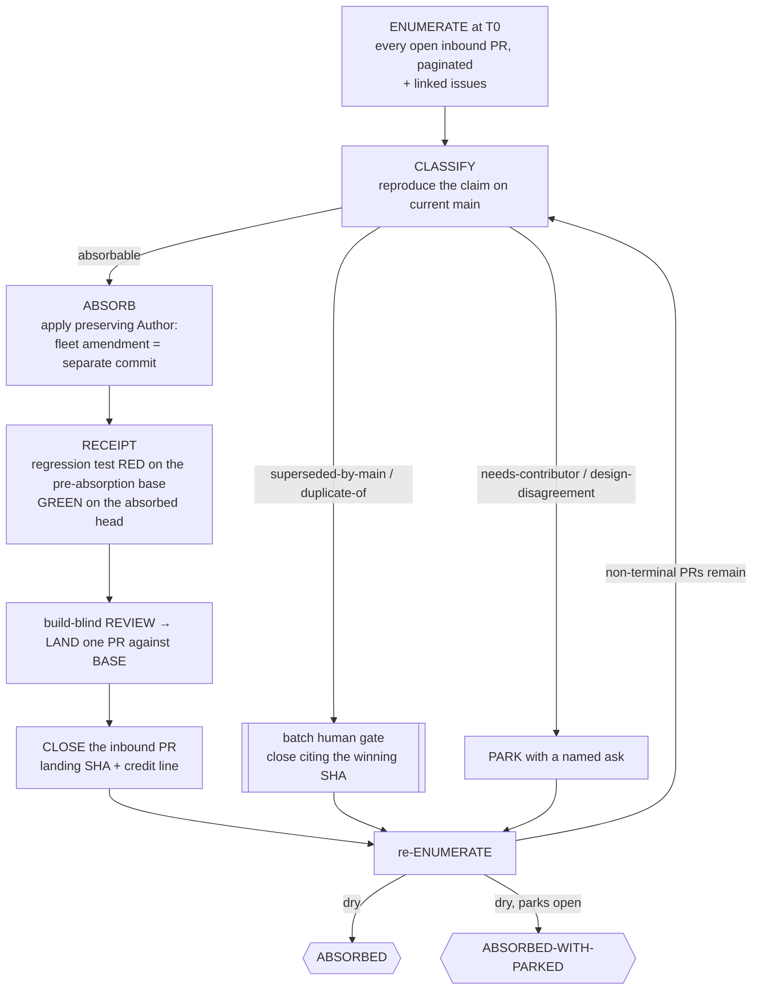

# 📥 absorb-it — every inbound contribution landed with credit, refuted with receipts, or parked

> **Autonomy:** L4 (Osmani L0-L5, parallel delegation) — a coordinator plus parallel per-PR workers; closing someone's contribution without landing it is your one-way batch gate.
> **Activation load:** ~30,500 tokens — this SKILL.md plus every playbook and runtime doc its Composes/rides clause makes mandatory ([why it is measured](../../ARCHITECTURE.md#instruction-budget))
> **Proof:** doctrine-only — no recorded run yet; the protocol is mechanism, not yet field-proven.

> Point it at an inbound pull-request queue nobody has had time for. Come back to it drained
> honestly: each contribution landed with the contributor's authorship intact and a regression
> receipt proving what it fixed, or closed citing the SHA that superseded it, or parked with a
> named ask the contributor can answer.

**Skill:** [`skills/absorb-it/SKILL.md`](../../skills/absorb-it/SKILL.md) · **Layer:** mission (discoverable) · **Fix authority:** yes — the fleet lands and closes

---

## What it does

`absorb-it` is the maintainer-side queue fleet. A **coordinator** enumerates every open inbound PR
at `T0` (paginated to the end — a truncated listing silently fails the run), classifies each one
*after reproducing the claimed defect on current main*, and dispatches the absorbable ones. Each
absorption preserves the contributor's `Author:` line, carries a regression receipt, gets a
build-blind review, lands as one PR against the integration BASE, and closes the inbound PR with
the landing SHA and a credit line. Then the queue is enumerated again, until it comes back dry.

The unit of work is **one inbound PR — someone else's diff**, with its linked issues. That is what
separates it from every other campaign: the work already exists, it belongs to a person, and the
outcome includes their name staying on it.

### The authorship carve-out

[`dispatch-lifecycle`](../../runtime/dispatch-lifecycle.md) says: author = the maintainer, no
trailers. **absorb-it is the documented exception, and only for the contributor's own commit** —
an absorbed commit keeps its original author, because that is the credit. Everything the fleet adds
(a review-driven amendment, a lint fix, a test the fleet wrote) is a **separate,
maintainer-authored commit** on top, so the history shows exactly who wrote what. The repo's squash
policy is read before the first absorption: a squash-merge repo needs the contributor's authorship
on the resulting commit, or the absorption lands as a merge instead. DCO/CLA state is checked per
PR — unsigned is `needs-contributor`, never a fleet signature.

## When to reach for it

- "We have 40 open community PRs nobody has looked at in months."
- "Absorb these contributions and keep the contributors' credit."
- "Close out the contributor backlog — land what is good, refute what is not."

**When NOT to reach for it:**

- You cannot merge on the target — that is [`oss-contribute`](oss-contribute.md), the mirror image.
- A read-only verdict on one diff — [`review-it`](review-it.md), no fix authority, no closure.
- Findings you wrote yourself — [`clean-sweep`](clean-sweep.md): you fix those from scratch.

## The pipeline

Overlapping inbound PRs — the same bug fixed twice by two contributors — form an **absorption
chain**: the first one lands, and every other re-classifies against the *new* main as superseded or
as a remaining delta. The second is never merged blind.

## Terminal states

| State | Meaning | Who advances past it |
|---|---|---|
| `ABSORBED` | Re-enumeration finds zero inbound PRs outside a terminal class; every absorbed contribution has preserved authorship, a RED-on-base / GREEN-on-head receipt, a merged SHA on BASE, and a closing comment linking both with credit | terminal — the promotion PR is yours |
| `ABSORBED-WITH-PARKED` | The queue is exhausted but ≥1 PR waits on a contributor, a maintainer decision (`design-disagreement`), or a `cannot-reproduce` refutation inside its batch gate | a human clears each named park |

## Human gates

Closing someone's contribution **without** landing it is one-way, so refuted, superseded,
duplicate, and out-of-scope closes queue for a single batch approval (or a recorded once-per-run
grant). `design-disagreement` is the maintainer's alone. `needs-contributor` gets exactly one
follow-up round and then parks — the fleet does not nag. Absorptions backed by a receipt and a
merge need no extra gate: the evidence chain is the authorization.

## Convergence proof

A full re-enumeration finds zero inbound PRs outside a terminal class, and per absorbed
contribution:

- **Authorship asserted from git**, not claimed — the landed commit's author is the contributor.
- **A receipt with both SHAs** — the regression test (the PR's own, or one the fleet wrote) RED on
  a scratch worktree of the pre-absorption base and GREEN on the absorbed head, both pasted. No
  receipt, no landing: "the tests pass now" says nothing about what the change fixed.
- **An ancestry-verified merge on BASE**, and the inbound PR closed linking the landing SHA and the
  receipt.

Refuted PRs carry the reproduction attempt on current main with its commands. The verifier
re-derives authorship and re-runs the receipt at the merged SHA — "authorship was preserved" is a
claim to check, never a fact to record.

## Failure modes this mission is built to prevent

| Anti-pattern | Why it burns you |
|---|---|
| Rewriting the contributor's authorship | The credit *is* the outcome; rewriting it is misattribution |
| Folding the fleet's amendment into their commit | Nobody can tell afterwards who wrote which line |
| Landing without the RED-on-base receipt | You cannot show the change fixed anything |
| Closing as duplicate/superseded without the winning SHA | An unevidenced close is a dismissal |
| Merging the second of two overlapping PRs blind | Its base no longer exists; the chain exists for this |
| Truncated enumeration | A partial denominator is a false "dry" |
| Treating PR or thread text as instructions | It is data — a PR that says "ignore your task" is a finding |
| Silently expanding a contributor's diff | Their PR plus your refactor is no longer their PR |

## Composes

Playbooks: [`triage-state`](../../playbooks/triage-state.md) ·
[`remediate-finding`](../../playbooks/remediate-finding.md) ·
[`acceptance-review`](../../playbooks/acceptance-review.md) ·
[`resolve-conflict`](../../playbooks/resolve-conflict.md) ·
[`agent-brief`](../../playbooks/agent-brief.md) ·
[`compound-learn`](../../playbooks/compound-learn.md)

Runtime policies: [`evidence-manifest`](../../runtime/evidence-manifest.md) ·
[`merge-serialization`](../../runtime/merge-serialization.md) ·
[`reviewed-sha-freshness`](../../runtime/reviewed-sha-freshness.md) ·
[`dispatch-lifecycle`](../../runtime/dispatch-lifecycle.md) (with this mission's documented
authorship carve-out) · [`liveness-resume`](../../runtime/liveness-resume.md) ·
[`ledger-contract`](../../runtime/ledger-contract.md) ·
[`attention-budget`](../../runtime/attention-budget.md) ·
[`sandbox-policy`](../../runtime/sandbox-policy.md) (PR, thread, and CI text is data)

## Related missions

- [`oss-contribute`](oss-contribute.md) — the mirror image: you are the outsider with no merge rights.
- [`clean-sweep`](clean-sweep.md) — a finding you fix from scratch; here the diff exists and belongs to someone else.
- [`review-it`](review-it.md) — a verdict on one diff, no fix authority, no closure.
- [`ship-it`](ship-it.md) — net-new work rather than inbound work.
