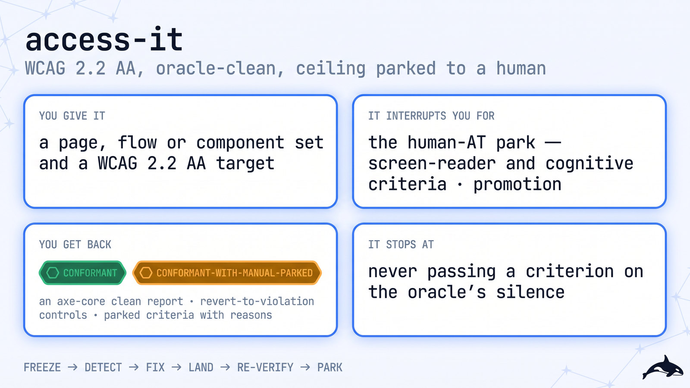
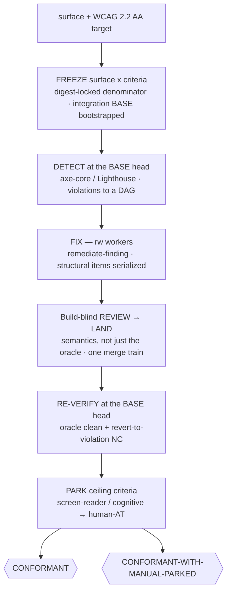

# ♿ access-it — WCAG 2.2 conformance over a frozen surface

> **Autonomy:** L4 (Osmani L0-L5, parallel delegation) — parallel fix workers on isolated violation units against a deterministic axe oracle; the residual human-AT park and the promotion are gate classes you own.
> **Activation load:** ~26,900 tokens — this SKILL.md plus every playbook and runtime doc its Composes/rides clause makes mandatory ([why it is measured](../../ARCHITECTURE.md#instruction-budget))
> **Proof:** doctrine-only — no recorded run yet; the protocol is mechanism, not yet field-proven.

> Point it at a page/flow/component set and a WCAG target. Come back to a surface a deterministic
> oracle certifies clean, every fix proven by a revert-to-violation negative control — and the
> ~30–40% a machine can't judge (screen-reader semantics, cognitive load) named and parked to a
> human with assistive tech, never silently passed.

**Skill:** [`skills/access-it/SKILL.md`](../../skills/access-it/SKILL.md) · **Layer:** mission (discoverable) · **Fix authority:** yes — `PROFILE=rw` fix workers

<p align="center">
  <picture>
    <source media="(prefers-color-scheme: dark)" srcset="../../assets/diagrams/missions/access-it.jpg">
    <source media="(prefers-color-scheme: light)" srcset="../../assets/diagrams/missions/access-it-light.jpg">
    
  </picture>
</p>

---

## Invoke it

```
> accessibility: bring <pages or flows> to WCAG 2.2 AA
```

**Needs** (the skill's `compatibility` field, verbatim): HARD dependency: Orca runtime + orchestration skill (Orca CLI). git + gh; a deterministic a11y oracle (axe-core / Lighthouse) and a runnable surface. A fix worker playbook (addyosmani, mattpocock, gstack) — one router per worker.

## What it does

`access-it` is the accessibility-conformance fleet. A **coordinator** freezes the surface (the
page/flow/component set × the WCAG 2.2 AA criteria), runs a deterministic oracle (axe-core / Lighthouse)
to enumerate violations, dispatches fresh `rw` **workers** to fix each, and re-verifies that the oracle
goes clean **and** each fix carries a mandatory negative control — revert the fix and the violation
returns. The criteria past the automation ceiling are parked, not assumed.

The unit of work is **one success-criterion violation instance on the frozen surface**. The hard
**~30–40% automation ceiling** is the defining property: axe-core is deterministic but partial, so the
un-automatable criteria (screen-reader semantics, keyboard traps, cognitive load) are a first-class
**human-AT park**, which is what keeps a green oracle run from masquerading as full conformance.
The figure is measured, not guessed: Deque's automated-coverage report finds axe-core-class tooling
flags ~32% of WCAG 2.1 AA success criteria by count (~57% by issue volume).

## When to reach for it

- "Bring the checkout flow to WCAG 2.2 AA."
- "Make this component accessible for screen-reader and keyboard users."
- "Section 508 / EAA / ADA conformance sweep over these pages." (Those laws formally reference
  WCAG 2.1/2.0 — this mission targets 2.2 AA, the backward-compatible engineering target that
  satisfies them.)

**When NOT to reach for it:**

- A bounded per-diff accessibility check on one PR — that is [`review-it`](review-it.md)'s a11y risk lens.
- Attesting a *standard's obligation set* (SOC 2 / EU AI Act) — that is [`attest-it`](attest-it.md);
  access-it's denominator is a rendered surface's violations, not a document's obligations.
- Closing a discovered code backlog — that is [`clean-sweep`](clean-sweep.md).

## The pipeline



## Terminal states

| State | Meaning | Who acts on it |
|---|---|---|
| `CONFORMANT` | *near-unreachable* — only when the frozen surface has no criteria past the ~30–40% automation ceiling (rare); axe-core clean, every criterion covered with a revert-to-violation NC | a human promotes |
| `CONFORMANT-WITH-MANUAL-PARKED` | automatable criteria clean; ceiling criteria parked to a named human-AT reviewer | the human-AT reviewer closes the parked criteria (a one-way gate) |

## Human gates

The residual **human-AT park** is a one-way door under
[`gate-classification`](../../runtime/gate-classification.md): the fleet never declares a
screen-reader/cognitive criterion passing on the oracle's silence. Fix workers run `PROFILE=rw`
([`sandbox-policy`](../../runtime/sandbox-policy.md)); promotion past a degraded terminal is human.

## Convergence proof

`access-it` is done when every criterion in the frozen (surface × WCAG 2.2 AA) denominator is
accounted for: the deterministic oracle is clean across the surface, each automatable criterion is
covered by a fix whose negative control (revert → violation returns) holds, and each ceiling criterion
is PARKED to a named human-AT reviewer with the reason the oracle cannot decide it. The verdict is
`CONFORMANT` or `CONFORMANT-WITH-MANUAL-PARKED`; the denominator was never shrunk to only the
automatable criteria.

## A worked example

*A run, sketched — the shape of one, not a transcript.*

> accessibility: bring the checkout flow — cart, address, payment, confirmation — to WCAG 2.2 AA

**Freeze.** Four pages × the AA criteria, digest recorded; the integration BASE is bootstrapped.

**Detect.** axe-core at the BASE head reports 23 violations, each a DAG unit; the structural ones
(landmark order, heading hierarchy) are serialized, the rest run in parallel.

**Fix → review → land.** One `rw` worker per violation. Every PR carries the negative control:
revert the markup fix on a throwaway branch and the oracle reports the violation again. The
build-blind reviewer judges semantics, not the oracle's silence — an `aria-label` that silences
axe over a worse experience fails review.

**Re-verify.** At the new BASE head the oracle is clean across the surface.

**Park.** Nine ceiling criteria — screen-reader announcement order, error-suggestion clarity,
cognitive load — go to a named human-AT reviewer with the reason the oracle cannot decide them.
The run ends `CONFORMANT-WITH-MANUAL-PARKED`; the denominator was never shrunk to what axe sees.

## Failure modes this mission is built to prevent

| Anti-pattern | Why it burns you |
|---|---|
| Declaring `CONFORMANT` off a green axe run alone | The oracle sees roughly a third of WCAG; its silence is not proof, and the un-automatable criteria must be parked, not assumed passing |
| Shrinking the denominator to what axe checks | The frozen surface × WCAG set is the denominator; the ceiling criteria still count |
| A fix with no revert-to-violation control | A green oracle over reverted markup proves nothing |
| Silencing the oracle — empty `alt`, `aria-label` stuffing, `aria-hidden` on real content, role soup | A clean axe over a worse experience; the build-blind review judges semantics, not silence |
| Treating this as `review-it`'s accessibility lens, or as `attest-it` | One is a per-diff verdict and the other a standard's obligation set; this mission's unit is a rendered surface's violations |

## Composes
Playbooks:
[`decompose-dag`](../../playbooks/decompose-dag.md) ·
[`remediate-finding`](../../playbooks/remediate-finding.md) ·
[`acceptance-review`](../../playbooks/acceptance-review.md) ·
[`compound-learn`](../../playbooks/compound-learn.md) ·
[`browser-drive`](../../playbooks/browser-drive.md)

Runtime policies:
[`evidence-manifest`](../../runtime/evidence-manifest.md) ·
[`sandbox-policy`](../../runtime/sandbox-policy.md) ·
[`merge-serialization`](../../runtime/merge-serialization.md) ·
[`reviewed-sha-freshness`](../../runtime/reviewed-sha-freshness.md) ·
[`dispatch-lifecycle`](../../runtime/dispatch-lifecycle.md) ·
[`liveness-resume`](../../runtime/liveness-resume.md) ·
[`ledger-contract`](../../runtime/ledger-contract.md) ·
[`attention-budget`](../../runtime/attention-budget.md)

## Related missions

- [`review-it`](review-it.md) — the bounded per-diff a11y lens, not a surface sweep.
- [`attest-it`](attest-it.md) — a standard's obligation set, not a surface's rendered violations.
- [`clean-sweep`](clean-sweep.md) — a discovered code backlog; access-it's denominator is a frozen surface × WCAG.
