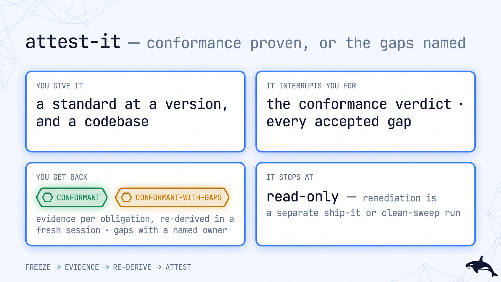

# 📋 attest-it — evidence-bound conformance to a frozen standard

> **Autonomy:** L4 (Osmani L0-L5, parallel delegation) — parallel evidence workers, one obligation each, re-derived independently; the human/legal owner's disposition of gaps and the conformance verdict are one-way gates, not a lower rung.
> **Activation load:** ~21,700 tokens — this SKILL.md plus every playbook and runtime doc its Composes/rides clause makes mandatory ([why it is measured](../../ARCHITECTURE.md#instruction-budget))
> **Proof:** doctrine-only — no recorded run yet; the protocol is mechanism, not yet field-proven.

> Point it at a standard (EU AI Act Art-12/50, SOC 2, NIST SSDF) and a codebase. Come back to an
> auditor-grade verdict: every obligation either satisfied with evidence a fresh session re-derived
> from authoritative state, or named as a GAP parked to a human/legal owner. No control marked
> satisfied on an agent's word.

**Skill:** [`skills/attest-it/SKILL.md`](../../skills/attest-it/SKILL.md) · **Layer:** mission (discoverable) · **Fix authority:** evidence-gathering (`ro`); remediation that lands code routes to `ship-it` / `clean-sweep`

<p align="center">
  <picture>
    <source media="(prefers-color-scheme: dark)" srcset="../../assets/diagrams/missions/attest-it.jpg">
    <source media="(prefers-color-scheme: light)" srcset="../../assets/diagrams/missions/attest-it-light.jpg">
    
  </picture>
</p>

---

## Invoke it

```
> prove compliance with <standard@version>
```

**Needs** (the skill's `compatibility` field, verbatim): HARD dependency: Orca runtime + orchestration skill (Orca CLI). git + gh; a FROZEN standard catalog (standard@version) as the denominator. A review/verify worker playbook (addyosmani specialists, mattpocock code-review, gstack review army) — one router per worker.

## What it does

`attest-it` is the conformance fleet. A **coordinator** freezes a standard at a version, enumerates its
obligations into a DAG, dispatches fresh **workers** to gather the evidence that satisfies each control,
and has an **independent session re-derive** every piece of evidence against authoritative state before
any control is marked satisfied. The output is an audit artifact: `CONFORMANT`, or
`CONFORMANT-WITH-GAPS` with a named gap register.

The unit of work is **one obligation from a frozen `standard@version` catalog** — not a discovered
finding. That is what separates it from [`clean-sweep`](clean-sweep.md) (a discovered backlog),
[`review-it`](review-it.md) (a per-PR verdict), and [`harden-it`](harden-it.md) (an exploit loop). Many
controls need no code change at all — they need evidence, gathered and re-derived.

## When to reach for it

- "Prove SOC 2 compliance with an audit-ready evidence pack."
- "Show EU AI Act Article 12 logging conformance for this high-risk system."
- "Attest NIST SSDF practices across the repo, or tell me the gaps."

**When NOT to reach for it:**

- You want a security exploit → fix → re-attack loop — that is [`harden-it`](harden-it.md).
- You want a merge verdict on one PR — that is [`review-it`](review-it.md).
- You want a discovered backlog closed — that is [`clean-sweep`](clean-sweep.md).

## The pipeline

```mermaid
flowchart TD
    A[standard@version + codebase] --> B[FREEZE the obligation set<br/>enumerate into a DAG · digest-locked]
    B --> C[EVIDENCE per obligation<br/>ro workers · bound to authoritative state]
    C --> D[RE-DERIVE independently<br/>fresh session · deterministic where possible]
    D --> E{Control satisfied?}
    E -->|evidence re-derived| F[VERIFIED]
    E -->|no re-derivable artifact| G[GAP → human/legal owner]
    F --> H{{CONFORMANT}}
    G --> I{{CONFORMANT-WITH-GAPS}}
```

## Terminal states

| State | Meaning | Who acts on it |
|---|---|---|
| `CONFORMANT` | every obligation VERIFIED with independently re-derived evidence | a human/legal owner accepts the attestation |
| `CONFORMANT-WITH-GAPS` | one or more GAPs, each with missing evidence + a named owner | the owner closes the gaps or accepts residual risk (a one-way gate) |

## Human gates

The conformance verdict and any accepted residual gap are **one-way doors** under
[`gate-classification`](../../runtime/gate-classification.md) — a fleet never signs off a standard on a
human/legal owner's behalf. Evidence gathering runs `PROFILE=ro`; remediation that lands code is a
separately authorized `ship-it` / `clean-sweep` run.

## Convergence proof

`attest-it` is done when every obligation in the frozen `standard@version` catalog is accounted for:
the union of unit contracts equals the standard's obligation set (nothing unassigned); each VERIFIED
control carries evidence bound to authoritative state and **independently re-derived** (not the
gatherer's narration); each GAP names its missing evidence and a human/legal owner; and the verdict is
`CONFORMANT` or `CONFORMANT-WITH-GAPS`. No obligation is silently dropped, and the denominator was never
shrunk.

## A worked example

*A run, sketched — the shape of one, not a transcript.*

> prove compliance with NIST SSDF 1.1 for this service

**Freeze.** The practices are enumerated from the standard at a digest into a DAG — `PS.1`,
`PW.4`, `RV.1` and the rest — one unit each; nothing is dropped for being hard.

**Evidence.** `ro` workers bind each practice to authoritative state: branch-protection settings
re-read through the GitHub API, the dependency-review workflow's runs, the advisory-intake process
as it exists in the tree.

**Re-derive.** A fresh session repeats each check without the gatherer's notes. `PS.1` and `PW.4`
re-derive and are VERIFIED. `RV.1` has no documented intake SLA anywhere in the tree — a GAP,
named and parked to the security owner, not buried.

**Attest.** The verdict is `CONFORMANT-WITH-GAPS`; accepting the residual gap is your one-way
door, and remediation that lands code is a separate `ship-it` or `clean-sweep` run.

## Failure modes this mission is built to prevent

| Anti-pattern | Why it burns you |
|---|---|
| Marking a control satisfied on the gatherer's word | The evidence must be re-derived independently — that is the whole point |
| Shrinking the obligation set to the ones you can pass | The denominator is frozen at a version digest |
| Burying a GAP as a failure | A GAP is a named, parked terminal with an owner |
| Confusing `attest-it` with `harden-it` or `review-it` | harden-it runs exploit → fix → re-attack and review-it is a per-PR verdict; this mission proves conformance to a standard |
| Re-using evidence whose `provenance.spec_version` no longer matches the frozen standard | Evidence for a different version proves nothing about this one |
| Enumerating obligations from model memory | The catalog is a sourced document at a digest; a plausible control list is not the standard |

## Composes
Playbooks:
[`decompose-dag`](../../playbooks/decompose-dag.md) ·
[`acceptance-review`](../../playbooks/acceptance-review.md) ·
[`research-brief`](../../playbooks/research-brief.md) ·
[`completion-audit`](../../playbooks/completion-audit.md) ·
[`human-handoff`](../../playbooks/human-handoff.md)

Runtime policies:
[`evidence-manifest`](../../runtime/evidence-manifest.md) ·
[`gate-classification`](../../runtime/gate-classification.md) ·
[`sandbox-policy`](../../runtime/sandbox-policy.md) ·
[`ledger-contract`](../../runtime/ledger-contract.md) ·
[`liveness-resume`](../../runtime/liveness-resume.md)

## Related missions

- [`review-it`](review-it.md) — a per-PR GO/NO-GO verdict, not a standard's obligation set.
- [`harden-it`](harden-it.md) — the security exploit → fix → re-attack loop.
- [`clean-sweep`](clean-sweep.md) — close a discovered backlog; attest-it's denominator is a standard, not a backlog.
- Rides the evidence manifest's [Art-12/50 `provenance` block](../compliance-provenance.md) — the record attest-it attests against.
