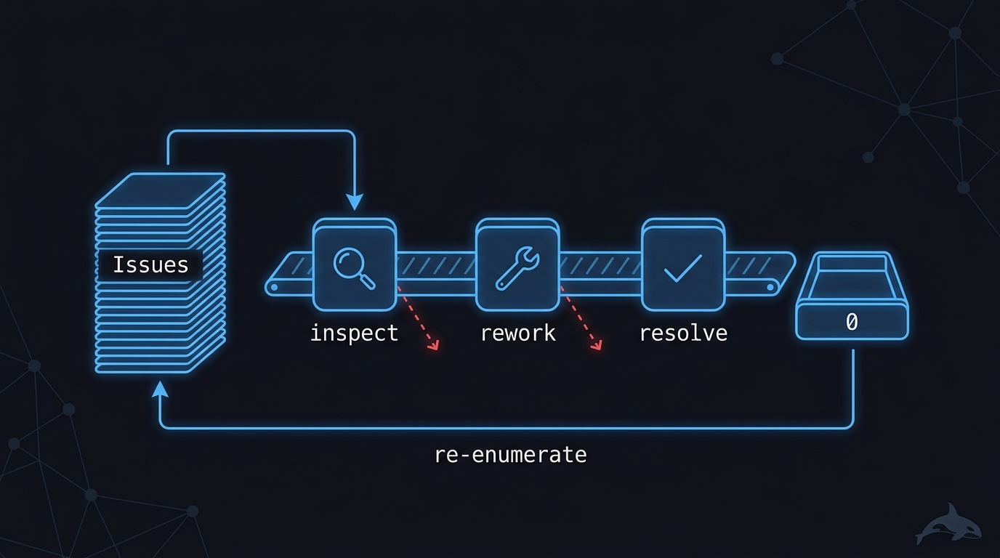
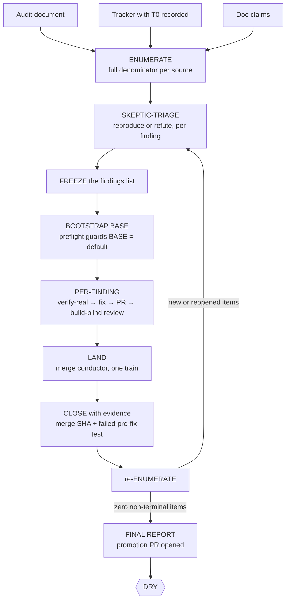

# 🧹 clean-sweep — a finite backlog exhausted to zero, with evidence

> Point it at an audit report, an issue tracker, or a README that lies. Come back to a backlog
> that is demonstrably empty: every real item fixed on an integration branch with a test that
> failed before the fix, every unreal item refuted with the attempts logged, and the final
> enumeration pasted into the ledger showing the dry state.

**Skill:** [`skills/clean-sweep/SKILL.md`](../../skills/clean-sweep/SKILL.md) · **Layer:** mission (discoverable) · **Fix authority:** yes

<p align="center">
  
</p>

---

## What it does

`clean-sweep` is the backlog-exhaustion fleet. A **coordinator** — a thin loop-holder that never
reviews, codes, opens PRs, or merges — enumerates a bounded set of findings, dispatches every one
through a per-finding pipeline, verifies each claim against authoritative state (git, the test
runner, the tracker), and re-enumerates until a full pass comes back dry. Coordinator memory gets
compacted mid-run, so the run's state lives in a ledger **file**, one row per finding:

```
| id | title | VERIFIED | CLASS | FIXED | PR | reviewed_sha | MERGED | CLOSED | evidence |
```

`CLASS` is the triage verdict, and there are exactly seven: `real-bug` · `real-feature-small` ·
`refuted` · `duplicate` · `externally-resolved` · `needs-human` · `out-of-scope`. Every close is
backed by a SHA-bound [evidence manifest](../concepts.md#the-evidence-manifest) — a worker saying
"fixed" is a claim to check, never a fact to record.

Three sources, one unit and one pipeline — you declare the source at the start:

- **`source=audit`** (default) — findings from a scan or adversarial-review document. The
  findings list is frozen up front.
- **`source=tracker`** — open issues. Run-start `T0` is recorded **first**, and the denominator
  is two queries: every open issue in scope, paginated to the very end (a truncated listing
  silently fails the run), plus every issue created or reopened since `T0` in any state (class
  `externally-resolved`). Both queries re-run on every loop, so mid-run filings cannot slip the
  count.
- **`source=doc-claims`** — falsifiable documentation claims. A false claim *is* a finding:
  extract it, verify it against a `file:symbol` or a run, correct or remove it. Writing new docs
  is not this mission — that is ship-it-scoped work.

Whatever the source, a *prior run's* completion report over the same surface enters the
enumeration as claims to re-verify — never as a pre-closed set. An autonomous run will believe
its own green checkmarks unless anti-inflation is structural.

## When to reach for it

- "Close every issue in the tracker."
- "Fix everything in this audit."
- "The README lies — verify and fix it."
- An overnight run where you want to wake up to a drained backlog with an evidence trail per close.

**When NOT to reach for it:**

- Security, perf, dependency, test-debt, or flake campaigns — those are
  [`harden-it`](harden-it.md), [`speed-it`](speed-it.md), [`modernize-it`](modernize-it.md),
  [`prove-it`](prove-it.md), and [`deflake-it`](deflake-it.md). They all paraphrase to
  "inventory → fix → repeat", but their denominators and convergence proofs differ, so each is
  its own mission.
- Building new work — that is [`ship-it`](ship-it.md).
- You want a verdict, not closes — [`review-it`](review-it.md) has no fix authority.

## The pipeline



Phase by phase:

1. **Self-orient and enumerate.** The coordinator reads the source and builds the full
   denominator. For `source=tracker` that means both `T0` queries, paginated to the end — the
   count is the contract, and a partial listing is a silent run failure, not a smaller job.
2. **Skeptic-triage.** Every finding is reproduced or refuted with evidence *before* any fix
   effort, with two codebase checks first: REDUNDANCY (search by domain concept — already
   implemented means wontfix) and PRIOR-REJECTION (an out-of-scope knowledge base). An
   unreproducible finding is refuted with the attempts logged, or `needs-human` if it implies
   private state. The verdict lands in the ledger as the finding's CLASS.
3. **Freeze and bootstrap.** The triaged list freezes; preflight verifies the integration BASE is
   not the default branch, compared on canonical refs
   ([`dispatch-lifecycle`](../../runtime/dispatch-lifecycle.md)) — if BASE is the default, every
   per-finding merge lands straight on production and bypasses the human promotion review.
4. **Fix, one PR per finding** ([`remediate-finding`](../../playbooks/remediate-finding.md) →
   [`build-change`](../../playbooks/build-change.md)). Clean baseline, failing test first with
   its expected value from an independent source of truth, smallest change to green, negative
   control. One finding = one branch = one PR = one merge commit; a build-blind integrator opens
   the PR against BASE — builders never open their own.
5. **Review** ([`acceptance-review`](../../playbooks/acceptance-review.md)). A fresh session that
   did not write the code, on isolated axes; every finding quotes its motivating line; the
   `reviewed_sha` is recorded — the merge depends on it.
6. **Land** ([`merge-serialization`](../../runtime/merge-serialization.md)). One conductor,
   strict arrival order, ancestry-verified; a rebase voids the review
   ([`reviewed-sha-freshness`](../../runtime/reviewed-sha-freshness.md)); same-file findings form
   a merge chain.
7. **Close and re-enumerate.** A finding closes only off the verified merge — never off worker
   memory — with a closing comment linking the PR and the failed-pre-fix test. Then the full
   enumeration runs again; new and reopened items re-enter at triage. The loop ends only when a
   complete pass comes back dry.

## Terminal states — every item ends in exactly one

| State    | Meaning                                                                                            | Who advances past it                                  |
|----------|----------------------------------------------------------------------------------------------------|-------------------------------------------------------|
| `CLOSED` | Merged, ancestry-verified PR + a test that failed pre-fix, both linked in the closing comment      | nobody — the evidence chain is the authorization      |
| `PARKED` | Refuted or duplicate, approved at the batch gate; or `needs-human`, naming its gate                | a human                                               |
| `DRY`    | A full enumeration finds zero items outside the two rows above; the output is pasted in the ledger | terminal — the promotion PR is opened and left to you |

The run ends by pasting the dry enumeration, never by asserting it. For `source=tracker`, issues
created or closed mid-run are reconciled against `T0`, so the final count is honest.

## Human gates

One in-run gate, batched: **refuted and duplicate closes**. Closing an issue without a fix is a
one-way door, so those closes queue for a single batch approval (or a once-per-run recorded
grant). Fix-backed closes need no extra gate — the evidence chain is the authorization.

Promotion stays yours: BASE → default is out of scope. The fleet opens the promotion PR and
stops. Stalls and crashes are not gates either — a stalled worker triggers the
[`liveness-resume`](../../runtime/liveness-resume.md) WATCH loop, and a dead coordinator is
rebuilt from provenance with RESUME, ledger-scoped and git-verified.

## Convergence proof

`clean-sweep` is done when — and only when — a full enumeration finds zero items that are not:

- **CLOSED with evidence** — a merged, ancestry-verified PR plus a test that failed pre-fix,
  revert-audited on a ≥10% sample, with the closing comment linking PR and test; or
- **PARKED with a human-approved reason** — refuted/duplicate through the batch gate, or
  `needs-human` naming its gate.

The final enumeration output is pasted into the ledger showing the dry state, and
`source=tracker` runs reconcile mid-run creations and closures against `T0` — no quietly
shrinking denominator, no honest-looking partial "done".

## Failure modes this mission is built to prevent

| Anti-pattern                                  | Why it burns you                                                              |
|-----------------------------------------------|-------------------------------------------------------------------------------|
| Fixing without the triage repro               | You "fix" symptoms and close real bugs unfixed                                |
| Closing from worker memory                    | Only a verified merge closes a finding; a memory is a claim                   |
| One mega-PR for many findings                 | Per-finding evidence and rollback die in the blob; the merge train exists     |
| Truncated enumeration                         | A partial denominator is a false "done"                                       |
| Sweeping security/perf/deps/tests/flakes here | Different convergence proofs — those are their own missions                   |
| Driving the loop with `orchestration run`     | The file-ledger boolean gate must stay under the coordinator's manual control |

## Composes

Playbooks: [`remediate-finding`](../../playbooks/remediate-finding.md) ·
[`build-change`](../../playbooks/build-change.md) ·
[`acceptance-review`](../../playbooks/acceptance-review.md) ·
[`compound-learn`](../../playbooks/compound-learn.md)

Runtime policies: [`merge-serialization`](../../runtime/merge-serialization.md) ·
[`reviewed-sha-freshness`](../../runtime/reviewed-sha-freshness.md) ·
[`dispatch-lifecycle`](../../runtime/dispatch-lifecycle.md) ·
[`liveness-resume`](../../runtime/liveness-resume.md) ·
[`attention-budget`](../../runtime/attention-budget.md)

## Related missions

- [`ship-it`](ship-it.md) — build new work instead of closing existing findings.
- [`harden-it`](harden-it.md) — the security campaign; same loop shape, a different proof (a clean re-audit).
- [`speed-it`](speed-it.md) — the perf campaign; done is a statistical budget, not an empty list.
- [`review-it`](review-it.md) — the verdict with no fix authority.
