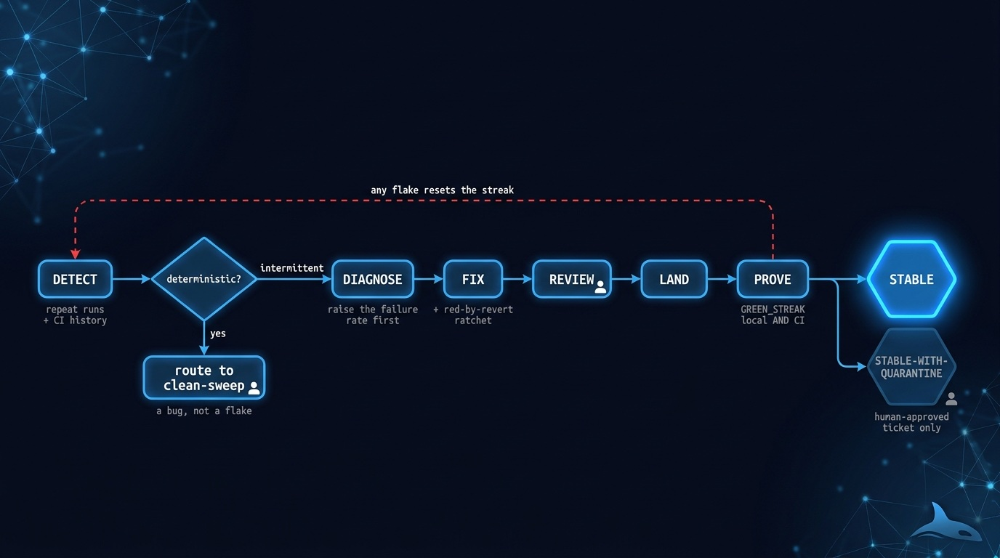
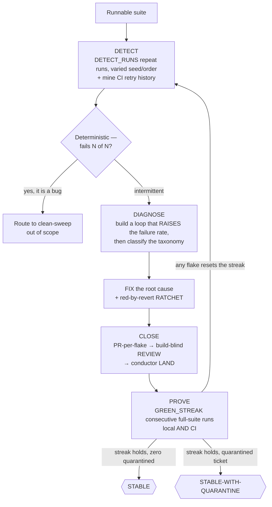

# 🎯 deflake-it — green N times in a row, local and CI

> Give it a suite nobody trusts. Come back to one that has passed a declared consecutive-green
> streak — locally and in CI — with every flake root-caused, every fix ratcheted red-by-revert,
> and not one retry-wrapper hiding the evidence.

**Skill:** [`skills/deflake-it/SKILL.md`](../../skills/deflake-it/SKILL.md) · **Layer:** mission (discoverable) · **Fix authority:** yes

  

---

## What it does

`deflake-it` is the flake-eradication fleet. The unit of work is an **intermittent failure
distribution, not a defect**: a test that fails 3 runs in 20 is a different object from a test
that fails every run, and everything about this mission — detection, diagnosis, proof — follows
from that. A **coordinator** measures per-test flake rates, dispatches **diagnosis workers**
(each running one feedback-loop-first debugging playbook — mattpocock diagnosing-bugs or
addyosmani debug — as its single router), and re-runs the whole suite for a consecutive-green
streak until the declared confidence contract holds. Every unit emits a SHA-bound
[evidence manifest](../concepts.md#the-evidence-manifest).

Rerun behavior **is** the mission, not verification bolted on after a fix. Detection means
repeated observations: the suite runs `{{DETECT_RUNS}}` times (default 20, in parallel, with
varied seed and order) to produce a per-test flake rate — and CI retry history is mined
alongside, because a pass-on-retry test flakes in an environment local runs never reproduce. A
CI-only flake is captured even when its local rate is zero.

One triage rule up front: a test that fails **N out of N runs is not a flake — it is a bug**,
and it routes to [`clean-sweep`](clean-sweep.md), out of scope here.

## When to reach for it

- "Kill the flaky tests." / "Deflake the CI." / "Flake zero."
- The suite is red one run in five and nobody trusts a green build anymore.
- CI retries are load-bearing and every merge is paying for them.
- Before [`prove-it`](prove-it.md) — a mutation audit needs a harness that fails only on
  signal.

**When NOT to reach for it:**

- One hard intermittent bug in production — that is [`root-cause`](root-cause.md), a single
  diagnosis, not a suite-wide statistical contract.
- The failures are deterministic — that is a bug backlog: [`clean-sweep`](clean-sweep.md).
- The suite is stable but thin — coverage of the critical surface is
  [`prove-it`](prove-it.md).

## The pipeline

Phase by phase:

1. **Detect.** `{{DETECT_RUNS}}` repeat runs (default 20; parallel, varied seed and order) turn
   "sometimes fails" into a measured per-test rate. CI retry history is mined for pass-on-retry
   tests — the flakes that live only in CI's environment — and each is captured even at a local
   rate of zero. Deterministic N/N failures are triaged out as bugs.
2. **Diagnose** ([`diagnose`](../../playbooks/diagnose.md), adapted). Phase 1 is the skill: a
   loop that **raises the failure rate** must exist before any theory does — a tight loop,
   under load, with clock skew, shuffled order, shared-state siblings. For an intermittent
   failure the goal is a higher reproduction rate, not a clean repro. Then the flake is
   classified: order-dependence, shared mutable state, real time or timezone, network, unseeded
   RNG, resource leak, too-tight timeout, async race — and **the class dictates the fix**.
3. **Fix and ratchet** ([`build-change`](../../playbooks/build-change.md)). The fix targets the
   root cause, never the symptom, and carries the flake's negative control — the
   **red-by-revert ratchet**: revert only the fix and show the flake returns at its measured
   rate; restore it and show it stays gone across a mini-streak. `retry(3)` is not a fix; it is
   how a flake goes into hiding.
4. **Close** ([`remediate-finding`](../../playbooks/remediate-finding.md)). PR-per-flake
   against BASE, a build-blind review, then the conductor lands it. The retry-wrapper ban is
   enforced mechanically: the diff is grepped for retry/rerun wrappers before the close counts.
5. **Prove.** The full suite runs `{{GREEN_STREAK}}` consecutive times (default 10), local
   **and** verified in CI via `gh run list`. Any flake anywhere resets the streak to zero and
   re-enters detection. The streak is the contract; one green run is an anecdote.

## Terminal states — quarantined is not stable

| State                    | Meaning                                                                                            |
|--------------------------|----------------------------------------------------------------------------------------------------|
| `STABLE`                 | Full suite green for the whole streak, local AND CI; zero flakes, zero retry-wrappers              |
| `STABLE-WITH-QUARANTINE` | At least one flake survived diagnosis with no root cause, quarantined with a human-approved ticket |

The degraded state is never reported as `STABLE`, and there is no "documented and left flaky"
exit: every detected flake ends root-caused-and-fixed or quarantined-with-a-ticket.

## Human gates

Per [`gate-classification`](../../runtime/gate-classification.md):

1. **The quarantine.** A flake that survives diagnosis with no root cause is quarantined only
   with a human-approved tracking ticket. The fleet cannot grant itself permission to give up.

Fix-backed closes need no extra gate — the evidence chain (merged PR, red-by-revert ratchet,
the streak) is the authorization.

## Convergence proof

`deflake-it` is done when — and only when:

- every detected flake — local and CI-only — reached a terminal state: root-caused, fixed, and
  merged with a red-by-revert ratchet, or quarantined with a human-approved ticket;
- CI-only flakes are not "disproven" by the local streak: each is fixed and verified in CI —
  green across `{{GREEN_STREAK}}` triggers with the `gh run list` output pasted — or
  quarantined;
- the streak itself is pasted: timestamps plus the seed and order of every run, local and CI;
- zero retry or rerun wrappers were added, verified by grepping the diff.

## A worked example

The ask: main goes red about one run in five, and nobody trusts CI anymore.

**Detect.** Thirty full-suite runs with varied seed and order, plus a mine of `gh run list`
retry history, surface three intermittents — and one impostor: a test that fails 30 of 30
under a fixed seed. Deterministic failure is a bug, not a flake; it routes to `clean-sweep`
and out of this run's denominator.

**Diagnose by raising the failure rate.** The worst flake is order-coupled: green alone, red
after `billing.spec` runs first. The diagnosis loop makes it fail 80% of the time (run the
pair, induced scheduling delay) before anyone touches code — a fix you cannot demonstrate
against a reliable red is a guess.

**Fix the root cause, ratchet the proof.** The culprit is the *other* test: `billing.spec`
freezes the clock and never restores it in teardown. The fix lands there — not a retry, not a
sleep in the victim — with a red-by-revert ratchet: revert the fix, watch the loop go red
again, restore, file both artifacts.

**Prove the streak.** `GREEN_STREAK` demands consecutive full-suite green runs local AND on CI.
At run 22 of 30 a different test flickers — the streak resets to zero and the new flake enters
the loop. Second time through, the streak holds: **STABLE**. The quarantine door exists
(`STABLE-WITH-QUARANTINE`) but only with a human-approved ticket — the fleet cannot grant
itself permission to give up.

## Failure modes this mission is built to prevent

| Anti-pattern                                  | Why it burns you                                         |
|-----------------------------------------------|----------------------------------------------------------|
| Theorizing before an elevated-rate loop       | A theory you cannot reproduce is a guess with confidence |
| `retry(n)` / `--rerun-failures` as the fix    | Hides the flake and poisons the detection signal         |
| One green run declared done                   | One pass says nothing about a distribution               |
| Treating an N/N failure as a flake            | It is a deterministic bug — `clean-sweep` owns it        |
| Widening a timeout to mask a race             | The race remains; the suite just got slower and quieter  |
| Trusting the local streak for a CI-only flake | It flakes in an environment local runs never reproduce   |

## Composes

Playbooks: [`diagnose`](../../playbooks/diagnose.md) ·
[`build-change`](../../playbooks/build-change.md) ·
[`remediate-finding`](../../playbooks/remediate-finding.md)

Runtime policies: [`merge-serialization`](../../runtime/merge-serialization.md) ·
[`reviewed-sha-freshness`](../../runtime/reviewed-sha-freshness.md) ·
[`dispatch-lifecycle`](../../runtime/dispatch-lifecycle.md) ·
[`liveness-resume`](../../runtime/liveness-resume.md) ·
[`evidence-manifest`](../../runtime/evidence-manifest.md) ·
[`gate-classification`](../../runtime/gate-classification.md)

## Related missions

- [`root-cause`](root-cause.md) — one hard intermittent bug, diagnosed to a demonstrated cause.
- [`prove-it`](prove-it.md) — once the suite is trustworthy, prove it covers what matters.
- [`clean-sweep`](clean-sweep.md) — where deterministic N/N failures go to be closed.
