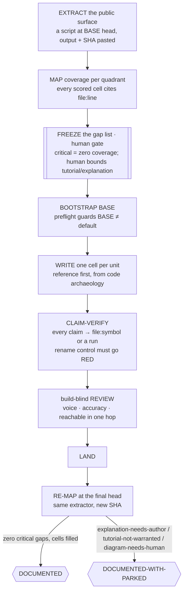

# 📚 document-it — every public-surface cell filled, every claim anchored

> **Autonomy:** L4 (Osmani L0-L5, parallel delegation) — a coordinator plus parallel per-cell writer workers, each reviewed build-blind; which entities deserve a tutorial or an explanation is your call.
> **Activation load:** ~29,500 tokens — this SKILL.md plus every playbook and runtime doc its Composes/rides clause makes mandatory ([why it is measured](../../ARCHITECTURE.md#instruction-budget))
> **Proof:** doctrine-only — no recorded run yet; the protocol is mechanism, not yet field-proven.

> Point it at a public surface nobody has documented. Come back to a coverage map re-derived at
> the final head with zero critical gaps — and every factual claim in every new page bound to a
> `file:symbol` or a pasted run, with a rename control proving the check actually checks.

**Skill:** [`skills/document-it/SKILL.md`](../../skills/document-it/SKILL.md) · **Layer:** mission (discoverable) · **Fix authority:** yes — docs land as PRs

<p align="center">
  <picture>
    <source media="(prefers-color-scheme: dark)" srcset="../../assets/diagrams/missions/document-it.jpg">
    <source media="(prefers-color-scheme: light)" srcset="../../assets/diagrams/missions/document-it-light.jpg">
    
  </picture>
</p>

---

## Invoke it

```
> document this project
```

**Needs** (the skill's `compatibility` field, verbatim): HARD dependency: Orca runtime + the orchestration skill (Orca CLI). git + gh. A machine-derivable public surface (an extractor script the repo has or the run writes) and a runnable claim check. Where the docs live in a framework (Docusaurus, MkDocs, Nextra), its build must run locally. One worker playbook pack per worker (matt or addy) — never two routers in one worker.

## What it does

`document-it` is the documentation-coverage fleet. The surface is **extracted by a script**, not by
reading: exported symbols, CLI commands and flags, config keys, environment variables, endpoints,
published skills. Every entity is then scored per Diataxis quadrant — reference, how-to, tutorial,
explanation — and every scored cell must cite a `file:line` a grep found. Zero coverage anywhere is
a **critical gap**; reference-only is a **common gap**. The human bounds which entities merit a
tutorial or an explanation, the gap list freezes, and each cell is written by its own worker,
reference first, from code archaeology.

The unit of work is **one (public-surface entity × quadrant) cell**. The oracle is the map
re-derived at the final head plus a per-claim anchor check with a negative control: rename the
anchored fact on a throwaway branch and the claim check must go RED. A claim check that stays green
against a renamed symbol is checking nothing.

## When to reach for it

- "Our public API and CLI are basically undocumented."
- "New hires cannot find anything — build the docs out."
- "Write the reference docs for these modules, and make sure they are true."

**When NOT to reach for it:**

- Docs that already exist and **lie** — that is [`clean-sweep`](clean-sweep.md) with
  `source=doc-claims`: its unit is a false claim, its terminal is zero false claims. This mission's
  unit is an empty coverage cell and its terminal is zero critical gaps. Same claim oracle,
  opposite denominators.
- Syncing docs to one wave's diff — [`ship-it`](ship-it.md)'s doc-sync unit inside the release
  states.
- Re-witnessing runtime doctrine against an installed binary — [`pin-it`](pin-it.md).
- Decisions rather than deliverables — [`map-it`](map-it.md).

## The pipeline



Reference cells for an entity land **before** its how-to and tutorial cells: reference establishes
the vocabulary the other quadrants use, and it is the quadrant derivable from code alone. Cells
touching one doc file form a merge chain.

## Terminal states

| State | Meaning | Who acts on it |
|---|---|---|
| `DOCUMENTED` | The re-derived map shows zero critical gaps and every frozen cell filled; every claim anchored with its rename control RED; every doc reachable in one hop; diagram entities cross-reference clean | terminal — the promotion PR is yours |
| `DOCUMENTED-WITH-PARKED` | ≥1 cell parked `explanation-needs-author`, `tutorial-not-warranted`, or `diagram-needs-human` | a human writes the "why", declines the tutorial, or fixes the diagram |

## Human gates

Freezing the gap list is a gate: critical gaps are mechanical (zero coverage), but "does this
entity deserve a tutorial" is taste, decided once, in a batch.
`explanation-needs-author` is one-way — design rationale that is not in the tree cannot be inferred
from it, and an invented "why" is worse than a blank. Diagram edits that change meaning are human.
BASE → default promotion stays yours.

## Convergence proof

- **The map is RE-DERIVED at the final head** with the same extractor at a new SHA — never the
  frozen copy — and shows zero critical gaps with every frozen cell filled and citing a `file:line`.
- **Every factual claim in every landed doc has a verified anchor**, and the negative control
  holds: rename the anchored fact on a throwaway branch and the claim check goes RED.
- **Diagram entities cross-reference clean** against the extracted surface, or are flagged and
  parked.
- **Every landed doc is reachable in one hop** from the repo's root entry points. An orphan page is
  a gap even when its content is perfect.

The verifier re-runs the extractor and the claim check at the merged SHA. Prose quality is *not*
the oracle here — coverage, anchoring, and reachability are; taste findings go to the review round
or park.

## A worked example

*A run, sketched — the shape of one, not a transcript.*

> document this project

**Extract.** A script at the BASE head lists 41 exported symbols, 12 CLI flags and 7 environment
variables; its output and SHA are pasted, so the denominator is not whatever a writer noticed.

**Map.** Every entity is scored per quadrant. Fifteen cells have zero coverage (critical); twenty
are reference-only (common).

**Freeze (your gate).** You bound the taste: three entities deserve a tutorial, none an
explanation page. The gap list freezes.

**Write → claim-verify.** One worker per cell, reference first, from code archaeology. Every
claim is anchored to a `file:symbol`; the negative control renames `parse_config` on a throwaway
branch and the claim check goes RED.

**Review → land → re-map.** Build-blind review checks voice, accuracy and that each page is
reachable in one hop. The map re-derived at the final head shows zero critical gaps. Two cells
are parked `explanation-needs-author` — the design rationale is not in the tree, and an invented
"why" is worse than a blank. The run ends `DOCUMENTED-WITH-PARKED`.

## Failure modes this mission is built to prevent

| Anti-pattern | Why it burns you |
|---|---|
| Writing before extracting | The denominator becomes whatever the writer happened to notice |
| Hand-listing the public surface | It shrinks silently as the code grows |
| Paraphrasing the old docs | That is how a false claim gets a second home |
| A claim with no anchor because it "reads true" | Unverifiable prose is how docs rot into lies |
| A claim check with no rename control | It proves nothing; a vacuous gate |
| A tutorial for every entity because the map has a column | Agent-written tutorials nobody needed are instruction debt |
| Auto-rewriting a diagram | Its meaning is a judgment; flag it, do not guess |
| Landing a page nothing links to | Unreachable coverage is not coverage |
| Clobbering the changelog / bumping a version | Those are history and a decision, not side effects |

## Composes
Playbooks:
[`doc-coverage`](../../playbooks/doc-coverage.md) ·
[`remediate-finding`](../../playbooks/remediate-finding.md) ·
[`acceptance-review`](../../playbooks/acceptance-review.md) ·
[`compound-learn`](../../playbooks/compound-learn.md)

Runtime policies:
[`evidence-manifest`](../../runtime/evidence-manifest.md) ·
[`merge-serialization`](../../runtime/merge-serialization.md) ·
[`reviewed-sha-freshness`](../../runtime/reviewed-sha-freshness.md) ·
[`dispatch-lifecycle`](../../runtime/dispatch-lifecycle.md) ·
[`liveness-resume`](../../runtime/liveness-resume.md) ·
[`ledger-contract`](../../runtime/ledger-contract.md) ·
[`attention-budget`](../../runtime/attention-budget.md) ·
[`gate-classification`](../../runtime/gate-classification.md)

## Related missions

- [`clean-sweep`](clean-sweep.md) — `source=doc-claims` removes false claims from docs that exist; this fills empty cells.
- [`ship-it`](ship-it.md) — its doc-sync unit covers the wave's own diff, not the whole surface.
- [`pin-it`](pin-it.md) — runtime doctrine re-witnessed against an installed binary.
- [`map-it`](map-it.md) — decisions, not deliverables.
