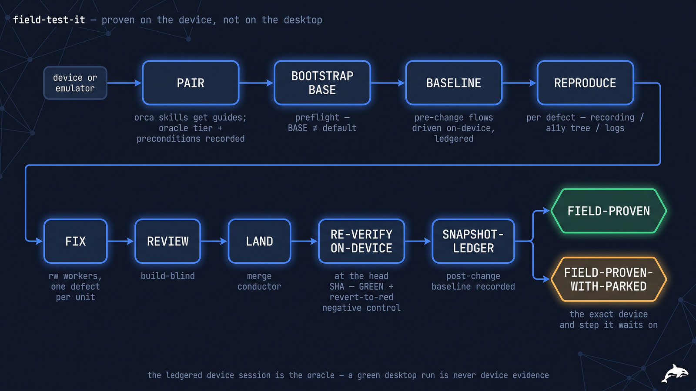
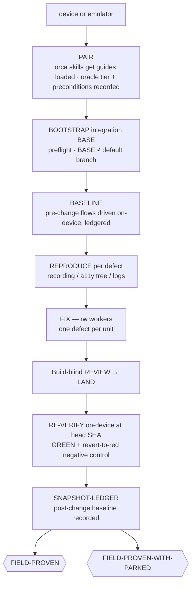

# 📱 field-test-it — proven on hardware, not on hope

> **Autonomy:** L4 (Osmani L0-L5, parallel delegation) — parallel fix workers per device-observed defect, each re-verified on the target; device pairing and anything outside the paired device set are your one-way gates.
> **Activation load:** ~29,100 tokens — this SKILL.md plus every playbook and runtime doc its Composes/rides clause makes mandatory ([why it is measured](../../ARCHITECTURE.md#instruction-budget))
> **Proof:** doctrine-only — no recorded run yet; the protocol is mechanism, not yet field-proven.

> Point it at "works on my machine, breaks on my phone." Come back to each on-device defect
> reproduced with artifacts, fixed, and re-proven on the same device at the head SHA — with a
> revert negative control that proves the fix caused the green.

**Skill:** [`skills/field-test-it/SKILL.md`](../../skills/field-test-it/SKILL.md) · **Layer:** mission (discoverable) · **Fix authority:** yes — `PROFILE=rw` fix workers

  

---

## What it does

`field-test-it` is the on-device verification fleet. A **coordinator** loads the version-matched
guides (`orca skills get orca-emulator` / `orca-emulator-android`) and pairs a session per them —
Android via adb (accessibility tree + logcat are the command surface; emulator or adb-visible
physical), iOS via the Simulator pane (the app's own xcodebuild/simctl builds and installs first;
physical iOS is not a command surface of either skill and parks) — records the session's **oracle
tier** (EMULATOR vs PHYSICAL — a hardware-only defect class can never be proven on an emulator),
and captures a **pre-change baseline** of the target flows. Each defect is reproduced on-device (recording / accessibility
tree / logs), fixed by an rw worker, and **re-verified on-device at the head SHA** — plus the
negative control: revert the fix and the on-device failure returns. The post-change baseline is
ledgered for the next run.

The unit of work is **one device-observed defect** (or one device QA pass over a flow). The
defining property: the oracle is the ledgered device session — typed by tier (PHYSICAL or EMULATOR),
never upgraded silently — so a green desktop run is never accepted as device evidence.

## When to reach for it

- "Works on desktop, breaks on mobile — verify on a real device and fix it."
- "Run the onboarding flow on an emulator and prove the fix there."
- "Mobile regression: reproduce, fix, re-verify on hardware."

**When NOT to reach for it:**

- Web performance budgets — [`speed-it`](speed-it.md) (measurement oracle).
- WCAG conformance on a rendered surface — [`access-it`](access-it.md).
- Test-coverage gaps — [`prove-it`](prove-it.md) (suite oracle).
- A per-diff verdict — [`review-it`](review-it.md).

## The pipeline

## Terminal outcomes

| Verdict | Meaning | Who acts on it |
|---|---|---|
| `FIELD-PROVEN` | every on-device defect fixed + re-verified on-device at head SHA; revert NC holds; baseline re-ledgered | nobody |
| `FIELD-PROVEN-WITH-PARKED` | ≥1 defect needs a device/step the session lacks; parked with the exact device + step named | the named owner runs the parked device step |

`FIELD-PROVEN-WITH-PARKED` is a degraded terminal; a chain stops there per
[`mission-chaining`](../../runtime/mission-chaining.md) unless the next link declares it tolerable.

## Human gates

Device pairing, permission grants, storefront/account surfaces, and anything outside the paired
device set are one-way or human items under
[`gate-classification`](../../runtime/gate-classification.md) — a stranger's device is never
touched. App installs are host-side work on the coordinator's machine; fix workers run `PROFILE=rw`
per [`sandbox-policy`](../../runtime/sandbox-policy.md). A defect that won't reproduce is parked
with the gap named, never silently closed — and a hardware-only defect class is never "verified" on
the emulator tier.

## Convergence proof

`field-test-it` is done when every device-observed defect carries: repro artifact + fix +
on-device re-verify GREEN at `head_sha` + revert-to-red negative control, ledgered with the
capability tier — or a PARK naming the exact device and step it waits on. The before/after
baselines are recorded; the verifier replays the recorded artifacts at the merged SHA (the
archived repro re-driven expecting GREEN, plus a spot-check of the revert-RED receipt) — it never
re-applies an already-landed fix — and, on a ≥10% sample per the mutation-unit floor, a fresh
worker reverts the fix on a throwaway branch and re-drives the on-device flow expecting RED
(landed BASE is never modified). A green desktop run is never accepted as device evidence; a
one-time repro is marked flaky and re-driven, not closed.

## Composes

Playbooks: [`diagnose`](../../playbooks/diagnose.md) ·
[`remediate-finding`](../../playbooks/remediate-finding.md) ·
[`acceptance-review`](../../playbooks/acceptance-review.md) ·
[`compound-learn`](../../playbooks/compound-learn.md) ·
[`browser-drive`](../../playbooks/browser-drive.md) ·
[`human-handoff`](../../playbooks/human-handoff.md)

Runtime policies: [`evidence-manifest`](../../runtime/evidence-manifest.md) ·
[`merge-serialization`](../../runtime/merge-serialization.md) ·
[`reviewed-sha-freshness`](../../runtime/reviewed-sha-freshness.md) ·
[`dispatch-lifecycle`](../../runtime/dispatch-lifecycle.md) ·
[`liveness-resume`](../../runtime/liveness-resume.md) ·
[`ledger-contract`](../../runtime/ledger-contract.md) ·
[`sandbox-policy`](../../runtime/sandbox-policy.md) ·
[`gate-classification`](../../runtime/gate-classification.md) ·
[`attention-budget`](../../runtime/attention-budget.md)

## Related missions

- [`root-cause`](root-cause.md) — diagnosis without fix authority; REPRODUCE borrows its discipline and adds the device oracle.
- [`prove-it`](prove-it.md) — suite-based coverage, not hardware.
- [`speed-it`](speed-it.md) — perf budgets on journeys, measured not observed.
- [`access-it`](access-it.md) — WCAG conformance on a rendered surface.
