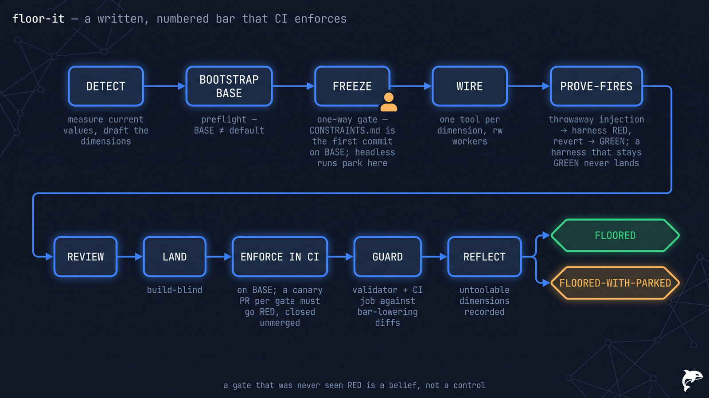

# 🧱 floor-it — a written bar that fires

> **Autonomy:** L4 (Osmani L0-L5, parallel delegation) — parallel wiring and prove-fires workers, one dimension each; freezing the bar is your one-way gate.
> **Activation load:** ~27,300 tokens — this SKILL.md plus every playbook and runtime doc its Composes/rides clause makes mandatory ([why it is measured](../../ARCHITECTURE.md#instruction-budget))
> **Proof:** doctrine-only — no recorded run yet; the protocol is mechanism, not yet field-proven.

> Point it at a repo whose standards live in people's heads. Come back to a committed, numbered
> CONSTRAINTS table where every dimension has a tool, every tool was proven to go RED on an
> injected violation, CI blocks on all of it — and a guard watches the bar itself for quiet
> lowering.

**Skill:** [`skills/floor-it/SKILL.md`](../../skills/floor-it/SKILL.md) · **Layer:** mission (discoverable) · **Fix authority:** yes — `PROFILE=rw` wire workers

<p align="center">
  
</p>

---

## What it does

`floor-it` installs the quality bar. A **coordinator** reads the stack and drafts the constraint
dimensions with measured current values, then **freezes** them with you — a committed
`CONSTRAINTS.md` table: dimension × threshold × tool × gate job × measured-at-freeze. Workers wire
one machine check per dimension on the integration BASE, each unit build-blind reviewed, and each unit
must **prove it fires before it is reviewed**: the coordinator (never a worker) injects
a violation on a throwaway branch — a deleted test file, a fixture lockfile a scanner reads without
installing, an injected sleep, a stripped alt text, a forbidden import — and the harness goes RED;
revert, GREEN — a harness that stays GREEN is reverted and never lands. After CI enforcement lands, a canary PR per gate must turn CI red and is closed
unmerged. Finally a **guard** — a checked-in validator plus a CI job — fails any diff that lowers a
threshold in `CONSTRAINTS.md` or touches a per-dimension tool-config surface listed in the frozen
table (suppressions, skipped tests, exclusions) without a waiver (a recorded DECISIONS line per
gate-classification).

The unit of work is **one constraint dimension**. The defining property: the bar is written,
numbered, and tool-enforced — prose standards are explicitly not the product.

## When to reach for it

- "Set the quality bar and make CI enforce it."
- "Our bar keeps slipping — catch threshold edits and new suppressions."
- "Define our standards: coverage, security scanning, perf budgets, architecture boundaries."

**When NOT to reach for it:**

- Closing test debt on critical paths — [`prove-it`](prove-it.md) (one dimension, not the bar).
- Journey-level performance budgets with measurement contracts — [`speed-it`](speed-it.md).
- Conformance to an external framework (SOC 2 / EU AI Act) — [`attest-it`](attest-it.md).
- A WCAG conformance sweep over a frozen page set — [`access-it`](access-it.md) (floor-it may wire its axe-core oracle as a CI gate; it never drives the surface).
- A security threat-model loop — [`harden-it`](harden-it.md).

## The pipeline

```mermaid
flowchart TD
    A[repo stack + existing gates] --> B[DETECT<br/>measure current values, draft dimensions]
    B --> C2[BOOTSTRAP integration BASE<br/>preflight · BASE ≠ default branch]
    C2 --> C[FREEZE — one-way gate<br/>CONSTRAINTS.md is the first commit ON BASE · headless run PARKS here]
    C --> D[WIRE per dimension — rw workers<br/>PROVE-FIRES pre-review: throwaway injection → harness RED · revert → GREEN<br/>a harness that stays GREEN never lands]
    D --> E[Build-blind REVIEW → LAND]
    E --> F[ENFORCE in CI on BASE (a reviewed unit) → canary PR per gate<br/>CI must go RED · canary closed unmerged]
    F --> G[GUARD<br/>checked-in validator + CI job against bar-lowering diffs]
    G --> H[REFLECT<br/>untoolable dimensions recorded]
    H --> I{{FLOORED}}
    H --> J{{FLOORED-WITH-PARKED}}
```

## Terminal outcomes

| Verdict | Meaning | Who acts on it |
|---|---|---|
| `FLOORED` | every frozen dimension wired, proven-RED (local + canary PR), enforced in CI; guard in CI; CONSTRAINTS.md committed | nobody — the bar holds |
| `FLOORED-WITH-PARKED` | ≥1 dimension has no measurable tool (parked with the human gate named), or the run parked AT the freeze in a headless session | the named human gate covers that dimension / answers the freeze |

`FLOORED-WITH-PARKED` is a degraded terminal; a chain stops there per
[`mission-chaining`](../../runtime/mission-chaining.md) unless the next link declares it tolerable.

## Human gates

**FREEZE is the one-way gate** ([`gate-classification`](../../runtime/gate-classification.md)) —
the thresholds are the product: interactive sessions interview with recommended defaults and you
freeze; **headless / spawned / scheduled runs publish the proposal and PARK at the freeze** —
one-way doors are human-only, never auto-resolved, never defaulted on timeout
([`mission-scheduling`](../../runtime/mission-scheduling.md) already parks at freeze). Editing a
threshold down mid-run is one-way, never mechanical — that is the GUARD's exact target. Violation
injections are coordinator-executed on throwaway branches (never delegated, never on BASE); wire
workers run `PROFILE=rw` ([`sandbox-policy`](../../runtime/sandbox-policy.md)).

## Convergence proof

`floor-it` is done when every dimension in the frozen `CONSTRAINTS.md` is accounted for: a wired
tool whose RED was demonstrated on a throwaway-branch injection and whose GREEN was restored, a
canary PR whose CI ran RED and was closed unmerged, enforcement on BASE, and guard coverage — all
bound to `head_sha` — or PARKED as untoolable with the human gate named. The verifier replays the
RECORDED injection artifacts (archived canary runs and RED/GREEN transcripts); it never injects
fresh violations into landed code. The table never shrank mid-run.

## Composes

Playbooks: [`decide-and-freeze`](../../playbooks/decide-and-freeze.md) ·
[`remediate-finding`](../../playbooks/remediate-finding.md) ·
[`acceptance-review`](../../playbooks/acceptance-review.md) ·
[`compound-learn`](../../playbooks/compound-learn.md) ·
[`human-handoff`](../../playbooks/human-handoff.md)

Runtime policies: [`evidence-manifest`](../../runtime/evidence-manifest.md) ·
[`merge-serialization`](../../runtime/merge-serialization.md) ·
[`reviewed-sha-freshness`](../../runtime/reviewed-sha-freshness.md) ·
[`dispatch-lifecycle`](../../runtime/dispatch-lifecycle.md) ·
[`liveness-resume`](../../runtime/liveness-resume.md) ·
[`ledger-contract`](../../runtime/ledger-contract.md) ·
[`sandbox-policy`](../../runtime/sandbox-policy.md) ·
[`gate-classification`](../../runtime/gate-classification.md) ·
[`attention-budget`](../../runtime/attention-budget.md)

## Related missions

- [`prove-it`](prove-it.md) — test debt on critical paths; one dimension of a bar, not the bar.
- [`speed-it`](speed-it.md) — journey-level perf budgets with measurement contracts.
- [`attest-it`](attest-it.md) — external framework obligations, not a self-imposed bar.
- [`access-it`](access-it.md) — the WCAG surface sweep; floor-it may wire its oracle as a CI gate.
- [`harden-it`](harden-it.md) — the security threat-model loop; floor-it's security dimension is a standing gate, not a loop.
- [`pin-it`](pin-it.md) — pins the fleet's own runtime doctrine; floor-it pins the target repo's bar.
