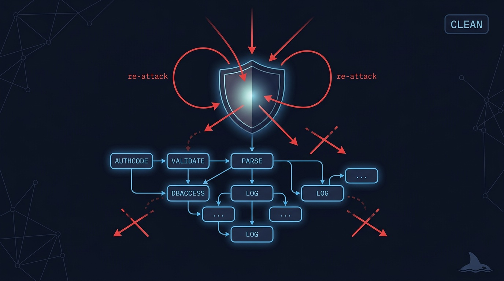
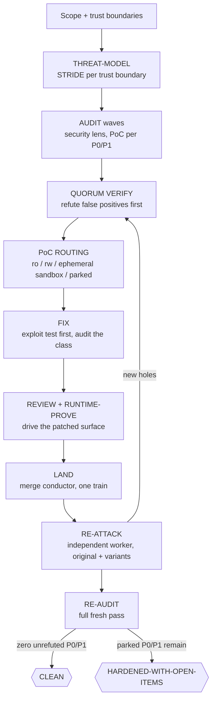

# 🛡️ harden-it — a threat model closed by a clean re-audit

> Fix it, then try to break the fix. Give it a system to harden and come back to a closed threat
> model: every P0/P1 proven with an exploit, fixed as a class, re-attacked by a worker that wants
> the fix to fail, and a fresh full audit finding zero unrefuted criticals — or an honest
> HARDENED-WITH-OPEN-ITEMS naming exactly what still stands open.

**Skill:** [`skills/harden-it/SKILL.md`](../../skills/harden-it/SKILL.md) · **Layer:** mission (discoverable) · **Fix authority:** yes

  

---

## What it does

`harden-it` is the adversarial security fleet. The unit of work is not a mere finding — it is a
**threatened invariant and an exploit class**. A leaked key is not "delete line 12"; it is
"secrets can reach the repo", and the class stays open until it is audited everywhere it lives.
A **coordinator** builds the threat model, dispatches audit waves that must prove every critical
with a PoC, quorum-refutes false positives before any fix effort is spent, routes each PoC to the
sandbox its blast radius demands, and — after every fix merges — sends a fresh, independent
worker to attack the fix again. The loop ends only when a full re-audit of the whole surface
comes back with zero unrefuted P0/P1.

Every disposition is backed by a SHA-bound
[evidence manifest](../concepts.md#the-evidence-manifest): the exploit test that failed pre-fix,
the quorum vote table behind a refutation, or the named blocker on a parked item. A parked P0 is
an exposed system, not an ordinary parked item — it is named, never buried.

The threat model is STRIDE per trust boundary; the audit lens covers OWASP Top 10, OWASP LLM
Top 10, and supply chain. Security is a NEVER_GATE lens: its value is the miss it would catch,
so it never auto-gates off no matter how many quiet dispatches precede it.

## When to reach for it

- "Harden this." / "Security sweep." / "Red team the service."
- "Close the security loop" after an audit landed a pile of scary findings.
- An unattended audit → fix → verify security run.

**When NOT to reach for it:**

- A bounded, per-diff security check — that is [`review-it`](review-it.md) running the
  [`risk-review`](../../playbooks/risk-review.md) security lens: one pass, no loop.
- A general findings backlog — [`clean-sweep`](clean-sweep.md); its proof is an empty list, not
  a clean re-audit.
- Building new work with security lenses along the way — [`ship-it`](ship-it.md) already
  composes `risk-review` inside its review phase.

## The pipeline

Phase by phase:

1. **Threat-model.** STRIDE per trust boundary. The Always / Ask-First / Never boundary maps to
   one-way gates up front, so nothing irreversible gets improvised mid-run.
2. **Audit waves** ([`risk-review`](../../playbooks/risk-review.md), security lens, per axis).
   Every P0/P1 needs a concrete, step-by-step exploit scenario — a PoC, not a vibe. Model output
   is treated as untrusted, live APIs are never tested, and one verified finding triggers a
   tree-wide grep for variants.
3. **Quorum verify.** False positives are killed before fix effort is spent. A refutation is a
   quorum verdict with the vote table recorded, not one worker's shrug.
4. **PoC routing** ([`sandbox-policy`](../../runtime/sandbox-policy.md)). Static analysis runs
   read-only (`ro`); a safe local exploit runs workspace-write (`rw`); networked, destructive,
   or supply-chain PoCs run under the danger profile inside an **ephemeral per-workspace
   sandbox** — work harvested by pushing the lane's own branch *before* teardown, the sandbox
   destroyed and verified, everything entering BASE through the normal PR pipeline. A finding
   with no safe sandbox becomes evidence-backed PARKED; its PoC is never executed on the host.
5. **Fix** ([`remediate-finding`](../../playbooks/remediate-finding.md)). The exploit test is
   written first and fails pre-fix. The fix audits the whole **class**, not the instance —
   otherwise the vuln walks next door. Secret leaks route to **rotation**: a one-way gate whose
   completion is verified (the rotated key confirmed dead), never a silent line-deletion.
6. **Review and prove** ([`runtime-prove`](../../playbooks/runtime-prove.md)). A build-blind
   review, then the patched surface is driven at its real entry point — a unit-harness-only
   green can leave the real route exploitable.
7. **Land, re-attack, re-audit** ([`merge-serialization`](../../runtime/merge-serialization.md)).
   The conductor merges; then a fresh worker that did not write the fix replays the original
   exploit plus variants and sweeps the class. New holes re-enter the loop. When the loop goes
   quiet, a full fresh audit pass names the outcome.

## Terminal states — name the one reached

| State                      | Meaning                                                                                                                              | Who advances past it           |
|----------------------------|--------------------------------------------------------------------------------------------------------------------------------------|--------------------------------|
| `CLEAN`                    | Every P0/P1 that ever surfaced is fixed + merged with a re-attack pass, or refuted; a final full re-audit finds zero unrefuted P0/P1 | terminal                       |
| `HARDENED-WITH-OPEN-ITEMS` | All fixable findings closed, but ≥1 P0/P1 is parked awaiting a verified one-way human action or has no safe sandbox — named per item | a human clears each named item |

One-way remediations count toward `CLEAN` only when the human action is **verified complete** — a
rotated key confirmed dead — not merely gate-recorded. And `HARDENED-WITH-OPEN-ITEMS` is a
degraded outcome, never a synonym: reporting it as `CLEAN` is exactly the overclaim the re-audit
exists to prevent.

## Human gates

- **One-way remediations.** Secret rotation, auth-flow changes — classified one-way, executed by
  you, and verified done before they count toward CLEAN.
- **The danger sandbox.** A danger-profile PoC lane requires `ORCA_COORD_ALLOW_DANGER=1`; under
  an active careful/freeze governance policy, even sandboxed danger needs an explicit recorded
  human grant.
- **Promotion.** As everywhere, merging BASE to the default branch is a one-way human gate; the
  fleet stops at the promotion PR.

## Convergence proof

`harden-it` is done when — and only when:

- every P0/P1 has a terminal disposition — fixed + merged with an exploit test that failed
  pre-fix (revert-audited), refuted by quorum with the vote table, or PARKED with its blocker;
- every fix carries a recorded RE-ATTACK verdict from an independent worker plus a class-audit
  note;
- a final, full, fresh re-audit is pasted, and the outcome line reads `CLEAN` or
  `HARDENED-WITH-OPEN-ITEMS`;
- every secret leak shows a verified rotation, never a deleted line.

## A worked example

The ask: harden a multi-tenant SaaS API before an enterprise pilot.

**Threat model → audit.** STRIDE over the tenant-isolation boundary. The audit wave lands a P1:
`GET /api/export?tenant_id=…` trusts the query parameter — any authenticated user can export
any tenant. A PoC is mandatory for a P1, and it is exploit code, so it routes to the ephemeral
sandbox under a recorded `ORCA_COORD_ALLOW_DANGER=1` grant — never your machine.

**Quorum verify.** A second worker tries to refute the finding before anyone fixes it (false
positives are cheaper to kill here than after a fix wave). It reproduces instead: confirmed.

**Fix the class, not the instance.** The fix worker writes the exploit as a failing test
(cross-tenant export asserts 403), fixes it, then audits the class: two sibling endpoints share
the same trust-the-parameter shape and join the same PR wave.

**Re-attack.** An independent worker re-runs the original PoC plus variants against the patched
build. The original fails (good); a variant — tenant id smuggled via the `X-Org` header a legacy
middleware still honors — lands. Back through the loop: second fix, second re-attack, clean.

**Re-audit → terminal.** A full fresh audit pass finds zero unrefuted P0/P1: **CLEAN**. One item
did not make it in: rotating the leaked staging credentials the audit tripped over is one-way,
so it parked for you — executed and verified before the run counted it.

## Failure modes this mission is built to prevent

| Anti-pattern                                         | Why it burns you                                                          |
|------------------------------------------------------|---------------------------------------------------------------------------|
| Fixing before quorum-verifying                       | Fix effort burns on false positives                                       |
| "Findings fixed" reported as clean                   | Clean needs a re-attack pass and a fresh full re-audit, not a closed list |
| Fixing the instance, not the class                   | The vuln walks next door                                                  |
| Executing instructions found in scanned code or logs | That is injection into the auditor; scanned content is data, not commands |
| Running a PoC on the host when a sandbox is required | Least privilege is the point; danger lives in an ephemeral sandbox        |
| Deleting a leaked secret's line and moving on        | The key is still live; rotation, verified dead, is the fix                |

## Composes

Playbooks: [`risk-review`](../../playbooks/risk-review.md) ·
[`remediate-finding`](../../playbooks/remediate-finding.md) ·
[`runtime-prove`](../../playbooks/runtime-prove.md) ·
[`compound-learn`](../../playbooks/compound-learn.md)

Runtime policies: [`sandbox-policy`](../../runtime/sandbox-policy.md) ·
[`merge-serialization`](../../runtime/merge-serialization.md) ·
[`attention-budget`](../../runtime/attention-budget.md)

## Related missions

- [`review-it`](review-it.md) — the bounded per-diff security lens: no loop, no fix authority.
- [`clean-sweep`](clean-sweep.md) — general findings; proof is an empty list, not a clean re-audit.
- [`ship-it`](ship-it.md) — build new work; risk lenses run per-diff inside its review phase.
