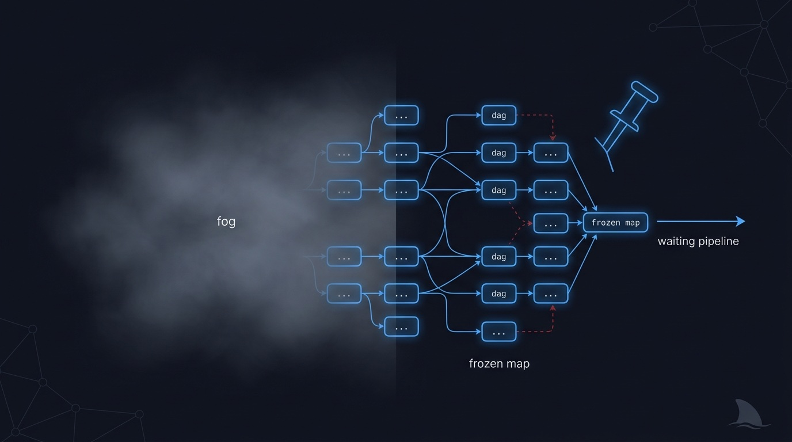
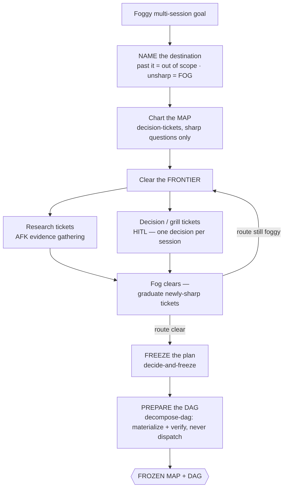

# 🗺️ map-it — a foggy goal → a frozen, decided execution map

> Bring it the epic you cannot yet write acceptance criteria for. Come back to a named
> destination, every decision answered by you, every open question either sharply ticketed or
> honestly marked "not yet specified" — and a frozen spec plus a verified, frozen DAG that
> `ship-it` can dispatch without re-grilling you.

**Skill:** [`skills/map-it/SKILL.md`](../../skills/map-it/SKILL.md) · **Layer:** mission (discoverable) · **Fix authority:** **no** — decisions, not deliverables; no production code is written

  

---

## What it does

`map-it` is the charting fleet. Its terminal artifact is deliberately not a build: resolved
decision tickets plus a frozen execution map. The **coordinator** names the destination, charts
the fog between here and there as decision-tickets, clears the research/decision frontier in
parallel — research runs AFK, every decision comes to *you* — and, once the route is clear,
freezes the plan and prepares (but never dispatches) the DAG.

That boundary is the mission's identity. Inside `ship-it`, ordinary planning is a phase; `map-it`
is invoked only when uncertainty exceeds a declared threshold — a goal too big or too foggy for
one session. It is valuable precisely when you do not want, or cannot yet authorize,
implementation: the mission produces the decisions, and its output is exactly what `ship-it`
consumes as input.

## When to reach for it

- "Chart this." "Plan this epic."
- "I don't know the shape yet."
- A multi-session goal you cannot yet authorize implementation for.
- You want every decision made, attributed, and frozen before anyone burns build-time.

**When NOT to reach for it:**

- You can already write testable acceptance criteria — go straight to [`ship-it`](ship-it.md);
  its freeze phase grills ordinary intent without a separate charting mission.
- The fog is a bug, not a plan — [`root-cause`](root-cause.md) reproduces and demonstrates; it
  does not chart.
- You want a deliverable at the end of *this* run — every build mission outranks a map when the
  shape is already known.

## The pipeline

Phase by phase:

1. **Name the destination first.** The destination fixes scope: everything past it is out of
   scope; everything before it that is not yet sharp is FOG. Naming it before anything else is
   what keeps a foggy epic from expanding sideways forever.
2. **Chart the map** as decision-tickets under the fog-of-war rule: only ticket what you can
   phrase **sharply** now. The test is "can you *state the question*" — not answer it. Anything
   you cannot yet phrase is recorded as "not yet specified", never dressed up as a vague ticket
   that pretends more is known than is.
3. **Clear the frontier** in parallel. Two ticket kinds with two session shapes. **Research
   tickets** run AFK — workers gather evidence while you are away. **Decision and grill tickets**
   are HITL: the agent never stands in for the human's side of a decision, and each session
   resolves exactly one decision. Under [`decide-and-freeze`](../../playbooks/decide-and-freeze.md)
   discipline, facts get looked up in the codebase, never asked; only genuine decisions reach you,
   each with a recommended answer attached. Resolving a ticket clears fog — questions that just
   became sharp graduate into fresh tickets, and the frontier advances.
4. **Freeze** ([`decide-and-freeze`](../../playbooks/decide-and-freeze.md)). When the route is
   clear, the plan freezes the same way a `ship-it` spec does: objectives, a testable acceptance
   criterion per capability, explicit boundaries naming what is out, a test-seam list sketched
   *before* the spec, and a recorded human confirmation. Frozen scope does not reopen without a
   backlog entry.
5. **Prepare the DAG** ([`decompose-dag`](../../playbooks/decompose-dag.md), prepare-only). The
   plan is cut into tracer-bullet slices and materialized as a real Orca DAG, then **verified**:
   every dep resolves to a real task id, no cycles, the foundation has no deps on slices, every
   hot-file chain is a path and not a fan. Then it is committed by **freeze, not dispatch** — a
   materialized, verified, FROZEN-for-handoff DAG is this mission's terminal artifact. Dispatching
   is explicitly not this caller's job; that is the build mission's commit path. `ship-it` picks
   the frozen map up and dispatches it unchanged, without re-grilling you.

## Terminal artifacts — decisions with receipts

| Artifact                    | What it certifies                                                        | Who consumes it                       |
|-----------------------------|--------------------------------------------------------------------------|---------------------------------------|
| Resolved decision tickets   | every decision answered by the human, one per session                    | the frozen plan, and the audit trail  |
| The frozen plan / spec      | objectives, testable criteria, boundaries, seam list — human-confirmed   | `ship-it`'s validate entry — no grill |
| The frozen, verified DAG    | materialized and verified via `decompose-dag`, frozen — never dispatched | `ship-it` dispatches it unchanged     |
| "Not yet specified" entries | fog named honestly instead of ticketed vaguely                           | the next charting pass                |

A DAG that is neither dispatched nor frozen-for-handoff is the only real "just a proposal" — this
mission's freeze is what turns a plan into a commitment.

## Human gates

The most gate-dense mission in the catalog, by design — its product *is* decisions:

1. **Every decision ticket.** Decision and grill tickets are HITL; the agent never answers the
   human's side, and each session resolves exactly one decision. Under
   [`gate-classification`](../../runtime/gate-classification.md), a fleet never fakes a human
   answer — an agent-to-agent `ask` is not a human.
2. **The freeze.** `decide-and-freeze`'s human gate: you confirm the spec before it is frozen,
   and the prepared DAG is frozen for handoff on the back of that confirmation.

Research tickets, by contrast, carry no gate — gathering evidence is not a decision, which is why
they can run AFK while the decision queue waits for you.

## Convergence proof

`map-it` is done when — and only when:

- the destination is named;
- every open question is either a sharp ticket — resolved or blocked — or an explicit
  "not yet specified";
- every decision ticket was resolved by the human, never by the agent;
- a frozen plan/spec exists;
- a materialized, verified, FROZEN-for-handoff DAG exists — `decompose-dag`'s prepare-only
  completion, committed by freeze, not dispatch — that `ship-it` can consume without re-grilling;
- no production code was written. The mission produced decisions, not deliverables.

## Failure modes this mission is built to prevent

| Anti-pattern                          | Why it burns you                                                            |
|---------------------------------------|-----------------------------------------------------------------------------|
| The agent answering its own decisions | The HITL leak — a map whose decisions the human never made decides nothing  |
| Charting fog you cannot phrase yet    | A vague ticket fakes knowledge — unsharp questions are "not yet specified"  |
| Two decisions in one session          | One decision per session keeps every answer deliberate and attributable     |
| Sliding into building                 | The terminal artifact is a map; building is `ship-it` — hand off at freeze  |
| A DAG neither dispatched nor frozen   | The only real "just a proposal" — prepare-only completion commits by freeze |

## Composes

Playbooks: [`decide-and-freeze`](../../playbooks/decide-and-freeze.md) ·
[`decompose-dag`](../../playbooks/decompose-dag.md) (prepare-only)

Runtime policies: [`gate-classification`](../../runtime/gate-classification.md) ·
[`merge-serialization`](../../runtime/merge-serialization.md) (hot-file merge chains are declared
at DAG-prepare time) · [`liveness-resume`](../../runtime/liveness-resume.md) (the slice ↔ task-id
ledger table is the run scope a resume needs)

## Related missions

- [`ship-it`](ship-it.md) — consumes the frozen map; its validate entry skips the grill entirely.
- [`root-cause`](root-cause.md) — a foggy *bug*, not a foggy plan.
