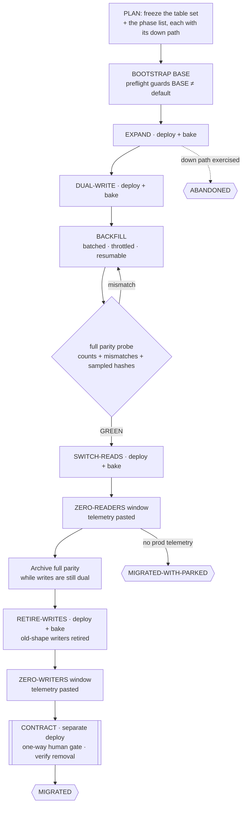

# 🗄️ migrate-it — a stateful shape change landed across deploys, nothing ever invalid

> **Autonomy:** L4 (Osmani L0-L5, parallel delegation) — a coordinator plus isolated per-phase workers; phases of one table are strictly serial, and the destructive CONTRACT step is your one-way door.
> **Activation load:** ~31,400 tokens — this SKILL.md plus every playbook and runtime doc its Composes/rides clause makes mandatory ([why it is measured](../../ARCHITECTURE.md#instruction-budget))
> **Proof:** doctrine-only — no recorded run yet; the protocol is mechanism, not yet field-proven.

> Point it at "we need to rename this column and we cannot take downtime." Come back to a table
> moved one deployable phase at a time — each phase with a down path that was actually run, old
> and new code both valid at every step, and a parity probe proving the data arrived before
> anything was dropped.

**Skill:** [`skills/migrate-it/SKILL.md`](../../skills/migrate-it/SKILL.md) · **Layer:** mission (discoverable) · **Fix authority:** yes — one PR per phase

---

## What it does

`migrate-it` is the migration fleet. A **coordinator** freezes the table set and the phase list,
then dispatches **one phase at a time per table** through the release machine: expand, dual-write,
backfill, switch reads, a zero-reader window, retiring the old writers, a zero-writer window, and
finally contract. Each phase is its own
deployable change with its own bake, its own review, and its own evidence.

The unit of work is **one migration phase of one table or shape** — not a feature slice. That is
the whole point: a deploy revert rolls back code, and data does not come back with it. So the
oracle is not "the tests pass": it is a **parity probe** (counts, full mismatch check, seeded hashes)
and a **zero-reader window** on the old shape, with a `down` path that was written *and run* before
each phase merged.

## When to reach for it

- "Rename `users.name` to `users.full_name` in production, no downtime."
- "Split the orders table; we cannot lock it."
- "Backfill this column across 40 million rows and then drop the old one."
- A modernize-it run that hits a data-shape change and hands it off.

**When NOT to reach for it:**

- Ordinary feature delivery — [`ship-it`](ship-it.md). A single additive schema slice can use
  the phase contract inside a wave; a stateful change across deploys hands to `migrate-it`.
- Code-only dependency or framework currency — [`modernize-it`](modernize-it.md). An upgrade
  needing a stateful schema/data transition hands here, including its dependent upgrade stage.
- Restructuring code behind unchanged behaviour — [`reshape-it`](reshape-it.md); no data at risk.
- "Why is this data wrong?" — [`root-cause`](root-cause.md) diagnoses; this mission moves.

## The pipeline



Every phase inside that ladder runs the same per-unit loop: build one PR against BASE, run `up`
then `down` and diff the dumped schema against the pre-`up` dump (it must be **empty**), prove
old-code-vs-new-schema and new-code-vs-old-schema, build-blind review, land through the merge
conductor, deploy, bake. Only then is the next phase dispatched.

## Terminal states

| State | Meaning | Who advances past it |
|---|---|---|
| `MIGRATED` | Complete pre-drop parity archived, zero old readers/writers over the declared window, removal verified, contract merged, down-path evidence retained | terminal — the promotion PR is yours |
| `MIGRATED-WITH-PARKED` | The ladder is complete up to a phase whose bake or zero-reader evidence the fleet cannot reach (`CODE_CLOSED` + `VERIFY_AT_SCALE`, or `needs-human`) | a human or OPS clears the named park |
| `ABANDONED` | The migration was walked back down the ladder using the exercised down paths, and the state it returned to is receipted | terminal, and honest — a half-expanded table is not |

## Human gates

**CONTRACT is always a human gate.** Dropping a column is one-way, and so is any phase declared
irreversible in its PR body ([`gate-classification`](../../runtime/gate-classification.md)). Bake
and zero-reader windows that need production telemetry the fleet cannot query become
`CODE_CLOSED` + `VERIFY_AT_SCALE` items naming the exact query and window — never an assumed pass.
BASE → default promotion stays yours, as always.

## Convergence proof

Per phase, all of:

- **The down path was run, not just written.** `up` + `down` + a schema dump whose diff against the
  pre-`up` dump is empty, with the command and the empty diff pasted. A `down` that merely exists
  in the file is not evidence.
- **Dual-validity, both directions.** The pre-phase application revision green against the migrated
  schema, and the phase's revision green against the un-migrated schema (what a rollback lands on).
- **Deployed and baked** for the declared window.

The parity requirement depends on the phase:

| Phase | Required evidence before advancing |
|---|---|
| EXPAND | Additive schema and compatibility; the new shape may be empty on historical rows |
| DUAL-WRITE | New inserts and updates agree in both shapes after activation; historical rows await backfill |
| BACKFILL / SWITCH-READS | Cursor complete and complete transformed-data parity on the frozen set, checked again at switch |
| RETIRE-WRITES | Pre-drop parity archived while writes were still dual, and the retirement deploy live |
| ZERO-WRITERS | Telemetry over the declared window showing no writer of the old shape on that deploy |
| CONTRACT | Archived pre-drop parity, zero old-shape readers/writers over their declared windows, and schema evidence of removal |

Complete parity requires row counts and a full mismatch check; seeded sampled hashes provide
repeatable diagnostics but cannot alone establish 100%. Each receipt names the phase SHA, data
boundary, probe and seed. Keep dual writes through the pre-drop parity archive, then retire the
old writers in their OWN deploy and observe zero use from it before removal — telemetry comes from
a running deployment, so a rung that retired and dropped together could never observe a writer. Both application revisions in the drop rollout
must already use only the new shape, so compatibility remains attainable. If recovery destroys
data, declare it irreversible and use the human gate; a schema-only round trip proves no data recovery.

After CONTRACT, the verifier checks the archived comparison and surviving shape against the bound
data boundary, plus zero-use and removal receipts. It never queries a dropped column or re-applies
a landed migration. That evidence, every phase's down-path evidence, and the merged contract PR
are required for `MIGRATED`.

## Populated SQLite walkthrough

These blocks run in order on one disposable in-memory SQLite connection. They illustrate the
phase data invariants; deploy bakes, rollback drills and zero-use telemetry still require their
own evidence. The repository's `tests/test_migration_walkthrough.py` executes these exact blocks.

```sql
-- phase: setup
CREATE TABLE users(id INTEGER PRIMARY KEY, name TEXT);
INSERT INTO users VALUES (1, 'Alice'), (2, 'Bob');
```

EXPAND preserves the old reader; both historical `full_name` values are NULL. Requiring full
parity here would block the next phase that can establish it.

```sql
-- phase: expand
ALTER TABLE users ADD COLUMN full_name TEXT;
```

DUAL-WRITE models an updated old row and a new insert. Bob is intentionally still unfilled.
In the application, every insert/update path must dual-write before backfill advances.

```sql
-- phase: dual-write
UPDATE users SET name = 'Alicia', full_name = 'Alicia' WHERE id = 1;
INSERT INTO users VALUES (3, 'Carol', 'Carol');
```

BACKFILL handles this fixture's one remaining batch. Real batches commit a resumable cursor and
throttle; the identity transform here makes an exhaustive mismatch query easy to inspect.

```sql
-- phase: backfill
UPDATE users SET full_name = name WHERE id <= 2 AND full_name IS NULL;
```

SWITCH reads only the new shape. The check requires zero mismatches on all three rows, including
the untouched historical row; equal row counts alone would have missed Bob's NULL.

```sql
-- phase: switch-reads
SELECT id, full_name FROM users ORDER BY id;
SELECT count(*) AS mismatches FROM users WHERE name IS NOT full_name;
```

CONTRACT archives the full comparison while dual writes still maintain parity. The fixture then
stands in for retiring old writers and obtaining zero-use evidence; it is not production telemetry
or human approval. Only after those external gates would a real drop run. The archive remains
queryable after the old column is gone and is tied to this pre-drop data boundary.

```sql
-- phase: contract
CREATE TABLE parity_receipt AS SELECT id, name, full_name FROM users;
ALTER TABLE users DROP COLUMN name;
```

## Failure modes this mission is built to prevent

| Anti-pattern | Why it burns you |
|---|---|
| Renaming or dropping a shape in place | During the rollout old and new code run together; one queries a shape that is gone |
| A `down` that exists but was never run | A migration you cannot reverse is a deploy you cannot roll back |
| Additive step and its consumer in one deploy | Couples a safe add to a risky read; there is no safe rollback point |
| One `UPDATE` over millions of rows | It locks the table — batch, throttle, resume |
| Restarting a failed backfill | Re-does completed work and corrupts non-idempotent copies; resume from the cursor |
| Parity from row counts alone | Equal counts with wrong values is exactly the failure the sampled hash catches |
| Dropping the old shape without the zero-reader window | "Nothing should read it" is a belief; telemetry is evidence |
| Two phases of one table in flight | The second phase's base is a schema that no longer exists |

## Composes

Playbooks: [`data-migration`](../../playbooks/data-migration.md) ·
[`remediate-finding`](../../playbooks/remediate-finding.md) ·
[`acceptance-review`](../../playbooks/acceptance-review.md) ·
[`completion-audit`](../../playbooks/completion-audit.md) ·
[`compound-learn`](../../playbooks/compound-learn.md)

Runtime policies: [`evidence-manifest`](../../runtime/evidence-manifest.md) ·
[`merge-serialization`](../../runtime/merge-serialization.md) ·
[`reviewed-sha-freshness`](../../runtime/reviewed-sha-freshness.md) ·
[`dispatch-lifecycle`](../../runtime/dispatch-lifecycle.md) ·
[`liveness-resume`](../../runtime/liveness-resume.md) ·
[`ledger-contract`](../../runtime/ledger-contract.md) ·
[`attention-budget`](../../runtime/attention-budget.md) ·
[`gate-classification`](../../runtime/gate-classification.md)

## Related missions

- [`ship-it`](ship-it.md) — ordinary feature delivery; cross-deploy stateful changes hand here.
- [`modernize-it`](modernize-it.md) — dependency currency; it hands a data-shape change here.
- [`reshape-it`](reshape-it.md) — code deepened behind unchanged behaviour, no data at risk.
- [`clean-sweep`](clean-sweep.md) — a finite findings backlog, not a deploy-gated ladder.
