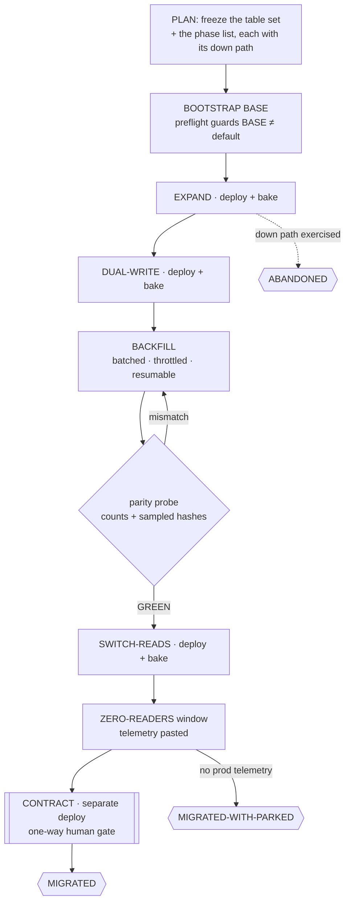

# 🗄️ migrate-it — a stateful shape change landed across deploys, nothing ever invalid

> **Autonomy:** L4 (Osmani L0-L5, parallel delegation) — a coordinator plus isolated per-phase workers; phases of one table are strictly serial, and the destructive CONTRACT step is your one-way door.
> **Activation load:** ~29,800 tokens — this SKILL.md plus every playbook and runtime doc its Composes/rides clause makes mandatory ([why it is measured](../../ARCHITECTURE.md#instruction-budget))
> **Proof:** doctrine-only — no recorded run yet; the protocol is mechanism, not yet field-proven.

> Point it at "we need to rename this column and we cannot take downtime." Come back to a table
> moved one deployable phase at a time — each phase with a down path that was actually run, old
> and new code both valid at every step, and a parity probe proving the data arrived before
> anything was dropped.

**Skill:** [`skills/migrate-it/SKILL.md`](../../skills/migrate-it/SKILL.md) · **Layer:** mission (discoverable) · **Fix authority:** yes — one PR per phase

---

## What it does

`migrate-it` is the migration fleet. A **coordinator** freezes the table set and the phase list,
then dispatches **one phase at a time per table** through the release machine: expand, dual-write,
backfill, switch reads, a zero-reader window, and finally contract. Each phase is its own
deployable change with its own bake, its own review, and its own evidence.

The unit of work is **one migration phase of one table or shape** — not a feature slice. That is
the whole point: a deploy revert rolls back code, and data does not come back with it. So the
oracle is not "the tests pass": it is a **parity probe** (row counts plus seeded sampled hashes)
and a **zero-reader window** on the old shape, with a `down` path that was written *and run* before
each phase merged.

## When to reach for it

- "Rename `users.name` to `users.full_name` in production, no downtime."
- "Split the orders table; we cannot lock it."
- "Backfill this column across 40 million rows and then drop the old one."
- A modernize-it run that hits a data-shape change and hands it off.

**When NOT to reach for it:**

- A feature slice through one pass of the release machine — that is [`ship-it`](ship-it.md). A
  schema slice *inside* a ship-it wave uses the same phase contract
  ([`data-migration`](../../playbooks/data-migration.md)) but stays ship-it's unit.
- Dependency or framework currency — [`modernize-it`](modernize-it.md).
- Restructuring code behind unchanged behaviour — [`reshape-it`](reshape-it.md); no data at risk.
- "Why is this data wrong?" — [`root-cause`](root-cause.md) diagnoses; this mission moves.

## The pipeline

Every phase inside that ladder runs the same per-unit loop: build one PR against BASE, run `up`
then `down` and diff the dumped schema against the pre-`up` dump (it must be **empty**), prove
old-code-vs-new-schema and new-code-vs-old-schema, build-blind review, land through the merge
conductor, deploy, bake. Only then is the next phase dispatched.

## Terminal states

| State | Meaning | Who advances past it |
|---|---|---|
| `MIGRATED` | Parity 100% on the frozen table set, old-shape readers zero over the declared window with pasted telemetry, contract PR merged, every down path exercised | terminal — the promotion PR is yours |
| `MIGRATED-WITH-PARKED` | The ladder is complete up to a phase whose bake or zero-reader evidence the fleet cannot reach (`CODE_CLOSED` + `VERIFY_AT_SCALE`, or `needs-human`) | a human or OPS clears the named park |
| `ABANDONED` | The migration was walked back down the ladder using the exercised down paths, and the state it returned to is receipted | terminal, and honest — a half-expanded table is not |

## Human gates

**CONTRACT is always a human gate.** Dropping a column is one-way, and so is any phase declared
irreversible in its PR body ([`gate-classification`](../../runtime/gate-classification.md)). Bake
and zero-reader windows that need production telemetry the fleet cannot query become
`CODE_CLOSED` + `VERIFY_AT_SCALE` items naming the exact query and window — never an assumed pass.
BASE → default promotion stays yours, as always.

## Convergence proof

Per phase, all of:

- **The down path was run, not just written.** `up` + `down` + a schema dump whose diff against the
  pre-`up` dump is empty, with the command and the empty diff pasted. A `down` that merely exists
  in the file is not evidence.
- **Dual-validity, both directions.** The pre-phase application revision green against the migrated
  schema, and the phase's revision green against the un-migrated schema (what a rollback lands on).
- **Parity GREEN.** Row counts equal on the frozen table set, plus seeded sampled hashes matching
  on the transformed value — re-derivable by a verifier, because the seed is recorded.
- **Deployed and baked** for the declared window.

The run is `MIGRATED` when parity is 100% on the frozen set, the old shape has zero readers over
the declared window with the telemetry pasted rather than summarized, and the contract PR is
merged with the drop verified against the dumped schema. The verifier re-runs the parity probe at
the merged SHA and re-derives the schema diff; it never re-applies a landed migration.

## Failure modes this mission is built to prevent

| Anti-pattern | Why it burns you |
|---|---|
| Renaming or dropping a shape in place | During the rollout old and new code run together; one queries a shape that is gone |
| A `down` that exists but was never run | A migration you cannot reverse is a deploy you cannot roll back |
| Additive step and its consumer in one deploy | Couples a safe add to a risky read; there is no safe rollback point |
| One `UPDATE` over millions of rows | It locks the table — batch, throttle, resume |
| Restarting a failed backfill | Re-does completed work and corrupts non-idempotent copies; resume from the cursor |
| Parity from row counts alone | Equal counts with wrong values is exactly the failure the sampled hash catches |
| Dropping the old shape without the zero-reader window | "Nothing should read it" is a belief; telemetry is evidence |
| Two phases of one table in flight | The second phase's base is a schema that no longer exists |

## Composes

Playbooks: [`data-migration`](../../playbooks/data-migration.md) ·
[`remediate-finding`](../../playbooks/remediate-finding.md) ·
[`acceptance-review`](../../playbooks/acceptance-review.md) ·
[`completion-audit`](../../playbooks/completion-audit.md) ·
[`compound-learn`](../../playbooks/compound-learn.md)

Runtime policies: [`evidence-manifest`](../../runtime/evidence-manifest.md) ·
[`merge-serialization`](../../runtime/merge-serialization.md) ·
[`reviewed-sha-freshness`](../../runtime/reviewed-sha-freshness.md) ·
[`dispatch-lifecycle`](../../runtime/dispatch-lifecycle.md) ·
[`liveness-resume`](../../runtime/liveness-resume.md) ·
[`ledger-contract`](../../runtime/ledger-contract.md) ·
[`attention-budget`](../../runtime/attention-budget.md) ·
[`gate-classification`](../../runtime/gate-classification.md)

## Related missions

- [`ship-it`](ship-it.md) — a feature slice through the release machine once; a schema slice inside a wave keeps ship-it's unit.
- [`modernize-it`](modernize-it.md) — dependency currency; it hands a data-shape change here.
- [`reshape-it`](reshape-it.md) — code deepened behind unchanged behaviour, no data at risk.
- [`clean-sweep`](clean-sweep.md) — a finite findings backlog, not a deploy-gated ladder.
