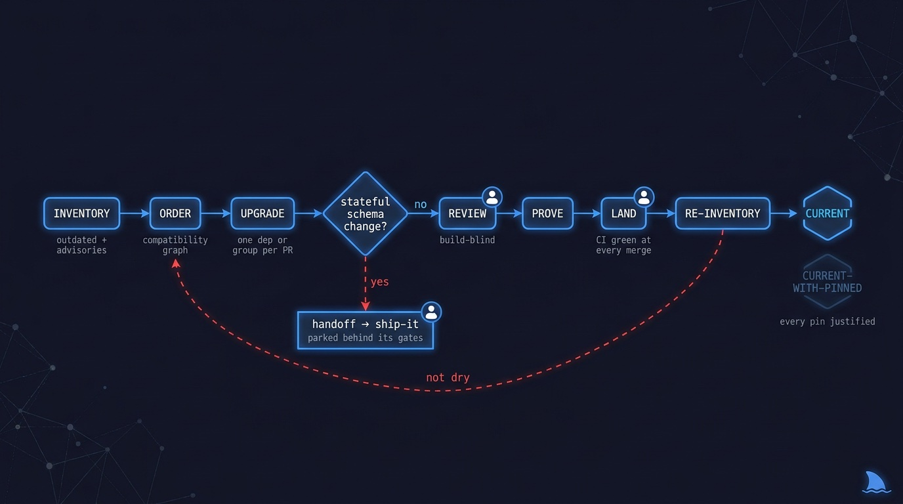
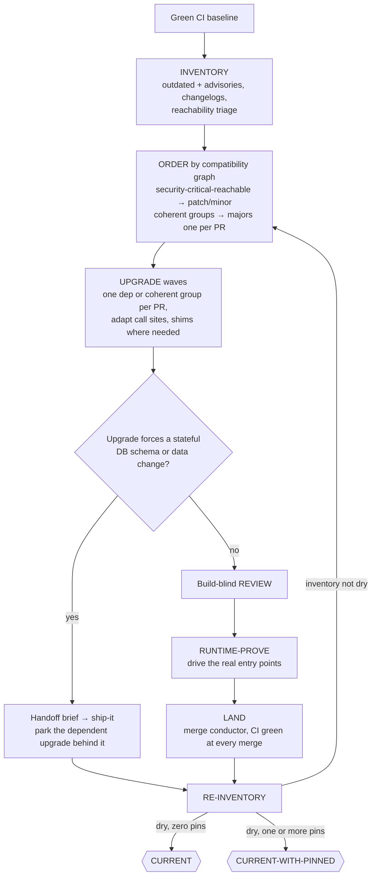

# 📦 modernize-it — every major current or pinned with a reason

> Point it at a repo with a green CI baseline. Come back to a dependency surface where every
> major is current or pinned with a written justification, every merge kept CI green, and every
> upgrade that forced a stateful data migration was handed to `ship-it` — never run in the loop.

**Skill:** [`skills/modernize-it/SKILL.md`](../../skills/modernize-it/SKILL.md) · **Layer:** mission (discoverable) · **Fix authority:** yes

  

---

## What it does

`modernize-it` is the dependency-currency fleet. A **coordinator** inventories what is outdated
and what carries an advisory, orders the work along a compatibility graph, dispatches upgrade
**workers** — one dependency or coherent group per PR, each running the addyosmani
deprecation-and-migration playbook as its single router — and re-inventories until the list
comes back dry. Every unit emits a SHA-bound
[evidence manifest](../concepts.md#the-evidence-manifest), and CI green at every merge is the
gate: a red pipeline never lands "to fix next PR".

The unit of work is a **compatibility-graph node, not a finding**. Ordering, ecosystem grouping,
lockfile contention, code-level adaptation, downstream-user churn, and rollback constraints
dominate this mission — which is why PR-per-outdated-package is often actively wrong. A
peer-locked ecosystem that versions together moves as one node in one PR; splitting it yields a
wall of individually-red PRs that can never merge. Majors, by contrast, go one per PR so
breakage stays bisectable.

The scope boundary is the mission-identity line: this mission owns dependency and framework
**currency** — bump, adapt call sites, CI green. A stateful DB schema/data migration across
deploys (backfills, destructive contracts, tested rollback) is a different mission with a
different unit (a data transition, not a package), a different state machine (temporally
separated deploys, not per-PR merges), and a different proof (deployed compatibility + completed
backfill, which needs the deploy states only [`ship-it`](ship-it.md) owns). When a dependency
upgrade *forces* such a migration, `modernize-it` flags it and hands off a brief for a
**staged sequence** of ship-it runs, each its own release: (1) expand, (2) the dependent
dependency upgrade plus migrate-in-batches, (3) contract only after (2) is deployed and stable.
A single BUILD→LAND→RELEASE cannot temporally separate the deploys. Parking the upgrade after
the full expand→migrate→contract sequence is wrong — that would contract before the upgraded
code runs. `modernize-it` never runs a cross-deploy data migration inside a currency loop.

## When to reach for it

- "Update the dependencies." / "Upgrade everything."
- "Get off the old major" — a framework migration with call-site adaptation.
- An unattended dependency-currency run against a green CI baseline.
- An advisory backlog you want triaged by reachability instead of mass-bumped.

**When NOT to reach for it:**

- The work is really a stateful DB schema/data migration across deploys — that is
  [`ship-it`](ship-it.md), which owns the deploy states expand/migrate/contract needs.
- You want an advisory *exploited and proven*, not just resolved — the audit → re-attack loop
  is [`harden-it`](harden-it.md).
- You want the data-migration lens as an opinion on one diff — [`review-it`](review-it.md).

## The pipeline

Phase by phase:

1. **Inventory.** List what is outdated and what carries an advisory — then read the
   **changelog, not the version delta**: `4.2 → 5.0` tells you nothing about what actually
   breaks. Advisories get **reachability triage**: a dev-only dependency or an unreachable
   transitive is lower priority than anything on a production path, and `audit fix --force` is
   never the answer. Each dependency's target is recorded under the "current supported"
   authority order: an explicit project constraint (engines, peerDeps, a support policy) first,
   then the dependency's own published support/EOL policy (LTS or security window), and
   registry-latest only when neither exists. A dep on a still-supported older major is already
   current — registry-latest is not the truth.
2. **Order.** The compatibility graph dictates the sequence: security-critical-reachable
   advisories first, then patch/minor bumps batched as coherent groups, then majors — one major
   per PR.
3. **Upgrade** ([`remediate-finding`](../../playbooks/remediate-finding.md), adapted). Bump,
   then adapt the call sites: code-level expand/migrate/contract, adding deprecation shims or
   dual-run APIs where a major needs them. The lockfile is **regenerated, never hand-edited**;
   provenance is verified when a package's registry or maintainer changed. CI green is the gate.
4. **Forced-migration check** ([`risk-review`](../../playbooks/risk-review.md), data-migration
   lens). The lens is a review **signal**, not an execution engine: it flags an upgrade that
   forces a stateful DB schema/data change. When it fires, the migration is not run here — a
   handoff brief routes it to `ship-it`, and the dependent upgrade parks behind that handoff.
5. **Prove** ([`runtime-prove`](../../playbooks/runtime-prove.md)). A green CI misses
   runtime-only breakage — lazy imports, env-dependent init. The upgraded app is driven through
   its real entry points before anything lands.
6. **Land and re-inventory** ([`merge-serialization`](../../runtime/merge-serialization.md)).
   One conductor serializes merges to BASE; then the inventory is re-run and the loop continues
   until it comes back dry.

## Terminal states — pinned is not current

| State                 | Meaning                                                                              |
|-----------------------|--------------------------------------------------------------------------------------|
| `CURRENT`             | Every dep on a current supported version, zero reachable unaddressed advisories      |
| `CURRENT-WITH-PINNED` | All upgradable deps current; one or more pinned-and-parked with a reason + human ref |

The degraded state is never reported as `CURRENT`. Every pin carries a written reason —
breaking upstream, dropped platform, unresolved conflict — and a human reference.

## Human gates

Per [`gate-classification`](../../runtime/gate-classification.md):

1. **The pin.** Parking a dependency as pinned requires a written reason and a human reference.
   The fleet never quietly narrows "current" to "whatever upgraded cleanly".
2. **The forced migration.** The stateful migration lands only through `ship-it` and its own
   gates. Inside this mission, a destructive migration sits on
   [`build-change`](../../playbooks/build-change.md)'s irreversibility stop-list: stop and
   escalate, never improvise.

Everything else is classified mechanical or taste and resolved per policy.

## Convergence proof

`modernize-it` is done when — and only when:

- every outdated dep is upgraded and merged with CI green (the green run referenced), **or**
  pinned-and-parked with a written reason and a human ref;
- every merge kept CI green — the merge commits' checks are verified; a red pipeline never
  landed;
- every upgrade that forced a stateful DB migration was handed to `ship-it` with a brief, its
  dependent upgrade parked behind the handoff — never silently run inside the loop;
- the advisory scan re-runs clean, or each remaining advisory is parked with a reachability
  rationale;
- the final inventory is pasted.

## A worked example

The ask: a two-year-unmaintained React app — 40 outdated packages, 3 security advisories.

**Inventory with reachability.** Advisories triage first: one CVE sits in a lodash function the
app never calls (noted, still patched in the cheap wave); one is reachable from the upload
path and jumps the queue.

**Order by the compatibility graph.** The reachable security fix ships alone and first. The
clean patch/minors follow as coherent groups — one PR per group that genuinely moves together
(the test stack, the lint stack), each CI-green before the next merges; one all-40 mass-bump
PR would be the documented anti-pattern. React 17→18 is a lone major: its own PR, codemods
applied, call sites adapted, `ReactDOM.render` → `createRoot` shims where third-party code lags.

**The stateful fork.** The ORM major renames a column type — a destructive migration. That is
not a dependency bump; it exits through the diamond: a handoff brief to `ship-it`, and the two
packages that depend on the new ORM park behind it. This mission never improvises a schema
change past its own gates.

**The pin gate.** `draft-js` is abandoned upstream and its replacement is a product decision.
Pinning is a human gate: written reason, your reference, revisit date — recorded in the ledger,
not silently skipped.

**Re-inventory → terminal.** The loop re-runs until the inventory is dry for everything this
mission may touch. The terminal report names both exceptions: the `draft-js` pin (justified,
human-referenced) and the ORM group still parked behind its `ship-it` handoff, which re-enters
the inventory once that migration lands. **CURRENT-WITH-PINNED**, CI green at every single
merge along the way — and no upgrade silently dropped from the tally.

## Failure modes this mission is built to prevent

| Anti-pattern                                | Why it burns you                                           |
|---------------------------------------------|------------------------------------------------------------|
| `audit fix --force` / mass-bump             | Forces resolutions the compatibility graph never validated |
| A cross-deploy DB migration inside the loop | This mission has no deploy states; only `ship-it` does     |
| Rename-in-place code migration              | Breaks dual-running deploys mid-rollout                    |
| Landing a red CI "to fix next PR"           | Every later upgrade now builds on a broken baseline        |
| Bumping a major without its changelog       | The version delta says nothing about what breaks           |
| Dropping a compat shim without a gate       | Removes the dual-run safety before consumers have moved    |
| Hand-editing the lockfile                   | The recorded resolution lies; regenerate it instead        |

## Composes

Playbooks: [`remediate-finding`](../../playbooks/remediate-finding.md) ·
[`risk-review`](../../playbooks/risk-review.md) ·
[`runtime-prove`](../../playbooks/runtime-prove.md)

Runtime policies: [`merge-serialization`](../../runtime/merge-serialization.md) ·
[`reviewed-sha-freshness`](../../runtime/reviewed-sha-freshness.md) ·
[`dispatch-lifecycle`](../../runtime/dispatch-lifecycle.md) ·
[`liveness-resume`](../../runtime/liveness-resume.md) ·
[`evidence-manifest`](../../runtime/evidence-manifest.md) ·
[`gate-classification`](../../runtime/gate-classification.md)

## Related missions

- [`ship-it`](ship-it.md) — owns the deploy states a forced stateful DB migration needs.
- [`harden-it`](harden-it.md) — the advisory exploit proof: full audit → re-attack.
- [`clean-sweep`](clean-sweep.md) — a general finding backlog, PR-per-finding.
- [`review-it`](review-it.md) — the data-migration lens as a per-diff review verdict.
