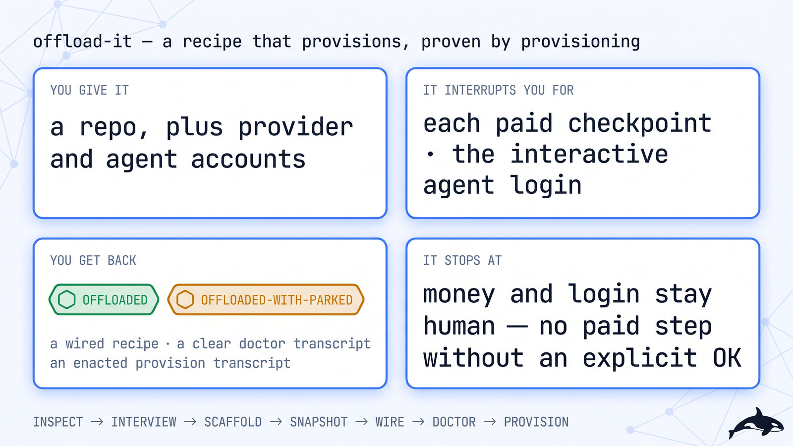
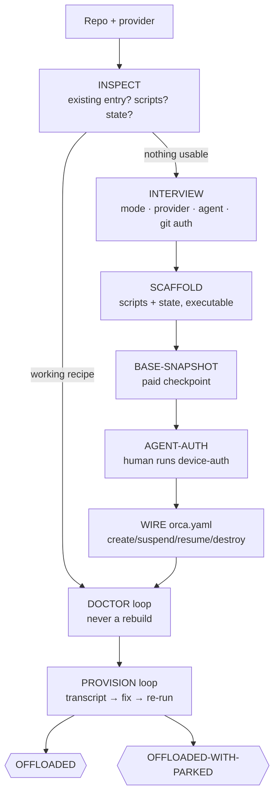

# ☁️ offload-it — a recipe that provisions, proven by provisioning

> **Autonomy:** L4 (Osmani L0-L5, parallel delegation) — one serial recipe lane (snapshots are paid and ordered); the money and the login are yours at classified checkpoints.
> **Activation load:** ~14,700 tokens — this SKILL.md plus every playbook and runtime doc its Composes/rides clause makes mandatory ([why it is measured](../../ARCHITECTURE.md#instruction-budget))
> **Proof:** doctrine-only — no run has been retained against this mission yet
> (`runtime/scripts/run_report.py`)

> Point it at a provider and a repo. Come back to a working Run-on option: the lifecycle scripts
> scaffolded, the base and agent-auth snapshots built, the recipe wired — and the proof is
> enactment, a live provision that ran create→validate→destroy, not a reviewer's opinion.

**Skill:** [`skills/offload-it/SKILL.md`](../../skills/offload-it/SKILL.md) · **Layer:** mission (discoverable) · **Fix authority:** **yes** — it writes `orca.yaml` plus `scripts/orca-vm/`, and spends your money only on your explicit OKs

<p align="center">
  <picture>
    <source media="(prefers-color-scheme: dark)" srcset="../../assets/diagrams/missions/offload-it.jpg">
    <source media="(prefers-color-scheme: light)" srcset="../../assets/diagrams/missions/offload-it-light.jpg">
    
  </picture>
</p>

---

## Invoke it

```
> offload this repo: stand up a cloud-sandbox recipe so workspaces boot from a snapshot
```

**Needs** (the skill's `compatibility` field, verbatim): HARD dependency: Orca runtime + orchestration skill (Orca CLI) with vm recipe doctor. A provider account + CLI with a sandbox/VM plan, and the provider's own docs for its verbs. An agent CLI + account for the auth snapshot. git + gh. One worker playbook pack per worker (matt or addy) — never two routers in one worker.

## What it does

`offload-it` is the recipe fleet. A **coordinator** interviews you for the choices only you can
make (connection mode, provider, scope, agent, git auth), scaffolds the lifecycle scripts and
state file, builds the base snapshot and the agent-auth snapshot in fixed order, wires the
`environmentRecipes` entry — then proves the recipe by *enacting* it: the doctor dry-run is
clear (no fail AND no warn) and a live provision ran create→validate→destroy end to end.

"Give this repo a working Run-on option" is infrastructure with someone else's money and
someone else's login. The money is guarded by one-way paid checkpoints — each proceeds only on
an explicit OK, and one OK covers the whole provision fix-and-rerun loop. The login is never
the fleet's to perform: the interactive device-auth step runs in your terminal, and the fleet
verifies the result by exit code before it snapshots. Worker methodology comes from one
upstream pack per worker, never two in the same context.

## When to reach for it

- "Run this in the cloud."
- "Set up a sandbox recipe for this repo."
- `orca vm recipe doctor` fails and the wiring needs a full pass, not a patch.
- Ephemeral dev environments per workspace, booted from a snapshot in seconds.

**When NOT to reach for it:**

- You want one worker placed on an existing host — that is orchestration placement, not a
  recipe; there is nothing to stand up.
- You want app behaviour proven on a fresh box — that is [`field-test-it`](field-test-it.md)
  CLEAN-ENV, which *drives* the room this mission *builds*.
- Runtime doctrine drifted from the binary — that is [`pin-it`](pin-it.md), re-witnessing, not
  new infrastructure.

## The pipeline



Phase by phase:

1. **Inspect.** The coordinator reads the repo for an existing `environmentRecipes` entry,
   `scripts/orca-vm/`, a state file, or setup notes. A working recipe goes straight to the
   doctor loop — rebuilding what exists is how two half-recipes are born.
2. **Interview — mode first.** Connection mode (Orca server vs SSH) is settled before anything
   else, because it changes the create output and half the templates. Then provider plus
   scope/project/region/plan, the agent CLI plus account, the git token source. Every choice is
   confirmed back; the fleet picks nothing and guesses nothing.
3. **Scaffold.** Scripts and state land under `scripts/orca-vm/`, executable, each reserving
   stdout for its final JSON object and resolving values env → state → fallback. The
   provider's exact create/exec/snapshot/remove verbs come from its own docs
   ([`research-brief`](../../playbooks/research-brief.md)), read before a line is scaffolded.
4. **Base snapshot [paid checkpoint].** Build headless main only, clone through a
   `GIT_ASKPASS` helper that is removed after, snapshot the stopped machine, parse the id into
   state. Never snapshot a machine where the runtime already ran — everything in its user-data
   directory bakes into the image and every workspace from it shares one pairing identity.
5. **Agent auth [human login].** Boot from the base snapshot; you run the device-auth flow in
   your terminal (plain login hangs on a headless box — the loopback callback is unreachable).
   The fleet verifies by the status command's exit code, refuses to snapshot unauthenticated,
   then — on your explicit OK, because the re-snapshot is paid and your login words do not
   cover it — re-snapshots and overwrites the state id.
6. **Wire.** `orca.yaml` points create/suspend/resume/destroy at the scripts. The composer
   reads recipes from the primary checkout, so a recipe that lives only on a branch never
   appears as a Run-on option — the doctor works anywhere, the picker does not.
7. **Doctor dry-run — free and static.** Clear means no fail AND no warn; `ok` alone proves
   nothing, and each warn is resolved or accepted-with-reason before any provision spend.
8. **Provision loop [paid checkpoint].** `create`, validation of the returned JSON, then
   `destroy` — reading the `provisionTranscript` on failure, fixing the script, re-running to
   green. Destroy is confirmed to really tear down; `destroy: none` is hand-cleanup, recorded
   and human-accepted, never assumed.
9. **Verdict.** OFFLOADED, or OFFLOADED-WITH-PARKED with the checkpoint register. An optional
   workspace test (create via the picker, verify sleep/wake/delete) runs only if you asked.

## Terminal states

*Two, both bound to the recipe id and its snapshot ids.*

| State | Meaning | Who acts on it |
|---|---|---|
| `OFFLOADED` | Doctor clear (no fail, no warn) and the provision loop green end to end; state holds the authenticated snapshot id; destroy tested | use the Run-on option |
| `OFFLOADED-WITH-PARKED` | ≥1 park naming its checkpoint: a quota/cap ask, an unauthenticated login to re-run, or an interactive step not yet run | the human named on the park |

## Human gates

The money and the login, both one-way under
[`gate-classification`](../../runtime/gate-classification.md): each paid checkpoint (base
snapshot, auth snapshot, the provision loop) proceeds only on your explicit OK, and the
interactive agent login is yours to run — the fleet has no TTY for it and never pretends
otherwise. What the fleet *may* do unasked is read, scaffold, and dry-run the doctor; what it
may never do is pick your plan or region, invent a scope or billing id, write a credential
into a script, `userData`, state, or a commit, or create a workspace except the step-10 test
you asked for. Each gate is filed through [`human-handoff`](../../playbooks/human-handoff.md)
with a verify-complete observation the run re-derives.

## Convergence proof

`offload-it` is done when — and only when — each recipe carries:

- a doctor result with zero fail and zero warn;
- a provision transcript with `ok: true` across create→validate→destroy;
- state holding the AUTHENTICATED `snapshotId` plus the `authSourceSnapshotId` it superseded;
- destroy enacted, not assumed.

The verifier re-runs the free doctor dry-run and re-derives the transcript's resource ids
through provider read-only verbs. It never re-provisions: a re-provision is a paid step, and
paid steps are the human's.

## A worked example

The ask: this repo has no recipe, and every workspace boots cold.

> offload-it: stand up a sandbox-cloud recipe

**Inspect** finds no `environmentRecipes` entry and no `scripts/orca-vm/` — a green-field
stand-up. **Interview** settles Orca-server mode, the sandbox-cloud provider with scope,
project, region, and plan caps recorded (the 45-minute sandbox timeout limits both the base
build and the per-workspace runtime), the agent CLI, and `GH_TOKEN` as the git source — each
confirmed back.

**Scaffold** writes the create/suspend/resume/destroy scripts plus the hand-run snapshot and
auth scripts, executable, stdout clean. The **base snapshot** checkpoint gets its explicit OK;
the build runs 20+ minutes, snapshots stopped, id parsed into state. For **agent auth** you
run the device-auth flow in your terminal and say so; the fleet verifies the exit code,
re-snapshots, and overwrites the state id. **Wire** points `orca.yaml` at the scripts on the
primary branch.

**Doctor** dry-run returns `ok: true` with one warn — suspend without resume. That warn is
resolved (the pair is scaffolded) before a cent of provision spend. The **provision loop**,
under its own OK, runs create→validate→destroy to green on the second pass, the transcript
naming the fixed JSON shape. **Verdict: OFFLOADED.** The Run-on option appears in the picker;
the manifest holds the snapshot ids and both transcripts.

## Failure modes this mission is built to prevent

| Anti-pattern | Why it burns you |
|---|---|
| Picking provider/region/plan for the human | Asked, never invented — a guessed scope bills the wrong project |
| Plain agent login on a headless box | The loopback callback is unreachable; device-auth or hang |
| Grep-for-logged-in | Matches "not logged in" and commits an unauthenticated image |
| Snapshotting post-runtime state | Every workspace from that image shares one pairing identity |
| Secrets in scripts, userData, state, or commits | The recipe is checked in; credentials never ride along |
| `ok: true` with warns treated as clear | A warn keeps `ok` true — the free gate is clear only with neither |
| Bind-mounting a host agent home | sqlite state and host config break inside the runtime |
| Recipe only on a branch | The picker reads the primary checkout; the doctor works anywhere |

## Composes
Playbooks:
[`human-handoff`](../../playbooks/human-handoff.md) ·
[`research-brief`](../../playbooks/research-brief.md)

Runtime policies:
[`evidence-manifest`](../../runtime/evidence-manifest.md) ·
[`gate-classification`](../../runtime/gate-classification.md) ·
[`sandbox-policy`](../../runtime/sandbox-policy.md)

## Related missions

- [`field-test-it`](field-test-it.md) — its CLEAN-ENV tier drives a fresh room; this mission
  builds the recipe that boots one.
- [`pin-it`](pin-it.md) — re-witnesses doctrine against the installed binary; this mission
  stands up new infrastructure instead.
- [`clean-sweep`](clean-sweep.md) — a doctor failure that turns out to be repo breakage rather
  than recipe wiring routes out as findings, not snapshots.
