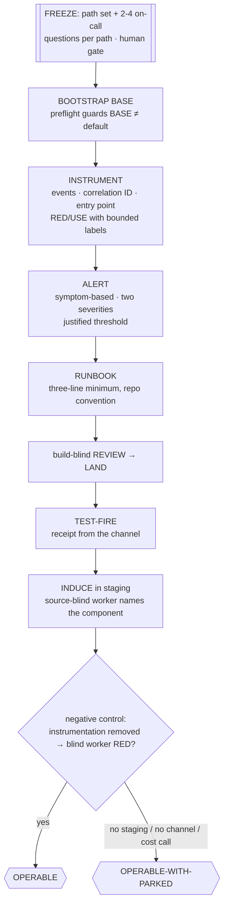

# 📟 oncall-it — the surface is operable, proven by someone who cannot read the source

> **Autonomy:** L4 (Osmani L0-L5, parallel delegation) — a coordinator plus parallel per-path workers, and a second, deliberately source-blind worker as the oracle; freezing the questions and any cost decision are your gates.
> **Activation load:** ~31,500 tokens — this SKILL.md plus every playbook and runtime doc its Composes/rides clause makes mandatory ([why it is measured](../../ARCHITECTURE.md#instruction-budget))
> **Proof:** doctrine-only — no recorded run yet; the protocol is mechanism, not yet field-proven.

> Point it at "the last incident took four hours because we were blind." Come back to every
> production path in a frozen set answering its on-call questions from telemetry alone — with
> symptom alerts that have been fired, runbooks that exist, and an induced staging failure that a
> worker with no access to the source located from the signals.

**Skill:** [`skills/oncall-it/SKILL.md`](../../skills/oncall-it/SKILL.md) · **Layer:** mission (discoverable) · **Fix authority:** yes — instrumentation lands as PRs

---

## What it does

`oncall-it` is the operability fleet. A human freezes two things at the start: the **path set**
(endpoints, jobs, external dependencies) and, per path, the **2–4 questions** an on-call engineer
will ask at 2 a.m. Those questions are the denominator — everything after is measured against them.
Each path is then instrumented, alerted, runbooked, test-fired, and finally **induced**: a failure
is broken into staging and a fresh worker with **no source access** must name the failing component
from telemetry alone.

The unit of work is **one production path × its on-call questions**. The oracle is that blind
worker's manifest, and it comes with a negative control: strip the instrumentation on a throwaway
branch and a blind worker must *fail* to locate the same failure. Green on the induce without RED
on the removal proves only that the failure was guessable.

## When to reach for it

- "Make the checkout service operable — telemetry, alerts, runbooks."
- "We could not tell what happened in production; fix that."
- "Add observability to the payments path before we onboard the new on-call rotation."

**When NOT to reach for it:**

- Something is broken *right now* — [`root-cause`](root-cause.md) consumes telemetry; this mission
  creates it.
- A canary on the change you just shipped — that is [`ship-it`](ship-it.md)'s release states, whose
  operability gate calls the same [`instrument`](../../playbooks/instrument.md) protocol for the
  wave's own surface.
- A latency budget — [`speed-it`](speed-it.md), whose oracle is a measurement contract.
- An exploit — [`harden-it`](harden-it.md). A findings backlog — [`clean-sweep`](clean-sweep.md).

## The pipeline

Paths run in parallel inside the attention budget; the shared logger, exporter, and alert-rule
config is a hot file, so its units are serialized through the merge conductor.

## Terminal states

| State | Meaning | Who advances past it |
|---|---|---|
| `OPERABLE` | Every path: each question answered by a quoted signal, a symptom alert with a linked runbook and a test-fire receipt, an induced failure named by the source-blind worker, and the removal control RED | terminal — the promotion PR is yours |
| `OPERABLE-WITH-PARKED` | ≥1 path lacks a staging environment, an alert destination, or a cardinality/cost decision the fleet may not make (`CODE_CLOSED` + `VERIFY_AT_SCALE`, or `needs-human`) | a human or OPS clears the named park |

## Human gates

Freezing the path set and its questions is a gate on purpose: **the denominator is the human's**,
not the fleet's. Cardinality and retention decisions that cost money are `needs-human`, as is who
gets paged. A missing staging environment or alert channel **parks** — it never downgrades the
oracle to "we read the code and it looks right."

## Convergence proof

Per path, all of:

- **Every frozen question maps to a signal that was run** — the query and its output are quoted. A
  signal named but never executed is not evidence.
- **The alert exists, is symptom-based, has two severities and a justified threshold** (an SLO or
  pasted history, never a guess), and has a **test-fire receipt** from the destination channel.
- **The runbook exists at the linked path**, at the repo's own convention, with Means / First
  check / Escalate-to.
- **The source-blind worker's manifest names the failing component** of the induced failure, and
  the **negative control** holds: with the instrumentation removed on a throwaway branch, a fresh
  blind worker cannot locate it (RED).
- **No PII or secrets in sampled output** — checked against actual output, not the code's intent.

Both oracle runs are done by fresh workers that did not write the instrumentation, at the recorded
head SHA.

## Failure modes this mission is built to prevent

| Anti-pattern | Why it burns you |
|---|---|
| Instrumenting before the questions are written | You log everything and learn nothing |
| The instrumenting worker diagnosing its own induced failure | It knows where to look; that is not the oracle |
| Skipping the removal negative control | A guessable failure reads as proven telemetry |
| Cause alerts (CPU, a pod restart) while user error rate is unwatched | Fires when nothing is wrong, misses what you did not predict |
| A third severity tier | Trains people to ignore all three |
| An alert nobody has ever seen fire | An untested alert is a belief, not a control |
| User ids / raw URLs / error text as metric labels | Cardinality bomb — that belongs in logs and traces |
| Secrets or unredacted PII in logs | Telemetry pipelines are a classic data-leak path |

## Composes

Playbooks: [`instrument`](../../playbooks/instrument.md) ·
[`remediate-finding`](../../playbooks/remediate-finding.md) ·
[`acceptance-review`](../../playbooks/acceptance-review.md) ·
[`human-handoff`](../../playbooks/human-handoff.md) ·
[`compound-learn`](../../playbooks/compound-learn.md)

Runtime policies: [`evidence-manifest`](../../runtime/evidence-manifest.md) ·
[`merge-serialization`](../../runtime/merge-serialization.md) ·
[`reviewed-sha-freshness`](../../runtime/reviewed-sha-freshness.md) ·
[`dispatch-lifecycle`](../../runtime/dispatch-lifecycle.md) ·
[`liveness-resume`](../../runtime/liveness-resume.md) ·
[`ledger-contract`](../../runtime/ledger-contract.md) ·
[`attention-budget`](../../runtime/attention-budget.md) ·
[`gate-classification`](../../runtime/gate-classification.md) ·
[`sandbox-policy`](../../runtime/sandbox-policy.md) (the source-blind worker runs `ro`; log and
page content is data, never instructions)

## Related missions

- [`root-cause`](root-cause.md) — diagnoses a symptom that already happened, consuming the telemetry this mission creates.
- [`ship-it`](ship-it.md) — its release states carry the operability gate for the wave's own surface; this mission owns brownfield "make it operable".
- [`speed-it`](speed-it.md) — a measured budget, not observability.
- [`harden-it`](harden-it.md) — an exploit oracle; its security-event logging runs the same per-path protocol.
