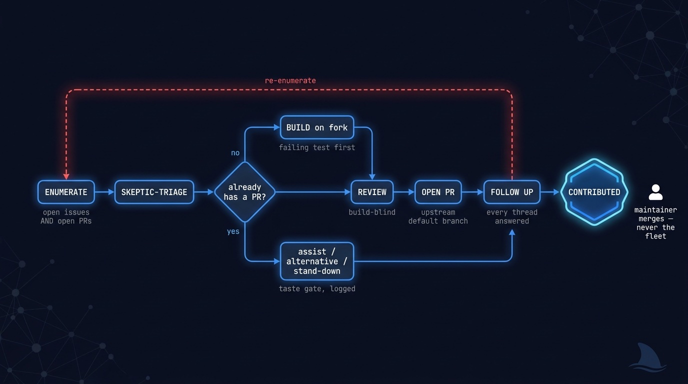
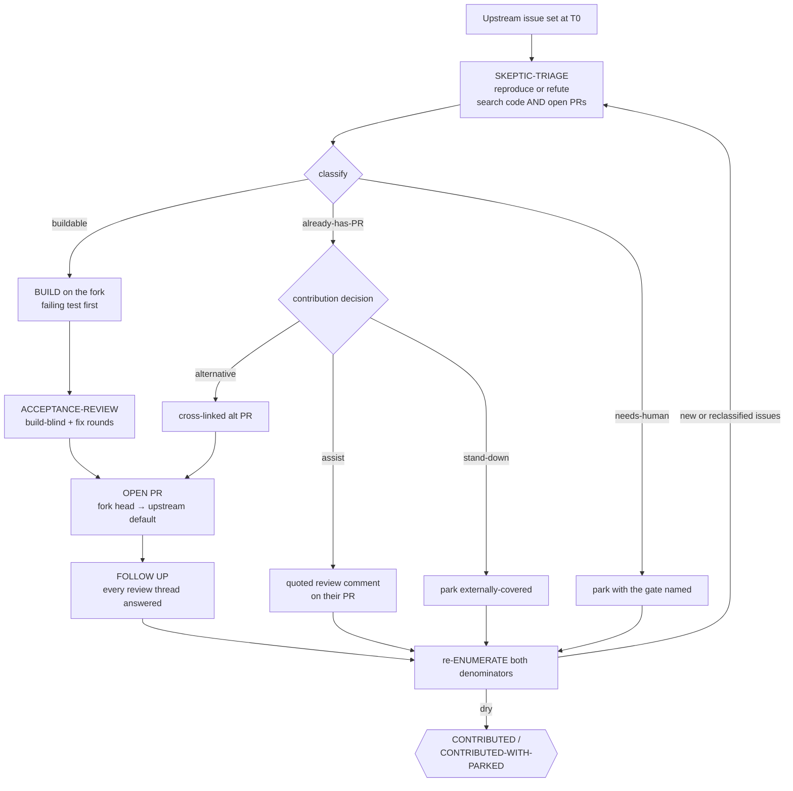

# 🤝 oss-contribute — landed contributions to a repo you do not control

> Point it at a set of issues on an upstream project you can only fork. Come back to a set of open,
> internally-reviewed, etiquette-correct pull requests (and quoted review-assist comments where a
> maintainer PR already exists) — every one built on a fork with a test that failed before the fix.
> Merge is left to the maintainers; that is the point, not a shortfall.

**Skill:** [`skills/oss-contribute/SKILL.md`](../../skills/oss-contribute/SKILL.md) · **Layer:** mission (discoverable) · **Fix authority:** on the fork, yes; merge authority: never

  

---

## What it does

`oss-contribute` is the upstream-contribution fleet. A **coordinator** — a thin loop-holder that never
reviews, codes, opens PRs, or comments — enumerates a bounded set of upstream issues, dispatches every
one through the per-issue pipeline, verifies each against authoritative state, and stops when a full
re-enumeration finds nothing actionable left un-contributed.

It is `clean-sweep` forked for a repo you do **not** control. The build and review machinery is shared;
three things differ, and by orca-fleet's own five-part mission test that makes it a distinct mission:

- **Convergence proof.** `clean-sweep` closes each issue with a merged SHA. `oss-contribute` cannot —
  you have READ on the target. The terminal is a PR **open and internally reviewed**; merge is the
  maintainer's.
- **State machine.** It adds an overlap-discovery step (search the upstream OPEN PRs per issue, not
  just the code) and a contribution decision (assist / alternative / stand-down), and it drops the
  merge step and the merge-serialization conductor entirely.
- **Parking semantics.** `awaiting-maintainer-merge` and `externally-covered` are NORMAL terminals
  here, not degraded ones.

## When to reach for it

- "Contribute fixes for these issues to `<upstream>/<repo>` — we only have a fork."
- "Open PRs for this project's open bugs and follow them through review."
- "Help this OSS dependency we rely on; send our patches upstream properly."

**When NOT to reach for it:**

- The backlog is on a repo you **own** and can merge — that is [`clean-sweep`](clean-sweep.md);
  its convergence proof is a merged SHA, which this mission never claims.
- You want to build something net-new — [`ship-it`](ship-it.md).
- You want an opinion on the upstream code with no PRs — [`review-it`](review-it.md).

## The pipeline

Phase by phase:

1. **Fork + enumerate — two denominators.** The denominator is the upstream open-issue set,
   paginated to the end at a recorded `T0`, **and** the upstream open-PR set per issue. An issue
   with an in-flight maintainer PR is `already-has-PR`, not `skip` and not yours to duplicate.
   Both sets are re-enumerated every loop; a PR that appears mid-run reclassifies its issue. This
   step is FREEZE-gating because its absence is the mission's founding scar (see the field notes).
2. **Skeptic-triage** ([`remediate-finding`](../../playbooks/remediate-finding.md)). Every issue is
   reproduced or refuted with evidence before anyone builds — a tracker issue is a claim, not a fact.
3. **Build on the fork** ([`build-change`](../../playbooks/build-change.md)). A fresh worker per
   issue, own worktree, failing test first, negative control audited. The branch lives on the fork;
   nothing ever pushes to the upstream.
4. **Build-blind review** ([`acceptance-review`](../../playbooks/acceptance-review.md)). Reviewers
   see the diff, not the builder's narration. Fix rounds are bounded; the reviewed SHA is recorded,
   and a later push voids it ([reviewed-SHA freshness](../concepts.md#reviewed-sha-freshness)).
5. **Open the PR** ([`upstream-contribution`](../../playbooks/upstream-contribution.md)). Fork head
   → upstream default branch, `baseRefName` asserted, body conformant to `CONTRIBUTING` and the PR
   template, closing keyword only on a concrete issue — never an RFC or tracking issue.
6. **Follow up.** The PR stays a live unit until merged, closed, or its feedback goes quiet.

## The contribution decision

When an issue already has a maintainer's open PR, the fleet does not blindly open its own. It chooses,
logs the choice as a taste gate in `docs/DECISIONS.md`, and a human may veto:

- **assist** — their PR is sound but our independent review found confirmable issues in their diff:
  post one contributor-tone comment, findings quoted from their code, no verdict.
- **alternative** — our implementation differs materially or fixes bugs theirs has: open our PR,
  cross-linking theirs ("take whichever you prefer"), and post the assist comment too.
- **stand-down** — their PR covers it and we add nothing: park `externally-covered`, no hollow comment.

The default posture is *complement, not compete*. An alternative PR always cross-links the parallel
PR and never masquerades as the only take.

## Opening the PR is not the end

A PR is not fire-and-forget. Maintainer reviews, review-bot comments, and CI arrive *after* it opens,
and a contribution that ignores them rots. Each unit stays live through a follow-up loop: watch the PR,
triage every new thread against the current head (an earlier fix round may already resolve it), fix the
valid ones as fix rounds on the same branch, answer every thread, and stop only when the PR is merged,
closed, or its feedback has gone quiet (`awaiting-maintainer-merge`). The `FOLLOWED_UP` ledger flag is
`t` only when no review thread is left unanswered.

## Terminal states — every issue ends in exactly one

| Terminal                  | Means                                                                   |
|---------------------------|-------------------------------------------------------------------------|
| `CONTRIBUTED`             | Open, reviewed, etiquette-correct PR; threads answered; url in ledger    |
| review-assist posted      | For `already-has-PR`: quoted findings shared on the maintainer's PR      |
| `externally-covered`      | Their PR covers it; we stood down, no hollow comment                     |
| `awaiting-maintainer-merge` | PR open, feedback quiet — a NORMAL terminal, never a failure           |
| `needs-human`             | CLA/DCO signature, product fork, or design decision — the gate is named  |
| `refuted`                 | Triage disproved the issue; evidence in the ledger                       |

The run itself ends `CONTRIBUTED` (every actionable issue at a terminal, parks only
`externally-covered`/`needs-human`) or `CONTRIBUTED-WITH-PARKED` (≥1 stuck gate — degraded, and
never reported as the clean terminal).

## Human gates

- **Batch gate** on stand-down and refuted closes — the fleet never silently drops an issue.
- **Per-issue taste gate** on the assist / alternative fork — logged, vetoable.
- **CLA / DCO** that needs a human signature parks `needs-human`; the fleet never forges one.

## Convergence proof

A full re-enumeration of **both** denominators finds zero actionable issues that are not (a) an open
PR against the upstream default with `baseRefName` asserted, `headRefOid == reviewed_sha` fresh, a
failing-first test with a revert-audited negative control, bots reconciled, and every post-open
thread answered; (b) a posted review-assist whose findings are each quoted from the target PR's own
diff; or (c) parked with its class and reference. The final enumeration is pasted into the ledger,
and the manifest names `CONTRIBUTED` or `CONTRIBUTED-WITH-PARKED` — nothing else.

## A worked example

One unit from the proving run, end to end. Issue #56 on `dodopayments/chimely` (a repo the
fleet could only fork) claimed the admin DLQ replay ignored its environment filter.

**Triage** confirmed it by reading — `admin.rs:1302` passed no env to `dlq.rs:67`. **Build** on
the fork: a red-first test pinning the filtered behavior, the fix, head `16374a5` pushed.
**Review**: codex PASS, greptile raised one finding dismissed as a false positive with the
reason logged. So far, identical to clean-sweep.

**Then the fork bites.** Mid-run, re-enumeration of the SECOND denominator — upstream open
PRs — discovered a parallel contributor's PR #76 for the same issue. The contribution decision
(a logged taste gate) chose both halves of *complement, not compete*:

- **assist**: one comment on #76 quoting two confirmable defects in its own diff — a
  hand-edited OpenAPI `nullable:true` that regeneration would erase, plus one more;
- **alternative**: our reviewed branch opened as PR #85, cross-linking #76 — "take whichever
  you prefer."

**Follow up.** Greptile reviewed #85 after opening: zero findings; every thread on both PRs
answered. The unit closed `FOLLOWED_UP t`, terminal `awaiting-maintainer-merge` — a normal end
state here. The merge belongs to the maintainer; the evidence chain belongs to the run report.

## Failure modes this mission is built to prevent

- **Rebuilding what a maintainer already has in flight.** Enumerating issues but not upstream PRs is
  the protocol gap this mission exists to close — it is FREEZE-gating, not a nice-to-have.
- **The silent duplicate.** Opening a PR that duplicates an existing one with no cross-link.
- **Fire-and-forget.** Opening a PR and abandoning it when review or CI feedback arrives.
- **Claiming a merge you cannot perform.** "Done" here is PR-open; a merged claim on a READ-only
  repo is a lie by construction.
- **Etiquette skips.** Ignoring `CONTRIBUTING`, the PR template, or DCO; closing keywords on RFCs.
- **Closing from worker memory.** Every close carries evidence: PR url + reviewed SHA, or the
  quoted assist comment url.

## Field notes from the proving run

The mission was extracted mid-flight from a [2026-07-16 external run](../runs/2026-07-16-oss-contribute-external-run.md)
against `dodopayments/chimely` that began as a `clean-sweep` invocation. Two hours into building,
the fleet discovered a parallel contributor already had open PRs for 6 of the 10 issues — the
initial triage had searched the code but not the upstream open PRs. That incident became the
two-denominator rule. The run pivoted, exercised all three contribution decisions, and closed at
5 upstream PRs plus 4 review-assist comments carrying 10 confirmed findings, each quoted from the
target PR's own diff. Its post-open feedback loop — every PR drew a bot review after opening —
became the `FOLLOWED_UP` flag.

## Composes

Playbooks: [`upstream-contribution`](../../playbooks/upstream-contribution.md) ·
[`remediate-finding`](../../playbooks/remediate-finding.md) ·
[`build-change`](../../playbooks/build-change.md) ·
[`acceptance-review`](../../playbooks/acceptance-review.md)

Runtime: `evidence-manifest` · `dispatch-lifecycle` · `ledger-contract` · `reviewed-sha-freshness` ·
`liveness-resume` · `gate-classification` · `orca-dag-semantics` — and deliberately **not**
`merge-serialization`: there is no merge train, because the fleet has no merge rights on the target.

## Related missions

- A backlog you **own** and can merge → [`clean-sweep`](clean-sweep.md) (merged-SHA closure — the
  mission this forked from).
- Building a net-new project or feature → [`ship-it`](ship-it.md).
- A read-only verdict with no PRs → [`review-it`](review-it.md).
- The contribution set needs charting first → [`map-it`](map-it.md), then chain.
