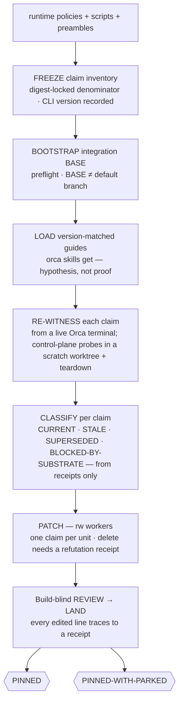

# 📌 pin-it — doctrine that matches the binary

> **Autonomy:** L4 (Osmani L0-L5) — re-witness probes are read-only and mechanical; doctrine patches land through the normal review + merge gates.
> **Proof:** doctrine-only — no recorded run yet; the protocol is mechanism, not yet field-proven.

> Point it at a freshly upgraded Orca runtime — or at the queasy feeling that the dispatch docs
> describe a binary you no longer have. Come back to a doctrine where every surviving mechanics
> claim carries a receipt captured from the installed binary, and every removed claim carries an
> archived refutation proving it now fails.

**Skill:** [`skills/pin-it/SKILL.md`](../../skills/pin-it/SKILL.md) · **Layer:** mission (discoverable) · **Fix authority:** yes — doctrine patches, `PROFILE=rw` workers

---

## What it does

`pin-it` re-pins the runtime contract. A **coordinator** freezes the *claim inventory* — every claim
about the installed binary's mechanics in `runtime/*.md`, `runtime/scripts/`, and mission dispatch
preambles (command shapes, receipt fields, lifecycle rules, error codes). Fleet-policy invariants
(BASE ≠ default, ledger flags, reviewed-SHA freshness) are deliberately **out of scope** — the
repo's own gates enforce them and the binary will not reject them. It then loads the version-matched
guides the binary serves (`orca skills get …`) and **re-witnesses** each claim by replaying it from
a live Orca terminal, capturing the verbatim receipt. Claims classify CURRENT, STALE, SUPERSEDED, or
BLOCKED-BY-SUBSTRATE (a failed probe precondition — no sender terminal, expired credentials — says
nothing about the mechanism), purely from receipts; stale doctrine is patched per claim by rw
workers, and a claim can only be *deleted* with a refutation receipt — the old shape demonstrated
failing.

The unit of work is **one mechanics claim**. The defining property: the version-matched guide is a
*hypothesis* about the binary, never the proof — guides drift too, so classification runs on
receipts alone.

## When to reach for it

- "Orca updated overnight — re-pin the runtime contract."
- "A receipt shape appeared in a field run that the runtime docs don't describe."
- "Our dispatch docs are stale; make them true against the installed binary."

**When NOT to reach for it:**

- Dependency or framework upgrades with the repo's own suite as oracle — [`modernize-it`](modernize-it.md).
- A falsifiable prose-claims backlog (README lies) — [`clean-sweep`](clean-sweep.md) `source=doc-claims`.
- A per-diff merge verdict — [`review-it`](review-it.md).

## The pipeline

## Terminal outcomes

| Verdict | Meaning | Who acts on it |
|---|---|---|
| `PINNED` | every claim in the inventory is CURRENT with a live receipt; patches receipt-backed at the merged SHA | nobody — doctrine is true |
| `PINNED-WITH-PARKED` | claims needing a surface the session lacks (remote host, paid tier, human-only action, an unfixable-in-session precondition) are PARKED, each named with the exact probe it waits on | the named owner runs the probe |

`PINNED-WITH-PARKED` is a degraded terminal; a chain stops there per
[`mission-chaining`](../../runtime/mission-chaining.md) unless the next link declares it tolerable.

## Human gates

Parked claims are one-way items only when the probe itself is one-way (a paid/remote/human-only
surface) under [`gate-classification`](../../runtime/gate-classification.md) — the fleet never
marks such a claim current. A probe whose *precondition* failed (no live Orca terminal, untrusted
worktree, expired credentials) is `BLOCKED-BY-SUBSTRATE`: the precondition is fixed and the probe
re-run — a substrate failure is never evidence about the mechanism, and never rewrites doctrine.
Control-plane probes (run-create, worker-start, worktree create) mutate local Orca state and run
in a scratch Orca worktree with full teardown (settle the run, release workers, remove the
worktree) per the SKILL's sandbox lane.

## Convergence proof

`pin-it` is done when every claim in the frozen inventory is accounted for: CURRENT with a captured
receipt, PATCHED citing its receipts, REMOVED with an archived refutation receipt, or PARKED with
the exact probe it waits on. For doctrine (no test suite binds the prose), the evidence-manifest §1
negative control maps to the claim level: the pre-patch refutation receipt — the old text's probe
demonstrated RED against the live binary — is archived per patched/removed claim and re-run by the
verifier post-merge; a patch whose old text still probes GREEN at `head_sha` is not proven.
Receipts name the CLI version they were captured from; the verifier re-derives a ≥10% sample by
re-running probes at `head_sha`. The inventory never shrank mid-run, and the repo gates (validator,
tests) are green at the landing SHA.

## Composes

Playbooks: [`remediate-finding`](../../playbooks/remediate-finding.md) ·
[`acceptance-review`](../../playbooks/acceptance-review.md) ·
[`compound-learn`](../../playbooks/compound-learn.md)

Runtime policies: [`evidence-manifest`](../../runtime/evidence-manifest.md) ·
[`merge-serialization`](../../runtime/merge-serialization.md) ·
[`reviewed-sha-freshness`](../../runtime/reviewed-sha-freshness.md) ·
[`ledger-contract`](../../runtime/ledger-contract.md) ·
[`liveness-resume`](../../runtime/liveness-resume.md) ·
[`gate-classification`](../../runtime/gate-classification.md) ·
[`dispatch-lifecycle`](../../runtime/dispatch-lifecycle.md) ·
[`sandbox-policy`](../../runtime/sandbox-policy.md) ·
[`attention-budget`](../../runtime/attention-budget.md)

## Related missions

- [`modernize-it`](modernize-it.md) — dependency/framework upgrades; its oracle is the repo suite, not runtime receipts.
- [`clean-sweep`](clean-sweep.md) — a findings backlog; its doc-claims mode checks prose against repo state, not mechanics against a binary.
- [`review-it`](review-it.md) — a bounded per-diff verdict, no fix authority.
