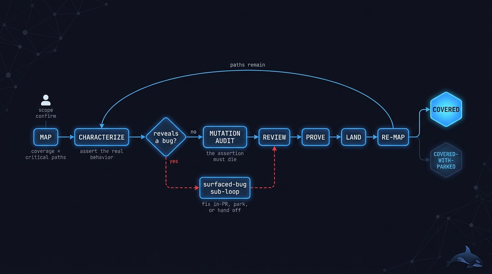
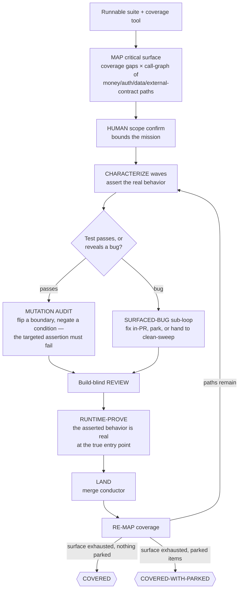

# 🧪 prove-it — a mutation-audited test on every critical path

> Point it at the money, auth, and data paths nothing currently protects. Come back to a
> human-confirmed critical surface where every path has a merged test that dies under a
> semantics-preserving mutation — and every bug the tests surfaced was fixed, parked, or handed
> off, never quietly asserted as correct.

**Skill:** [`skills/prove-it/SKILL.md`](../../skills/prove-it/SKILL.md) · **Layer:** mission (discoverable) · **Fix authority:** yes — tests, plus small clear fixes for surfaced bugs

  

---

## What it does

`prove-it` is the test-debt fleet. Unlike a finding-driven mission, the work here **creates
proof where no defect finding necessarily exists**: a **coordinator** maps the untested critical
surface, a human confirms the scope, and **characterization workers** — each running a single
TDD playbook (addyosmani or mattpocock) as its router — write tests that assert what the code
really does, then prove each test earns its keep. Every unit emits a SHA-bound
[evidence manifest](../concepts.md#the-evidence-manifest).

The denominator is a **finite critical surface**: coverage gaps crossed with the call-graph of
the money, auth, data, and external-contract entry points. Uncovered trivial getters are not
the mission, and coverage percent is not the pass criterion — 100% with tautological asserts
proves nothing. Done is **mutation-sensitive** coverage of the confirmed surface.

The proof itself is the heart of the mission: a test counts only if a **semantics-preserving
mutation** of the code — one that still compiles, under a harness that still runs — makes the
targeted assertion fail. And when characterization reveals the code is wrong, a nested
remediation loop takes over: the buggy behavior is never asserted as correct.

## When to reach for it

- "Close the test gap." / "Cover the critical paths."
- Test debt on code you are about to refactor — characterize first, then change safely.
- The suite is green but you have no idea whether it would catch a real regression.
- An audit demands proof the money/auth/data paths are tested, not a coverage number.

**When NOT to reach for it:**

- The suite is intermittently red — a flaky harness cannot anchor a mutation audit; run
  [`deflake-it`](deflake-it.md) first.
- You already have a pile of known bugs to close — that is [`clean-sweep`](clean-sweep.md).
- The tests are for new work — [`ship-it`](ship-it.md) builds them in, failing test first.

## The pipeline

Phase by phase:

1. **Map.** Coverage gaps are crossed with the call-graph of the money, auth, data, and
   external-contract entry points to produce a finite list of untested critical paths. This is
   the mission's denominator; without it, nothing can converge.
2. **Confirm scope.** A human confirms the critical list before any test is written. The
   confirmation bounds the mission — an unbounded surface is the anti-pattern, not a bigger
   win.
3. **Characterize** ([`build-change`](../../playbooks/build-change.md)). Each worker writes a
   characterization test that asserts **real** expected behavior, with the expected value drawn
   from an independent source of truth — never recomputed the way the code computes it (the
   tautology guard). Two outcomes: the test passes, meaning the code was correct but untested;
   or the test reveals a bug.
4. **Mutation-audit** the passing test. Apply a semantics-preserving mutation — flip a
   boundary, negate a condition, zero a return — so the code still **compiles** and the harness
   still **runs**, and watch the targeted assertion fail. A mutation that breaks the compile or
   the imports proves the test depends on the source's shape, not its behavior — it does not
   count.
5. **Surfaced-bug sub-loop** ([`remediate-finding`](../../playbooks/remediate-finding.md)). A
   small, clear fix ships in-PR with its test. Anything ambiguous or behavior-changing is
   parked as needs-human or handed to [`clean-sweep`](clean-sweep.md). The one forbidden move
   is asserting the buggy behavior as correct — that freezes the defect into the contract.
6. **Review, prove, land, re-map** ([`runtime-prove`](../../playbooks/runtime-prove.md),
   [`merge-serialization`](../../runtime/merge-serialization.md)). A build-blind review checks
   each test; runtime-prove confirms the characterization asserts behavior the real entry point
   actually exhibits, not behavior the test harness fabricates; the conductor lands; coverage
   is re-mapped and the loop continues until the confirmed surface is exhausted.

## Terminal states — parked is not covered

| State                 | Meaning                                                                                      |
|-----------------------|----------------------------------------------------------------------------------------------|
| `COVERED`             | Every confirmed path has a merged, mutation-audited test; every surfaced bug fixed-with-test |
| `COVERED-WITH-PARKED` | All writable paths mutation-audited; at least one bug or path parked as needs-human          |

The degraded state is never reported as `COVERED`. A parked item names its blocker — a
load-bearing quirk, a behavior-change decision, a path untestable without a human call.

## Human gates

Per [`gate-classification`](../../runtime/gate-classification.md):

1. **The scope confirm.** You approve the critical surface before characterization begins. This
   is what makes the denominator finite and the convergence proof checkable.
2. **The behavior call.** When a characterization test reveals what might be a load-bearing
   quirk — or a fix that would change observable behavior — the decision is yours; the worker
   parks it as needs-human rather than guessing.

Fix-backed closes need no extra gate: the evidence chain is the authorization.

## Convergence proof

`prove-it` is done when — and only when:

- every path on the confirmed critical surface has a merged test that fails at its assertion
  under a semantics-preserving mutation, with the harness still runnable — the mutation-audit
  recorded, and spot-audited on a sample;
- every surfaced bug is fixed-with-test, parked with a reason, or handed to `clean-sweep`;
- no assertion was weakened to pass — the diff is audited for it;
- coverage before/after is pasted — but the pass criterion is the mutation-audit set, never
  the percent.

## Failure modes this mission is built to prevent

| Anti-pattern                              | Why it burns you                                           |
|-------------------------------------------|------------------------------------------------------------|
| Chasing the coverage percent              | 100% with tautological asserts proves nothing              |
| A green test whose mutation also passes   | Insensitive to the behavior — worse than no test           |
| A compile break as the mutation proof     | Proves source-shape dependence, not behavior sensitivity   |
| Asserting a surfaced bug as correct       | Freezes the defect into the behavioral contract            |
| An unbounded surface                      | No confirmed critical list, no denominator, no convergence |
| Expected values recomputed the code's way | A tautological test that can never fail                    |

## Composes

Playbooks: [`build-change`](../../playbooks/build-change.md) ·
[`remediate-finding`](../../playbooks/remediate-finding.md) ·
[`runtime-prove`](../../playbooks/runtime-prove.md)

Runtime policies: [`merge-serialization`](../../runtime/merge-serialization.md) ·
[`reviewed-sha-freshness`](../../runtime/reviewed-sha-freshness.md) ·
[`dispatch-lifecycle`](../../runtime/dispatch-lifecycle.md) ·
[`liveness-resume`](../../runtime/liveness-resume.md) ·
[`evidence-manifest`](../../runtime/evidence-manifest.md) ·
[`gate-classification`](../../runtime/gate-classification.md)

## Related missions

- [`deflake-it`](deflake-it.md) — make the suite stable enough to trust before proving with it.
- [`clean-sweep`](clean-sweep.md) — where ambiguous surfaced bugs go to be closed properly.
- [`ship-it`](ship-it.md) — new work arrives with its tests built in, failing test first.
