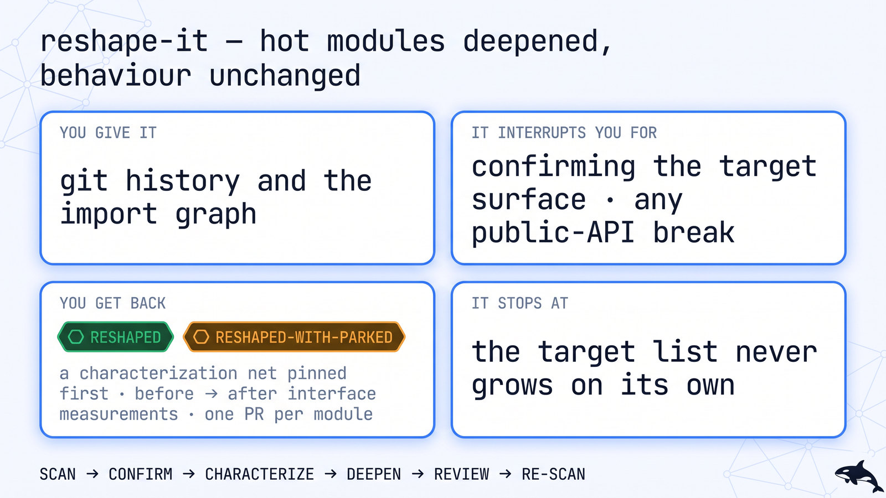
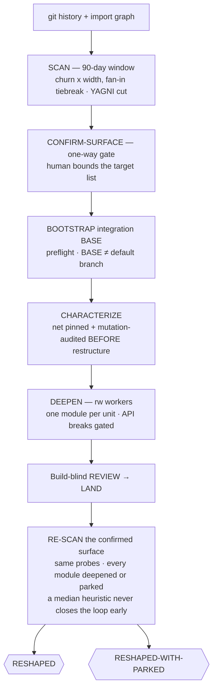

# 🧬 reshape-it — deep modules, same behaviour

> **Autonomy:** L4 (Osmani L0-L5, parallel delegation) — parallel scan and deepen waves behind a pinned characterization net; bounding the target surface and any API-break are your gates.
> **Activation load:** ~32,200 tokens — this SKILL.md plus every playbook and runtime doc its Composes/rides clause makes mandatory ([why it is measured](../../ARCHITECTURE.md#instruction-budget))
> **Proof:** doctrine-only — no recorded run yet; the protocol is mechanism, not yet field-proven.

> Point it at the codebase where every change touches twelve imports. Come back to hot modules
> sitting behind smaller, testable interfaces — with the characterization net green on both sides
> of every move, so "behaviour unchanged" is a claim with evidence, not confidence.

**Skill:** [`skills/reshape-it/SKILL.md`](../../skills/reshape-it/SKILL.md) · **Layer:** mission (discoverable) · **Fix authority:** yes — `PROFILE=rw` deepening workers

<p align="center">
  <picture>
    <source media="(prefers-color-scheme: dark)" srcset="../../assets/diagrams/missions/reshape-it.jpg">
    <source media="(prefers-color-scheme: light)" srcset="../../assets/diagrams/missions/reshape-it-light.jpg">
    
  </picture>
</p>

---

## Invoke it

```
> refactor the hot path safely: <the module or god file>
```

**Needs** (the skill's `compatibility` field, verbatim): HARD dependency: Orca runtime + orchestration skill (Orca CLI). git + gh. The target repo's test suite must be runnable and its mutation tooling available for the characterization net. A fix worker playbook pack (mattpocock, addyosmani, gstack) — one router per worker.

## What it does

`reshape-it` repairs architectural erosion. A **coordinator** builds a churn-weighted shallowness
inventory over a 90-day window — `git log` touches per module × interface width (exported symbols +
parameter surface), importer fan-in as tiebreak; a module nobody changes is not erosion — you
**confirm the target surface**, and only then does code move: first a
**characterization net** is pinned at each target's current seam and mutation-audited so it actually
detects behaviour change; then workers deepen **one module per unit** — shrink the interface, push
detail down, keep every call site green. Each unit gets build-blind review and a before/after
interface measurement.

The unit of work is **one module-deepening (one interface shrink at one seam)**. The defining
property: the net is pinned *before* the restructure — the oracle for "same behaviour" is the
mutation-audited suite, not the reviewer's memory.

## When to reach for it

- "This module is a god file; the interface is wider than the implementation."
- "Refactor the hot path safely — behaviour must not change."
- "Architecture erosion: everything imports everything."

**When NOT to reach for it:**

- Dependency/framework version upgrades — [`modernize-it`](modernize-it.md).
- A finite list of known defects — [`clean-sweep`](clean-sweep.md).
- Missing test coverage on critical paths — [`prove-it`](prove-it.md) (reshape-it borrows its net harness, but the unit is a module seam, not a path).
- Performance budgets — [`speed-it`](speed-it.md).

## The pipeline



## Terminal states

| State | Meaning | Who acts on it |
|---|---|---|
| `RESHAPED` | every confirmed module deepened; net green at both SHAs; review passed | nobody |
| `RESHAPED-WITH-PARKED` | ≥1 module needs a one-way API-break / behaviour decision; parked with the decision named | the human decides the parked API breaks |

`RESHAPED-WITH-PARKED` is a degraded terminal; a chain stops there per
[`mission-chaining`](../../runtime/mission-chaining.md). Advancing requires a one-way human gate
recorded in the ledger, even when the next link's allowlist declares this state tolerable.

## Human gates

**CONFIRM-SURFACE** and any **public-API break** are the one-way gates
([`gate-classification`](../../runtime/gate-classification.md)) — the fleet never grows the target
list itself and never breaks an API mid-wave. Deepen workers run `PROFILE=rw`
([`sandbox-policy`](../../runtime/sandbox-policy.md)).

## Convergence proof

`reshape-it` is done when every confirmed module carries (a) a before/after interface-surface
measurement, (b) the legal negative-control pair for a behaviour-preserving change — the
CHARACTERIZE-pinned mutant still KILLED at `head_sha` (the net is proven live on both sides of the
move) and a revert of the deepening that makes the interface measurement no longer smaller — because
the suite staying green is the contract, not the proof, (c) a build-blind review at the reviewed
SHA, and (d) the deletion test — the module's remaining interface justifies its existence.
The confirmed surface never grew mid-run. `RESHAPED`, or `RESHAPED-WITH-PARKED` with each parked
module's one-way decision named.

## Composes
Playbooks:
[`characterize`](../../playbooks/characterize.md) ·
[`decide-and-freeze`](../../playbooks/decide-and-freeze.md) ·
[`remediate-finding`](../../playbooks/remediate-finding.md) ·
[`acceptance-review`](../../playbooks/acceptance-review.md) ·
[`compound-learn`](../../playbooks/compound-learn.md) ·
[`design-twice`](../../playbooks/design-twice.md) ·
[`record-decision`](../../playbooks/record-decision.md) ·
[`plan-review`](../../playbooks/plan-review.md)

Runtime policies:
[`evidence-manifest`](../../runtime/evidence-manifest.md) ·
[`merge-serialization`](../../runtime/merge-serialization.md) ·
[`reviewed-sha-freshness`](../../runtime/reviewed-sha-freshness.md) ·
[`dispatch-lifecycle`](../../runtime/dispatch-lifecycle.md) ·
[`liveness-resume`](../../runtime/liveness-resume.md) ·
[`ledger-contract`](../../runtime/ledger-contract.md) ·
[`sandbox-policy`](../../runtime/sandbox-policy.md) ·
[`gate-classification`](../../runtime/gate-classification.md) ·
[`attention-budget`](../../runtime/attention-budget.md)

## Related missions

- [`prove-it`](prove-it.md) — the characterization net's harness and mutation audit; its unit is a critical path, not a module seam.
- [`clean-sweep`](clean-sweep.md) — an enumerable findings backlog, not architectural erosion.
- [`modernize-it`](modernize-it.md) — dependency/framework versions, not interfaces.
- [`map-it`](map-it.md) — when the erosion's shape is itself undecided: map first, reshape after.
