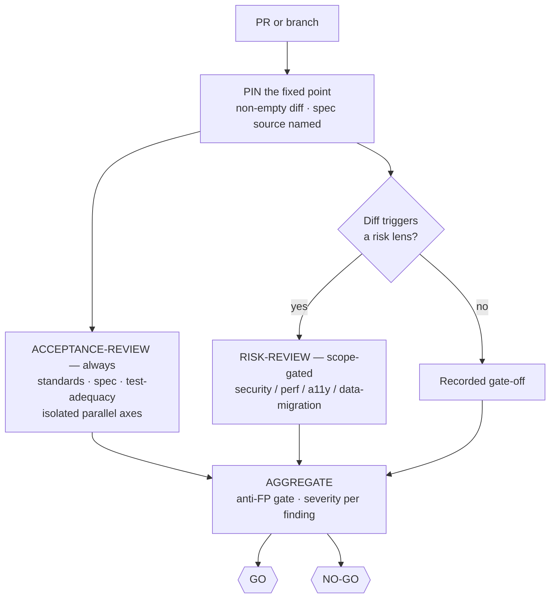

# 🔍 review-it — a trusted, read-only, SHA-bound GO/NO-GO verdict

> Point it at a PR or a branch. Come back to a verdict you can act on: every axis reviewed by a
> fresh session that never wrote the code, every finding quoting the exact line that motivated it,
> the whole bound to one reviewed SHA — and not a single byte of the tree modified.

**Skill:** [`skills/review-it/SKILL.md`](../../skills/review-it/SKILL.md) · **Layer:** mission (discoverable) · **Fix authority:** **no** — the catalog's read-only permission boundary

---

## What it does

`review-it` is the report-only fleet. A **coordinator** pins the change to a fixed point,
dispatches fresh **workers** to review it along isolated axes, pushes their findings through an
anti-false-positive gate, and emits a GO / NO-GO verdict bound to the exact SHA it reviewed.

"Produce a trusted verdict without modifying code" is three things at once: a user-facing outcome,
a PR gate, and a **permission boundary**. Every worker runs `PROFILE=ro`
([`sandbox-policy`](../../runtime/sandbox-policy.md)) — read-only sandbox, plan-mode permissions —
so the mission has no fix authority by construction, not by promise. A finding that wants a fix
routes to [`ship-it`](ship-it.md) or [`clean-sweep`](clean-sweep.md); it never gets patched in
place. Worker methodology comes from the upstream review packs (Matt's `code-review` two-axis,
Addy's specialist lenses, gstack's review-army dispatch), composed at the mission level with one
router per worker.

## When to reach for it

- "Review this PR."
- "Is this ready to merge?"
- A review matrix over a branch before it boards a merge train.
- A pre-merge quality gate you can trust precisely *because* it cannot touch the code.

**When NOT to reach for it:**

- You want the findings closed, not just found — that is [`clean-sweep`](clean-sweep.md), or
  [`ship-it`](ship-it.md) when the fix is new work.
- You want the full audit → exploit → fix → re-attack security loop — that is
  [`harden-it`](harden-it.md); this mission's security lens is the bounded per-diff review.
- There is nothing to diff yet — the mission refuses an empty `git diff <fp>...HEAD`; a goal with
  no change to judge is [`map-it`](map-it.md) territory.

## The pipeline

Phase by phase:

1. **Pin the fixed point.** A verdict needs something to be a verdict *of*. The coordinator names
   a SHA or PR and requires a non-empty `git diff <fp>...HEAD` — an empty diff is a refused run,
   not a trivially green review. It also identifies the spec source (the frozen spec or the
   originating issue), so the spec axis has an authority to judge against.
2. **Acceptance review — always** ([`acceptance-review`](../../playbooks/acceptance-review.md)).
   Build-blind: the reviewer is a fresh session that did not write the code. Three axes run as
   separate fresh-context workers so they cannot pollute each other, and nothing is reranked
   across axes — code can pass one and fail another; that is the point. **Standards** judges each
   hunk against the repo's documented standards (pasted into the worker) plus the Fowler 12-smell
   baseline; the repo standard overrides the baseline, and whatever tooling already enforces is
   skipped. **Spec** asks whether the diff faithfully implements the frozen spec or originating
   issue — missing or partial criteria, scope creep, implemented-but-wrong — quoting the spec line
   per finding. **Test-adequacy** asks, for each claimed fix, whether reverting the production
   change would fail a test — judged *statically* here, because `ro` workers predict what a revert
   would fail and never run one; executed negative controls belong to the fix missions.
3. **Risk review — scope-gated** ([`risk-review`](../../playbooks/risk-review.md)). Lenses are
   dispatched only when the change surface triggers them: auth/query/route/dep change → security,
   render/query/bundle → performance, component/markup → accessibility, schema/migration →
   data-migration. Each lens is a fresh-context worker with its own protocol — threat-model-first
   security demanding a concrete exploit scenario, measure-first performance, WCAG 2.1 AA,
   expand→migrate→contract. Gating adapts: a lens with zero findings across 10+ dispatches
   auto-gates off, but security and data-migration are `NEVER_GATE` — their value is the miss
   they would catch.
4. **Aggregate.** Findings land side by side per axis with severity
   (Critical / Required / Nit / Optional / FYI). The anti-false-positive gate: a finding **must
   quote its verbatim motivating code line**, or its confidence drops and it moves to an appendix —
   this kills the "field doesn't exist on the model" class of hallucinated findings. Multiple axes
   flagging the same `path:line` is confirmation, and confidence is boosted.
5. **Verdict.** GO / NO-GO with the worst issue per axis, bound to the recorded `reviewed_sha` in
   the [evidence manifest](../concepts.md#the-evidence-manifest). Any Critical defaults the
   verdict to NO-GO. The binding is load-bearing: under
   [`reviewed-sha-freshness`](../../runtime/reviewed-sha-freshness.md), a review is valid only for
   the exact SHA it reviewed — if the head moves, the verdict is void.

## Terminal verdicts — two, both SHA-bound

| Verdict | Meaning                                                                     | Who acts on it                                  |
|---------|-----------------------------------------------------------------------------|-------------------------------------------------|
| `GO`    | Every axis reported, no Critical finding, the whole bound to `reviewed_sha` | a human, or the mission that owns the merge     |
| `NO-GO` | At least one Critical finding — the default whenever any Critical exists    | route the findings to `ship-it` / `clean-sweep` |

Either way the verdict names the worst issue per axis, and it expires with its SHA: a head that
moves past `reviewed_sha` leaves you holding an opinion about code that no longer exists.

## Human gates

Zero inside the run — a mission that mutates nothing has no one-way doors to hold. Workers run
`PROFILE=ro`, report-only fleets preflight with `preflight.py --mode readonly`
([`dispatch-lifecycle`](../../runtime/dispatch-lifecycle.md)), and the permission boundary is
enforced below the model rather than requested of it.

The human gate lives *after* the mission: acting on the verdict. Merging to the default branch
stays a one-way door under [`gate-classification`](../../runtime/gate-classification.md) no matter
how green the review, and dispatching a fix is a new, separately authorized mission.

## Convergence proof

`review-it` is done when — and only when — the verdict holds at a named fixed point:

- the fixed point is pinned and the diff against it was non-empty;
- every axis is reported — acceptance always; each risk lens either ran or is a recorded gate-off;
- nothing was reranked across axes; the findings sit side by side, per axis;
- every finding quotes its verbatim motivating line and names its severity — anything that cannot
  quote its line lives in the appendix, not the verdict;
- the whole is bound to `reviewed_sha`, with a GO / NO-GO verdict and the worst issue per axis;
- no code was modified. The permission boundary held.

## Failure modes this mission is built to prevent

| Anti-pattern                          | Why it burns you                                                                |
|---------------------------------------|---------------------------------------------------------------------------------|
| Fixing "just this one thing"          | A reviewer that edits is no longer a permission boundary; route fixes out       |
| Reranking across axes                 | Masks one axis with another; passing standards while failing spec is the signal |
| Trusting an unquoted finding          | Findings that cannot quote their motivating line are the hallucination class    |
| Running every lens on every diff      | Noise; lenses are scope-gated so a triggered lens still means something         |
| Gating off security or data-migration | Their value is the miss they would catch — `NEVER_GATE`                         |
| Honoring a GO after the head moved    | The verdict is bound to `reviewed_sha`; a moved head voids it                   |

## Composes

Playbooks: [`acceptance-review`](../../playbooks/acceptance-review.md) ·
[`risk-review`](../../playbooks/risk-review.md)

Runtime policies: [`sandbox-policy`](../../runtime/sandbox-policy.md) ·
[`evidence-manifest`](../../runtime/evidence-manifest.md) ·
[`reviewed-sha-freshness`](../../runtime/reviewed-sha-freshness.md) ·
[`dispatch-lifecycle`](../../runtime/dispatch-lifecycle.md)

## Related missions

- [`ship-it`](ship-it.md) — act on the verdict when the fix is new work; it runs the same
  acceptance review per slice, with fix authority.
- [`clean-sweep`](clean-sweep.md) — exhaust the findings this verdict produced, PR-per-finding.
- [`harden-it`](harden-it.md) — the full audit → exploit → fix → re-attack loop when the bounded
  security lens is not enough.
