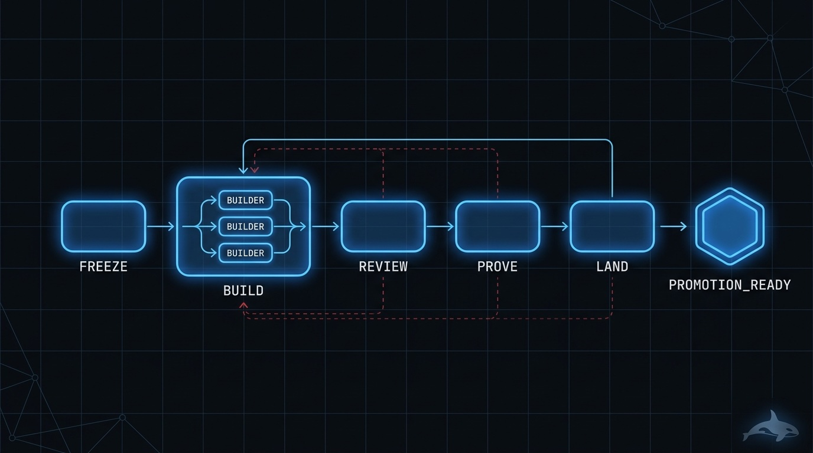
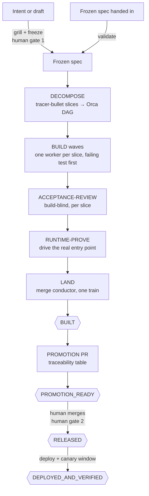

# 🚢 ship-it — intent or spec → a released, verified outcome

> Give it an idea or a frozen spec. Come back to a change that is built, reviewed at the
> integrated whole, proven at a real entry point, landed on an integration branch, and taken
> exactly as far down the release state machine as you authorized — with evidence for every claim.

**Skill:** [`skills/ship-it/SKILL.md`](../../skills/ship-it/SKILL.md) · **Layer:** mission (discoverable) · **Fix authority:** yes

<p align="center">
  
</p>

---

## What it does

`ship-it` is the build-to-release fleet. You are not asking one agent to "please implement this" —
you are starting a coordinated run in which a **coordinator** decomposes the work into
tracer-bullet slices, dispatches each slice to a fresh **worker** in its own worktree and terminal,
reviews every slice build-blind, proves the integrated whole at a real entry point, and merges
through a serialized conductor — then walks the release state machine as far as it is allowed.

The coordinator never writes code. Its job is dispatch, verification against authoritative state
(git, the test runner, the deploy target), and keeping the ledger. Every worker emits a SHA-bound
[evidence manifest](../concepts.md#the-evidence-manifest), and an independent verifier checks the
claims before the run advances. A worker saying "done" is a claim to check, never a fact to record.

Two entries, one canonical pipeline:

- **Frozen spec in hand** → the spec is validated (are its dependencies real? are its acceptance
  criteria testable?) and the run goes straight to decomposition.
- **Raw intent** ("build me X") → the coordinator runs a grilling session with *you* — one
  question at a time, recommended answers attached — and freezes the result. The grill is never
  delegated to a worker: it is your side of the alignment conversation.

## When to reach for it

- "Build and ship this feature."
- "Here's the spec — take it to a promotion PR."
- "Spec to shipped product, autonomously; I'll approve the freeze and the merge to main."
- An overnight run where you want to wake up to a reviewed, verified, promotion-ready branch.

**When NOT to reach for it:**

- You have an existing pile of findings or issues to close — that is
  [`clean-sweep`](clean-sweep.md); its unit of work and convergence proof are different.
- The goal is too foggy to write acceptance criteria for — chart it first with
  [`map-it`](map-it.md), then feed the frozen map to `ship-it`.
- You want an opinion, not a change — [`review-it`](review-it.md) produces a verdict with no fix
  authority.

## The pipeline



Phase by phase:

1. **Freeze** ([`decide-and-freeze`](../../playbooks/decide-and-freeze.md)). Facts are looked up
   in the codebase; decisions go to you. The output is a spec with testable acceptance criteria,
   explicit non-goals, and a test-seam list — sketched *before* the spec, not retrofitted after.
   Frozen scope does not reopen; new wants become backlog entries.
2. **Decompose** ([`decompose-dag`](../../playbooks/decompose-dag.md)). The spec is cut into
   vertical slices — each a narrow but complete path through every layer it touches, demoable
   alone, sized for one fresh context window. Foundation work (scaffold, data layer, seams)
   serializes; slices parallelize behind it. Hot mount-point files (route registries, DI wiring,
   migrations) become merge chains so parallel workers never fight over them.
3. **Build** ([`build-change`](../../playbooks/build-change.md)). Every worker starts from a clean
   baseline and writes the failing test first, with the expected value derived from an independent
   source of truth — never recomputed the way the code computes it. Smallest change to green.
   Adjacent problems are noticed-but-not-touched: recorded to the backlog, not fixed on the sly.
4. **Review** ([`acceptance-review`](../../playbooks/acceptance-review.md)). A fresh session that
   did not write the code reviews each slice on isolated axes — standards, spec fidelity,
   test adequacy — with no cross-axis reranking. Findings must quote the motivating line or they
   drop to an appendix. Two disciplines keep it honest: the reviewer writes its own expected fix
   to disk *before* opening the diff (anti-anchoring), and a unit gets at most three failed
   review rounds before it parks with a gate instead of ping-ponging forever.
5. **Prove** ([`runtime-prove`](../../playbooks/runtime-prove.md)). Green units are the start of
   verification, not the end. The change is driven through its true public entry point and the
   persisted state is asserted — plus a negative control: revert the change, watch the proof go
   red, restore it.
6. **Land** ([`merge-serialization`](../../runtime/merge-serialization.md)). One conductor owns
   all merges to the integration BASE. Reviewed-SHA freshness is enforced: a rebase voids the
   review and the PR re-boards with a fresh one.
7. **Release** ([`release`](../../playbooks/release.md)) and **observe**
   ([`observe`](../../playbooks/observe.md)). Version bump, changelog, promotion PR with a
   traceability table; a human merges to the default branch; deploy and a canary window follow
   only where authorized.

## Terminal states — stop where your authorization ends

| State                   | Meaning                                                            | Who advances past it |
|-------------------------|--------------------------------------------------------------------|----------------------|
| `BUILT`                 | Every slice merged to BASE, ancestry-verified                      | the fleet            |
| `PROMOTION_READY`       | Promotion PR open with a traceability table                        | a human, always      |
| `RELEASED`              | Human merged the promotion PR to the default branch                | ops / authorization  |
| `DEPLOYED_AND_VERIFIED` | Deployed revision equals the released SHA, canary green over its window | terminal        |

The mission **names the state it reached** and what blocks the next one. Reaching BASE with an
open promotion PR is `PROMOTION_READY` — reporting it as `RELEASED` is the overclaim this state
machine exists to prevent.

## Human gates

Exactly two, both one-way doors under
[`gate-classification`](../../runtime/gate-classification.md):

1. **The freeze** (intent entry only) — you confirm the spec before any slice is cut.
2. **The promotion** — merging BASE to the default branch is always yours. The fleet opens the
   PR and stops. Merge ≠ deploy, and the fleet never self-merges a promotion.

Everything else is classified mechanical (auto-resolved, audited in the ledger) or taste
(recommendation picked, batched for your veto, work continues).

## Convergence proof

`ship-it` is done when — and only when — the verifier confirms, against authoritative state:

- every frozen acceptance criterion maps to a passing test in a traceability table, verified on
  the **BASE head** (the integrated whole, not per-slice green);
- the criterion set is re-derived from the frozen spec at its recorded digest, so no worker can
  quietly shrink the denominator;
- every slice has a merged, ancestry-verified PR, a fresh reviewed SHA, and a passing negative
  control (revert-audited on a sample by a fresh worker);
- the manifest names the terminal release state with its evidence — merge SHA, deploy revision,
  canary verdict;
- everything noticed but not touched is in a backlog file.

## A worked example

The ask: passwordless login for a Next.js + Postgres app.

> ship this: magic-link login — email a signed link, 15-minute expiry, reuse the existing
> session middleware

**Freeze (gate 1).** The coordinator grills you, one question at a time, recommendation attached:

> Token storage — (a) stateless signed JWT in the link (recommended: no schema change; revocation
> only by expiry) or (b) DB-backed one-time token (revocable, adds a table + cleanup)?

You pick (b) — support wants revocation. The frozen spec carries five acceptance criteria
(AC-1 request endpoint … AC-5 rate limit) and two non-goals (no SSO, no account merge).

**Decompose → build.** The token table + mailer seam is foundation and serializes; three slices
build in parallel behind it, each from a failing test. Mid-build, one ledger row reads:

```
| task_a41 | AC-3 verify+session | BUILT t | PR_OPEN t | BOT t | REVIEWED f | MERGED f | WT_CLEAN f |  | PR #214 @ 9c1f2e0 |
```

**Review → prove → land.** The build-blind reviewer fails AC-3 once (missing expired-token
case); one fix round passes. RUNTIME-PROVE drives the real flow — request a link against the
dev server, extract it from the mail sink, verify, assert the session cookie — and files the
transcript as an artifact. The conductor merges the train; every row ends `MERGED t · WT_CLEAN t`.

**Promotion (gate 2).** The fleet opens the promotion PR with its traceability table (AC ↔ PR ↔
test ↔ merge SHA) and stops at `PROMOTION_READY`. Merging to `main` is your click, not its.

## Failure modes this mission is built to prevent

| Anti-pattern                       | Why it burns you                                                      |
|------------------------------------|-----------------------------------------------------------------------|
| Fanning the grill to a worker      | The alignment conversation is with *you*; a worker answering your side is fiction |
| Building on a moving spec          | Reviews and acceptance tests lose their fixed point; freeze first     |
| Per-slice green mistaken for done  | Slices can pass alone and fail integrated; runtime-prove the whole    |
| Claiming RELEASED at an open PR    | The release state machine exists so nobody has to trust adjectives    |
| Two playbook routers in one worker | Upstream packs fight when co-mounted; one worker, one pack            |

## Composes

Playbooks: [`decide-and-freeze`](../../playbooks/decide-and-freeze.md) ·
[`decompose-dag`](../../playbooks/decompose-dag.md) ·
[`build-change`](../../playbooks/build-change.md) ·
[`acceptance-review`](../../playbooks/acceptance-review.md) ·
[`risk-review`](../../playbooks/risk-review.md) ·
[`runtime-prove`](../../playbooks/runtime-prove.md) ·
[`release`](../../playbooks/release.md) · [`observe`](../../playbooks/observe.md) ·
[`compound-learn`](../../playbooks/compound-learn.md)

Runtime policies: [`dispatch-lifecycle`](../../runtime/dispatch-lifecycle.md) ·
[`merge-serialization`](../../runtime/merge-serialization.md) ·
[`reviewed-sha-freshness`](../../runtime/reviewed-sha-freshness.md) ·
[`evidence-manifest`](../../runtime/evidence-manifest.md) ·
[`gate-classification`](../../runtime/gate-classification.md) ·
[`liveness-resume`](../../runtime/liveness-resume.md) ·
[`attention-budget`](../../runtime/attention-budget.md)

## Related missions

- [`map-it`](map-it.md) — chart a foggy goal into the frozen spec this mission consumes.
- [`clean-sweep`](clean-sweep.md) — close an existing set of findings instead of building new work.
- [`review-it`](review-it.md) — the verdict without the build.
