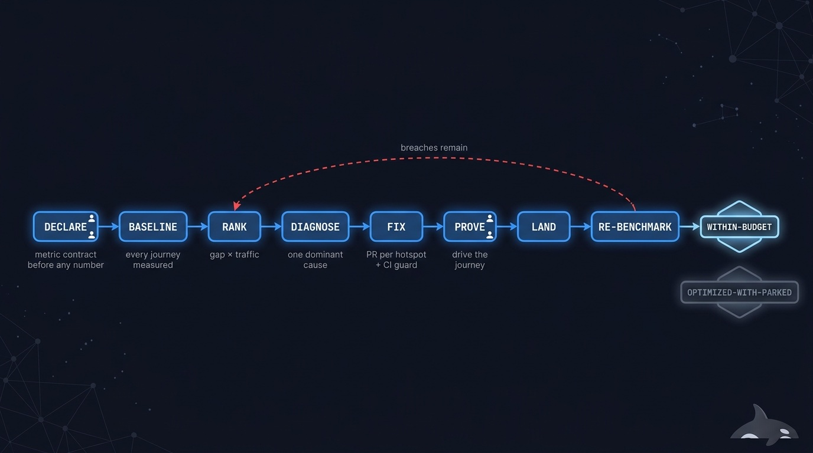
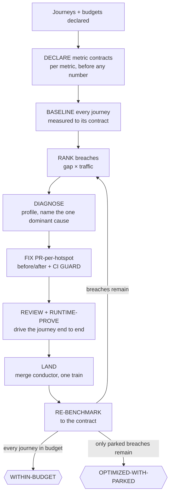

# ⚡ speed-it — every journey within budget, proven by a number

> Declare the journeys and their budgets. Come back to every one of them measured within budget
> against a pre-declared statistical contract — a before/after on every fix, a CI regression
> guard so the wins don't rot, and not a single number you have to take on faith.

**Skill:** [`skills/speed-it/SKILL.md`](../../skills/speed-it/SKILL.md) · **Layer:** mission (discoverable) · **Fix authority:** yes

  

---

## What it does

`speed-it` is the performance-budget fleet, and it is deliberately not a findings mission. Here
**baseline measurement precedes inventory** — you cannot rank what you have not measured — fixes
interact systemically, measurements are noisy, and done is a **statistically-defined budget over
journeys**, not the closure of a list. A **coordinator** declares metric contracts, baselines
every journey, ranks the breaches, dispatches one fix PR per profiled hotspot, and re-benchmarks
the journeys until every one is within budget or parked with a human reference.

The spine of the mission is the **measurement contract**, declared per metric before any number
is taken:

- **Field Core Web Vitals** — the metric's percentile (p75) over a window, with the sample count.
- **Lab Core Web Vitals** — the median of ≥5 runs, spread reported, at a pinned throttle, cache
  state, and device.
- **Server latency** — p95/p99 over ≥N requests at a stated concurrency, with two independent
  load runs agreeing.

Baseline and candidate must share source, sample size, and pinned conditions — a lab-vs-field or
warm-vs-cold comparison is not a delta, and two runs is a smoke minimum, not proof. A number that
cannot be measured to its contract is `unmeasured` and human-flagged, never a downgraded proxy.
And a metric is **never fabricated** — every pasted number is spot-checked against the artifacts
in its [evidence manifest](../concepts.md#the-evidence-manifest).

## When to reach for it

- "The app is slow."
- "Get these journeys under budget." / "Core Web Vitals are failing."
- A perf sweep before a launch, or an unattended perf-hardening run.

**When NOT to reach for it:**

- A per-diff perf opinion on one change — that is [`review-it`](review-it.md) running the
  [`risk-review`](../../playbooks/risk-review.md) performance lens.
- A general findings backlog — [`clean-sweep`](clean-sweep.md); its proof is an empty list, not
  a met budget.
- Watching production after a release — that is the [`observe`](../../playbooks/observe.md)
  playbook inside a release run, not a campaign.

## The pipeline

Phase by phase:

1. **Declare contracts.** Per metric, before baselining — the contract is what makes a later
   "improved" claim falsifiable instead of vibes.
2. **Baseline.** Every declared journey is measured to its contract *before* any inventory of
   fixes exists. Optimizing without a baseline is the cardinal sin: with no starting number, no
   fix can ever prove a win.
3. **Rank.** Breaches are ordered by **gap × traffic** — how far over budget, times how many
   users feel it — so the fleet spends effort where the user-felt win is largest.
4. **Diagnose** ([`risk-review`](../../playbooks/risk-review.md), performance lens). Profile,
   walk the symptom→cause tree (slow load: bundle, or TTFB?), and name the **one dominant
   cause**. Scattershot micro-optimizations are a named anti-pattern, not a strategy.
5. **Fix, one PR per hotspot** ([`remediate-finding`](../../playbooks/remediate-finding.md)).
   Every fix PR carries a mandatory measured **before → after** to its metric contract, and adds
   a **CI regression budget** (GUARD) so the win cannot silently rot after the run ends.
6. **Review and prove** ([`runtime-prove`](../../playbooks/runtime-prove.md)). A build-blind
   review, then the journey is driven at its real entry point — fast but behaviorally wrong is a
   bug, not a win, and the review must catch it.
7. **Land and re-benchmark** ([`merge-serialization`](../../runtime/merge-serialization.md)).
   The conductor merges; then the journey is re-measured to its full contract — a lucky single
   run is not confirmation. Because fixes interact systemically, the loop re-ranks whatever is
   still breached and goes again.

## Terminal states — name the one reached

| State                   | Meaning                                                                                                                                          | Who advances past it         |
|-------------------------|--------------------------------------------------------------------------------------------------------------------------------------------------|------------------------------|
| `WITHIN-BUDGET`         | Every critical journey meets its budget on its metric contract's confirmation                                                                    | terminal                     |
| `OPTIMIZED-WITH-PARKED` | All fixable hotspots fixed; ≥1 journey needs an infra/architecture change beyond scope or is an inherent-cost tradeoff — parked with a human ref | a human decides the tradeoff |

`OPTIMIZED-WITH-PARKED` is a degraded outcome, never a synonym — reporting it as `WITHIN-BUDGET`
is exactly the overclaim the measurement contract exists to prevent.

## Human gates

- **`unmeasured` metrics.** A metric that cannot be measured to its declared contract is flagged
  to you — the fleet never quietly substitutes a weaker proxy.
- **Parking a journey.** An over-budget journey parks only with a human reference — an infra or
  architecture change beyond scope, or an accepted inherent-cost tradeoff.
- **Promotion.** As everywhere, merging BASE to the default branch is a one-way human gate; the
  fleet stops at the promotion PR.

## Convergence proof

`speed-it` is done when — and only when:

- every declared journey is within budget, **confirmed to its metric contract** — source,
  sample, conditions, and the numbers pasted — or parked with its reason;
- every fix PR carries a measured before → after to its contract, and a fresh worker has
  re-measured a sample of them;
- no metric is fabricated — pasted numbers are spot-checked against their artifacts;
- CI budgets are in place, so the wins are guarded after the run ends;
- no fix changed behavior — fast-but-wrong is a bug the review must catch, not a win.

## Failure modes this mission is built to prevent

| Anti-pattern                                  | Why it burns you                                                |
|-----------------------------------------------|-----------------------------------------------------------------|
| Optimizing without a baseline                 | With no starting number, no fix can ever prove a win            |
| One fast run declared "fixed"                 | Perf is noisy; the contract's statistics are the confirmation   |
| Comparing across conditions                   | Lab-vs-field or warm-vs-cold is not a delta                     |
| Confirming below the metric's contract        | Two runs is a smoke minimum, not proof                          |
| Scattershot micro-optimizations               | Profile first; fix the one dominant cause                       |
| Downgrading an unmeasurable metric to a proxy | It is `unmeasured` and human-flagged — never an invented number |

## Composes

Playbooks: [`risk-review`](../../playbooks/risk-review.md) (performance lens) ·
[`remediate-finding`](../../playbooks/remediate-finding.md) ·
[`runtime-prove`](../../playbooks/runtime-prove.md)

Runtime policies: [`merge-serialization`](../../runtime/merge-serialization.md) ·
[`reviewed-sha-freshness`](../../runtime/reviewed-sha-freshness.md) ·
[`dispatch-lifecycle`](../../runtime/dispatch-lifecycle.md) ·
[`liveness-resume`](../../runtime/liveness-resume.md)

## Related missions

- [`clean-sweep`](clean-sweep.md) — general findings; done is an empty list, not a met budget.
- [`harden-it`](harden-it.md) — the security campaign; done is a clean re-audit.
- [`review-it`](review-it.md) — the per-diff perf lens without the campaign loop.
